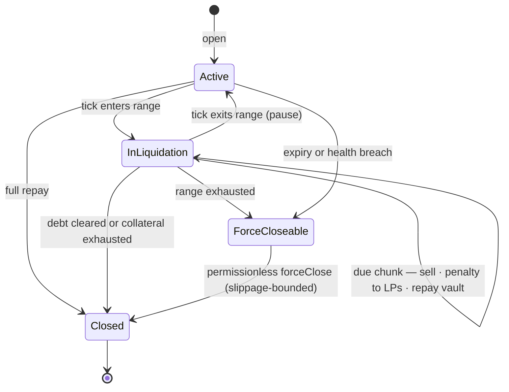
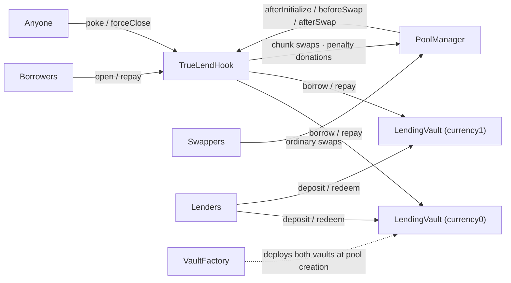
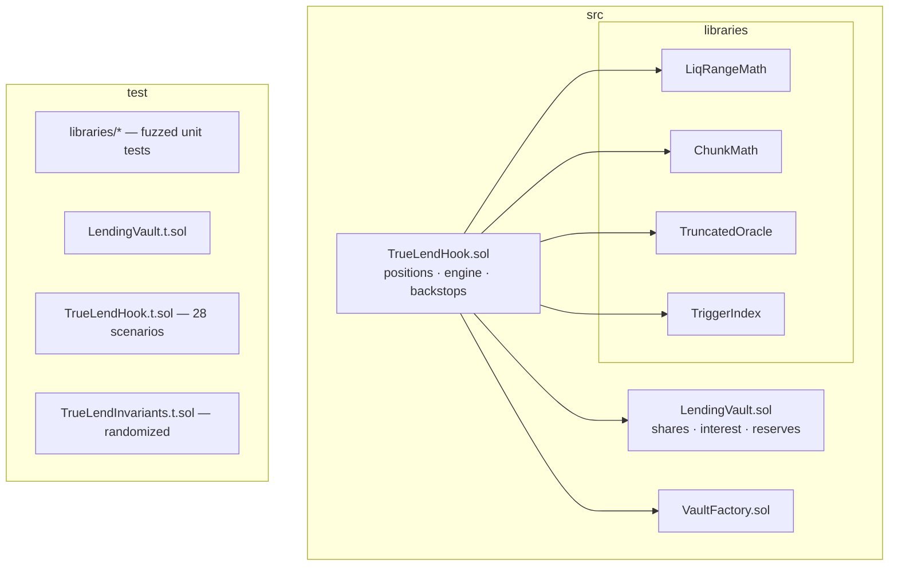
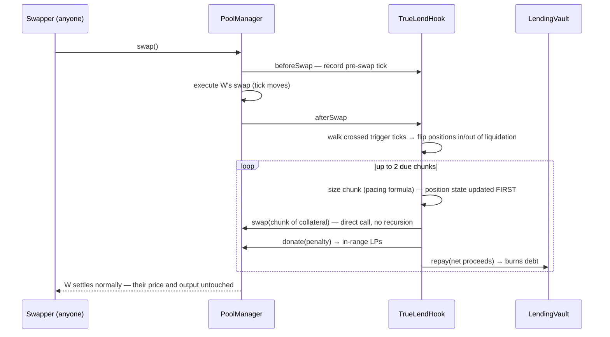
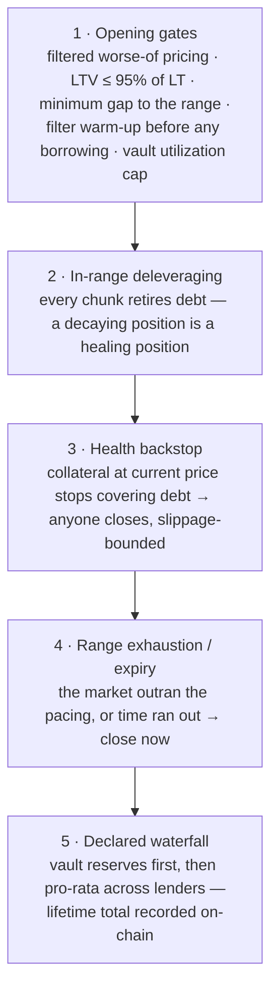

# TrueLend — Design Specification

TrueLend is a lending protocol built as a Uniswap v4 hook. It does not rely on any external oracle: the pool's own price decides everything, and liquidation happens *inside* the pool as a gradual, rate-limited conversion of collateral and not as a one-shot seizure by a keeper.

This document is the build specification. The background that includes prior art, why this mechanism is the right (and essentially the only) AMM-native one, manipulation economics, and derivations can be found in [RESEARCH.md](RESEARCH.md). How the numeric parameters are derived is in [PARAMETERS.md](PARAMETERS.md). A reference glossary sits in Appendix C, but the document is written to be read straight through without it.

---

## 1. What TrueLend is

Start with the venue. A Uniswap pool holds two tokens and quotes an exchange rate between them, tracked on a discrete grid of **ticks** at 0.01% spacing. The counterparty capital is supplied by **liquidity providers (LPs)**, who earn a fee on every trade. In v4 a pool can additionally attach a **hook** — a contract invoked before and after every swap, able to maintain its own state and execute swaps of its own.

TrueLend is such a hook, and it turns the pool it is attached to into a credit market: lenders deposit one of the pool's tokens into a vault and earn interest; borrowers lock the other token as collateral and draw the lenders' token as debt.

Every lending protocol turns on one question: what happens when the collateral stops covering the debt. Solvency is measured by the **loan-to-value ratio (LTV)** — debt over collateral value — and before LTV reaches 100% the protocol must convert collateral into the debt token. That conversion is **liquidation**; the LTV at which it begins is the **liquidation threshold (LT)**.

Conventional protocols (Aave, Compound) answer that question with two moving parts TrueLend deliberately does not have:

- **An oracle** — an external price feed — decides when LTV has crossed LT. Feeds lag, can be manipulated, and exist only for major assets; and because the protocol cannot fully trust its own trigger, it sets LT conservatively, at 50–80%.
- **A keeper** — an outside bot — performs the liquidation as a single event: repay the debt, seize all the collateral at a discount, right now. That all-at-once sale shoves the price down, which pushes the *next* borrower over their threshold. This is the cascade dynamic behind every major DeFi deleveraging.

TrueLend replaces both parts with the pool itself:

- **The pool's own tick is the only trigger.** There is nothing external to lag or spoof: when the tick reaches the price at which a loan's LTV equals its LT, that is not an *estimate* of trouble — it *is* trouble, by definition, in the very venue where the collateral would have to be sold.
- **Liquidation is a process, not an event.** Each loan gets a **liquidation range**: a band of ticks beginning at its LT price and extending a defined distance further. (The far edge — the **bankruptcy line** — is where gradualism has failed and an emergency rule takes over.) While the tick sits inside this band, the hook sells the collateral in small timed **chunks** — roughly 1% of the position per minute — and uses each sale to pay down the debt. If the price recovers and the tick leaves the band, the selling simply stops, and the borrower keeps everything that remains.

The chunking removes the cascade channel: no position is ever dumped, only bled at a bounded rate, and every chunk retires debt, so a decaying position is simultaneously deleveraging. The tick trigger removes the oracle. Together they make very high thresholds sound to offer: liquidation at LT 99% is a gradual, reversible, pausable process rather than a discrete seizure. The counterparties to the chunk sales are the pool's ordinary LPs, and each chunk pays them a **penalty fee** — LPs replace keepers as the compensated absorbers of liquidation flow.

Everything else in this document is machinery in service of those two replacements: vaults so lenders can be passive (§5), an internal price filter for the one moment a price judgment is unavoidable (§6), gas bounds so the lending market never burdens ordinary traders (§4.3), and backstops for the cases gradualism cannot handle (§2.5, §4.5).

> Why must liquidation be something the hook actively *does*, rather than collateral parked in the pool that "liquidates itself" as price crosses it? Because passive pool liquidity can only ever trade *against* the direction of a price move, and liquidation always requires trading *with* it. That impossibility — proved in [RESEARCH.md §1](RESEARCH.md) — is why every oracle-free design must execute. TrueLend's contribution is executing *gently*.

---

## 2. A loan, end to end

Section 1 becomes concrete with one worked loan. The pool is ETH/USDC with ETH at **$2,500**. Alice deposits **1 ETH** as collateral, borrows **1,800 USDC** (LTV 72%), and chooses **LT = 90%**.

### 2.1 Opening

Where should Alice's liquidation range begin? At the price where her LTV reaches her chosen LT — that is, where her debt equals LT × the collateral's value:

```
P_liq = debt / (LT × collateral) = 1800 / (0.90 × 1) = $2,000
```

So her range starts at $2,000 and extends down to $2,000/√2 ≈ **$1,414**. (The default width is a price factor of √2 — about 3,466 ticks — chosen so that no realistic single-block price jump can leap across the whole band; the jump analysis behind that choice is in [PARAMETERS.md §5.2](PARAMETERS.md).) The hook records the two boundary ticks, pulls Alice's ETH into its custody, draws 1,800 USDC from the USDC vault, and sends it to her.

One check precedes all of this. Opening is the single moment the protocol must value collateral against debt, and a valuation can be gamed: a spot price pumped one block earlier would let an attacker overborrow. Collateral is therefore valued at the **worse of** the live tick and the hook's filtered record of recent ticks (§6), and opening LTV must sit at least 5% below the chosen LT — headroom that keeps ordinary interest accrual from pushing a fresh loan directly into its range.

### 2.2 While the loan is healthy

ETH stays above $2,000 and the hook does nothing for this position — no per-swap bookkeeping, no storage touched. The lending market costs ordinary traders nothing until a range boundary is actually crossed (§4.3 shows the mechanism that makes this true).

Alice's debt accrues interest at a rate set by the USDC vault's utilization (§5). The loan carries a **term** — 180 days by default — because interest is the one force that erodes a position without the price moving; the term and the opening headroom jointly bound that erosion. Repayment is possible at any moment, partial or full; full repayment returns the collateral in the same transaction.

### 2.3 Price enters the range: decay

ETH slides to $1,900. The swap that pushed the tick below $2,000 also — in the same transaction, inside the hook's after-swap callback — flips Alice's position into liquidation and executes the first chunk. From here, every swap in the pool (or anyone calling the public `poke()` function) advances the process, one paced slice at a time:

```
chunk = (collateral remaining / 100)      ← base slice: 1% of what's left
      × min(minutes since last chunk, 5)  ← quiet gaps catch up, capped
      × (1 + depth into range)            ← $1,900 is 17% deep → ×1.17
      × (1 + position ÷ pool depth)       ← thin pools decay faster
      … and never more than 1% of the pool's own in-range depth
```

Concretely, the first chunk sells ≈0.0117 ETH (~$22), donates ≈$0.10 of penalty to the in-range LPs, and retires ~$22 of debt. At this pace full unwinding takes 2–3 hours, and the position's health improves at every step: decay is deleveraging, not confiscation.

The pool never receives more than a bounded flow from any position per interval, and the per-chunk cap ties even that flow to measured pool depth. A crash that drops fifty positions into their ranges produces fifty independent bounded flows — not one avalanche.

### 2.4 Price recovers: pause

ETH recovers to $2,050 after ten chunks. The tick re-crosses $2,000 and the position returns to healthy — with ~0.9 ETH remaining and ~$220 less debt. No exit fee applies and nothing further is taken; the only persistent state is that accumulated time-in-liquidation scales future penalty rates, so lingering near the boundary carries an economic cost rather than a physical one. A further dip resumes the decay where it paused.

This is the property the mechanism is built around: an excursion that reverses leaves the borrower substantially whole. The same dip on a conventional protocol costs the entire position at the first wick below the threshold, plus a liquidation bonus, plus the price impact imposed on every other borrower.

### 2.5 When gradualism isn't enough: the backstop

Three conditions end the soft treatment. Each makes the position closable by **anyone** for a small reward paid from the penalty flow — the only keeper-like role in the protocol, and it is a bounty, not a dependency:

1. **Range exhausted.** The price fell through $1,414 with collateral still unsold — the market outran the pacing, so pacing no longer protects anyone. The remainder is sold at once.
2. **Term expired.** 180 days passed without repayment.
3. **Health breached.** At the *current* price, the remaining collateral (after an execution buffer, capped at half the position's own LT gap so it can never preempt a high-LT range) no longer covers the debt — interest or a partial gap-through has made further waiting strictly worse for lenders.

The closing sale itself is **slippage-bounded**: it may move the pool price at most ~10%. If the book is drained or manipulated, the sale fills partially or not at all, the remainder stays as collateral, and the close is retried when liquidity returns. A fire sale into an empty book is structurally impossible — this exact scenario is a test (`test_forceClose_drainedPool_noFireSale`).

If, after all of that, proceeds still fall short, the difference is **bad debt**, and it follows a waterfall declared in the contract rather than implied: first the vault's **reserves** (a tenth of all interest the vault has ever earned, accumulated for exactly this), then pro-rata across lenders — with the lifetime total recorded on-chain, so lenders can see and price the tail they underwrite.

### 2.6 The lifecycle, compactly



---

## 3. The system that runs it

The walkthrough involved four kinds of actors — a borrower, lenders, the traders whose swaps drove the decay, and an anonymous closer — and three pieces of machinery. Here is how the machinery divides the work:



**`TrueLendHook`** is the protocol: it holds positions and their collateral, runs the liquidation engine, and maintains the price filter. One deployment serves any number of pools — initializing an ERC20/ERC20 pool with this hook *is* creating a lending market on it. Its three callbacks each have one job: `afterInitialize` sets up a new market (deploys its two vaults, starts the price filter); `beforeSwap` records one filter observation of the pre-swap tick; `afterSwap` detects any range boundaries the swap crossed, then runs up to two due chunks. Borrower and public entry points (`open`, `repay`, `poke`, `forceClose`) are ordinary external functions on the same contract.

**`LendingVault`** (two per pool — either token can be the borrowed one, with the other as collateral) keeps lenders passive: deposit, receive shares, earn. Its interest mechanics are §5.

**Four libraries** carry the math, deployed once and shared: `LiqRangeMath` (range placement, exact for any token-decimal pair), `ChunkMath` (the pacing formula), `TruncatedOracle` (the price filter), `TriggerIndex` (the crossing detector). The repository mirrors this structure, with a test suite per piece:



### 3.1 The core/periphery boundary

The rule that decides where code lives: **core is anything that must run inside PoolManager callbacks or that custodies funds; periphery is anything that only reads state or rearranges who signs.** Two forces make the core's minimality non-negotiable. A hook's address is baked into every pool key that uses it, so the core is effectively immutable per market — redeploying it strands the old pools rather than upgrading them. And the hook sits 132 bytes under the EIP-170 bytecode limit (24,444 of 24,576), which is why the pure math already lives in **linked external libraries** (`LiqRangeMath`, `ChunkMath`, `TruncatedOracle`, `TriggerIndex`): their bytecode is deployed once and shared by delegatecall, outside the hook's own limit — and, usefully, those library singletons are reusable on-chain by any future contract.

What is core today stays core: the hook (callbacks, chunk engine, trigger walking, oracle writes, collateral custody, WETH bridging), the vaults and their factory, and the libraries. Nothing currently in the contracts is a periphery candidate — every entrypoint either runs the engine (`poke`, `forceClose`), mutates custody (`open`, `repay`), or serves state that tests and integrators read directly.

The first two periphery contracts are shipped, alongside the one core accommodation they need (`open` takes an `onBehalfOf` owner, so a router can construct positions that belong to the trader rather than to itself — collateral is pulled from and the loan is disbursed to the caller; ownership, payouts and surplus go to `onBehalfOf`):

1. **[`TrueLendLens`](../src/periphery/TrueLendLens.sol)** — a stateless view aggregator: position health (usable collateral over debt, where 10,000 bps is the force-close boundary), live LTV, effective penalty, force-close reason, a chunk-size preview computed through the same linked libraries the engine executes, per-pool lending state, and spot-quoted open checks. It custodies nothing and can be replaced freely; it is also the pressure valve for the byte budget — any future view the hook is tempted to grow lives here instead.
2. **[`LeverageRouter`](../src/periphery/LeverageRouter.sol)** — the leveraged-spot construction (RESEARCH.md appendix, path 1): inside one PoolManager unlock it flash-takes the debt token, swaps it into collateral through the same pool, opens a single ordinary position owned by the trader, and settles the flash with the loan the hook disburses — exposure λ = 1/(1−LTV) with no new liquidation code and no funding rate. Closing reverses it: flash the exact debt, repay (collateral pays out to the trader), buy the debt back, pull only what the buy-back consumed. Notably the oracle's worse-of pricing self-defends here: the router's own flash swap moves the spot price, and origination values collateral at the pre-swap filtered price, so the construction cannot lever against its own impact.
3. **Keepers** remain off-chain periphery: `poke()` is their incentive-compatible entrypoint, paid from the penalty flow.

---

## 4. The liquidation engine, precisely

Section 2 showed the engine from the borrower's seat. This section shows it from the implementer's: what kind of mechanism it is, how one chunk actually executes, how crossings are detected cheaply, and what happens when the pool's liquidity thins out.

### 4.1 What kind of thing this is

The engine's closest relative is the **TWAMM** (time-weighted AMM), which executes one large order as many small time-spaced slices so that no single moment bears the whole impact. TrueLend's engine is a TWAMM with two modifications that turn an execution strategy into a liquidation mechanism:

| | Canonical TWAMM | TrueLend's engine |
|---|---|---|
| The order | placed explicitly by a trader | implied by the loan: "sell this collateral" |
| When it runs | continuously until filled | **only while the tick is inside the range** — exits pause it, re-entries resume it |
| Slice size | constant rate | adaptive (time × depth × pressure), capped at 1% of live pool depth |
| Who executes | unconditionally, every block | lazily, inside ordinary swaps or a public `poke` |
| Why it's paced | to minimize impact | **to bound every position's sell flow per interval — the anti-cascade guarantee** |

The conditionality is the novel element: a TWAMM must finish, whereas this engine treats interruption as success — an interruption means the borrower recovered.

### 4.2 One chunk, step by step

Two v4 facts make in-callback execution legal and safe. During a hook callback the PoolManager is already unlocked, so the hook calls `swap` and `donate` directly — v1 instead re-entered `unlock()`, which reverts mid-swap; that was the single bug that kept the hackathon build from ever executing a liquidation. And v4's `noSelfCall` guard means the hook's own swaps do not re-trigger its callbacks, so there is no recursion to defend against.



Note the ordering discipline: the position's accounting is updated *before* the external calls (checks-effects-interactions), so even a malicious token re-entering mid-settlement sees the chunk as already taken.

### 4.3 Finding crossings without scanning positions

A naive engine would iterate every open position on every swap — v1 did, and it is a gas liability. v2 inverts the lookup: each position registers its two boundary ticks in a per-pool **bitmap**, and `afterSwap` walks only the registered ticks lying between the previous and current tick. A swap crossing no boundary pays one bitmap check; a swap crossing N boundaries pays O(N), itself capped at 8 ticks and 32 position updates per swap, with a persisted cursor from which the next swap or poke resumes. The refresh operation is idempotent — it recomputes in-range status from the current tick — which is what makes capped, lazy, resumable walking safe. Registration is capped at 32 positions per trigger tick — exactly the per-walk refresh budget — because a tick hosting more positions than one walk can refresh would stall the cursor there permanently; without the cap, 33 dust positions sharing a boundary would freeze trigger processing for the whole pool past that tick.

### 4.4 When liquidity thins out — or vanishes

The pool's liquidity is the engine's counterparty, so every selling path is sized against *measured* depth, in the same transaction that sells:

- **Chunks** are capped at 1% of the token depth of in-range liquidity across the position's own range, re-measured in the transaction that sells. "Thinner books, smaller chunks" is proportionality *to the pool's depth, not the position*: a thin venue gets smaller absolute slices while the pressure term quickens the cadence — more, smaller steps, bounded impact everywhere. **Zero in-range liquidity → the chunk is skipped entirely**; the position waits. There is no stranded remainder at the other end either: decay normally terminates on *debt* reaching zero (final-chunk excess routes to the borrower, remaining collateral goes home), each chunk is clamped to what remains, and dust positions finish in a single chunk because integer division makes the base the whole remainder.
- **forceClose** sales carry the hard ~10% price-impact bound described in §2.5, fill partially against thin books, and retry. The adversarial version — pull all LP liquidity, then trigger a backstop sale into your own dust bid — is thereby structurally unprofitable.
- **Penalty donations** need an in-range LP recipient (a v4 rule); when none exists the penalty simply stays with the proceeds and retires more debt instead.

### 4.5 What keeps the protocol solvent

No single mechanism does — a *ladder* does, where each rung only needs to catch what the rung above lets through:



A natural question: why not make rung 5 unreachable — demand that even a worst-case gap through the entire range must repay the debt? Because that demand has a closed form, and it caps LT near 50–70% ([RESEARCH.md §6.5](RESEARCH.md)) — precisely the conservative regime this protocol exists to escape. High thresholds are offered *because* the tail is priced instead of forbidden: high-LT borrowers pay LT-scaled penalties, lenders earn utilization interest plus a reserve built for this, and the loss path is explicit. Sizing that tradeoff — how high LT can safely go, per pool tier — is what [PARAMETERS.md](PARAMETERS.md) does.

---

## 5. The lending side

Everything so far protected lenders; this section is what they get, and how the borrowing cost forms.

Lenders deposit into a vault and receive shares; the share price rises as interest accrues. Internally, debt is tracked against a per-vault **borrow index** — a number that starts at 1 and grows continuously at the current interest rate. A position's debt is simply its share count times the index, so interest needs no per-position bookkeeping at all.

The rate comes from **utilization** — the fraction of the vault currently lent out — via a curve with a deliberate shape: 0% at rest, rising gently to 4% at 80% utilization (the **kink**), then steeply above it, with borrowing **hard-capped at 90% utilization**. The steep zone and the cap protect a liquidity buffer this protocol needs even more than Aave does: chunk proceeds *repay through the vault*, and lender withdrawals must always clear, so free cash is an invariant of the design rather than a courtesy. Ten percent of all interest is skimmed into the vault's **reserve** — the first rung of the loss waterfall.

Why loans have a term: price risk is handled by the range, but interest erodes a position invisibly — a loan opened a hair under its threshold would, given enough months, drift into liquidation with the price never moving. The 5% opening headroom absorbs normal accrual; the health backstop catches pathological accrual; the 180-day term puts a hard end on how long a stale position can squat on vault liquidity.

---

## 6. The one price judgment, hardened

Liquidation needs no price input — a range crossing is a fact of the venue itself. **Opening** a loan does: collateral must be valued against debt, and any valuation can be attacked. The relevant modern adversary is cheap: since the merge, a validator proposing two consecutive blocks can set any pool price at the end of the first and restore it at the top of the second, exposed to no arbitrage and paying only swap fees. The design therefore assumes the spot price can lie for one or two blocks at a time.

The defense is a filter built from nothing but the pool's own history, plus a conservative rule for using it:

- **Observations that cannot be forged in one shot.** Once per minute the hook records the tick — the tick from *before* the current swap (so no swap ever records its own effect), clamped to move at most ±9,116 ticks (~2.5×) from the previous observation. A spike must survive many consecutive, arbitrage-bleeding minutes before it enters the record at all.
- **A median, not an average.** The filter reads as the median of the last nine observations; a minority of corrupted entries changes nothing.
- **Extremes that only widen.** The raw high and low ticks seen within recent intervals also bound the valuation, on the unfavorable side — a spike-and-revert too brief to become an observation still counts against the next borrower.
- **A warm-up gate.** No borrowing until the observation ring has filled (~9 minutes after pool creation), so an attacker cannot create a pool and immediately borrow against a history they authored.

The usage rule: collateral is valued at the **worse of** the live tick and the filter, so pumping spot changes nothing about borrowing power. Manipulation in the other direction — forcing the price into a victim's range — starts only the rate-limited, pausable, penalty-paying decay of §2.3, at the cost of two-way fees: an attack with negative expected value. That asymmetry is the structural reason gradual liquidation and oracle-freedom belong together.

---

## 7. Parameters

Who controls each number, with defaults. Entries marked ★ are risk parameters whose production values come from the modelling in [PARAMETERS.md](PARAMETERS.md) (first-cut recommendations per pool tier are already tabulated there).

| Set by | Parameter | Default | One-line rationale |
|---|---|---|---|
| **Borrower**, per position | LT (50–99%) · borrow amount (LTV ≤ 95% of LT) · collateral side · size | — | risk appetite is the borrower's to choose |
| **Pool owner**, per pool | range width ★ | √2 in price (3,466 ticks) | wide enough that jumps can't skip it |
| | chunk count ★ / interval ★ | 100 / 60 s | the pacing: ~1%/min baseline |
| | base penalty ★ | 0.5% | LP compensation; scales with LT and time, capped per position at ¼ of the LT gap |
| | max LT ★ | 99% | tier by volatility & depth per PARAMETERS.md |
| | per-chunk depth cap ★ | 1% of in-range depth | no chunk meaningfully moves price |
| | term | 180 days | bounds silent interest erosion |
| | executor reward | 0.1% of proceeds | pays forceClose callers and `poke` callers, carved from the penalty flow (swapper rebates are infeasible: the hook sees routers, not traders) |
| | minimum borrow ★ | 0 — **owner must set** | keeper gas economics; dust defense |
| **Protocol constants** | LTV headroom 95% · walk caps (8 ticks / 32 refreshes) · 2 chunks per swap, 10 per poke · forceClose impact bound ~10% · filter (60 s × 9 obs, ±9,116-tick clamp) | — | mechanical safety; not risk-tuned |
| **Interest model**, per vault | 0% base · 4% at kink 80% · +100% above · hard cap 90% · reserve 10% | — | liquidity buffer + first-loss capital |

---

## 8. Build status

Implemented, green, and deployed: 86 tests (fuzzed library units, vault accounting, 28 lifecycle scenarios, 4 native-ETH pool scenarios, randomized invariants), gas snapshot checked in, deploy script (address mining + CREATE2 + linked libraries) verified end-to-end, live on Unichain Sepolia — addresses in the [README](README.md).

**Invariants held under randomized action sequences:** the hook holds exactly the sum of open positions' collateral (nothing strands, nothing leaks); position debt shares reconcile with vault totals; vault balances always cover tracked reserves; utilization never exceeds its cap; lender value falls below principal only through the declared waterfall.

**Security posture (v1 scope):** standard ERC-20 tokens — no fee-on-transfer, rebasing, or transfer-hook tokens. **Native-ETH pools are supported** via WETH bridging at the hook boundary: payable `open`/`repay` wrap raw ETH on arrival, vaults hold WETH, chunk settlement unwraps/wraps against the PoolManager, and all user payouts are WETH (raw-ETH payouts inside swap callbacks would let a reverting `receive()` block position closes); checks-effects-interactions ordering plus reentrancy guards on all entry points; strictly bounded per-swap work; owner powers limited to per-pool config (timelock it for production), and `setConfig` rejects liquidation-bricking values — zero pacing fields, non-positive range width, LT gaps too thin for the penalty and buffer arithmetic. Internally audited (three findings — force-close reward accounting, the trigger-tick registration cap, config validation — fixed with regression tests); not yet externally audited. Deliberately deferred to keep v1 simple: per-position size caps against measured in-range depth (the backtest's principal long-tail finding), per-block borrow caps, aggregate per-tick-region exposure caps, LT-scaled interest premiums, configurable opening headroom.

---

## Appendix A — What v1 got wrong (and the v2 correction)

| # | v1 | Why it failed | v2 |
|---|---|---|---|
| 1 | called `unlock()` inside `afterSwap` to run chunks | reverts `AlreadyUnlocked` mid-swap — no chunk ever executed; try/catch in tests hid it | direct `swap()` from the callback |
| 2 | hook lent tokens it was pre-minted in tests | no lender side existed | vaults, interest, utilization |
| 3 | `repayDebt()` credited repayment without pulling tokens | free debt cancellation, by anyone | real transfers + access control |
| 4 | looped over all positions & ticks every swap | gas bomb | trigger bitmap + bounded walks + `poke` |
| 5 | `sqrt(rawRatio) << 96` for the liquidation tick | wrong except for 18/18-decimal pairs near price 1 | exact Q96 math (`LiqRangeMath`) |
| 6 | price-impact estimation heuristic in `beforeSwap` | unreliable; already abandoned in v1 | deleted; `beforeSwap` only feeds the filter |
| 7 | hand-rolled reentrancy flag for its own swaps | v4's `noSelfCall` already guarantees this | deleted |
| 8 | unauthenticated router registry | anyone could register as router | router removed entirely |

## Appendix B — v4 facts this design relies on

(1) Hook callbacks run with the PoolManager unlocked; `swap`/`donate`/`settle`/`take` are directly callable, and balances must net to zero only when the outer operation completes. (2) `noSelfCall`: hook-initiated pool calls skip the hook's own callbacks. (3) `afterSwap` does not receive the pre-swap tick — hence the hook's own last-tick record. (4) `donate()` pays only currently-in-range liquidity and requires some to exist. (5) Hook permissions live in the low 14 bits of the hook's address — deployment mines a matching address via CREATE2. (6) Requires a Cancun-capable chain (transient storage).

## Appendix C — Glossary (reference)

**tick** 0.01% price step · **LP** liquidity provider, earns pool fees · **hook** contract a v4 pool calls around every swap · **LTV** debt ÷ collateral value · **LT** the LTV where liquidation begins (borrower-chosen here) · **liquidation range** tick band from the LT price to the bankruptcy line · **chunk** one paced slice of collateral sold in-range · **pacing** the rate limits on chunks · **vault** pooled lender deposits, one per currency · **utilization** fraction of a vault lent out · **borrow index** accumulator turning debt shares into current debt · **keeper** any outside caller of `poke`/`forceClose` · **filter** the hook's internal manipulation-resistant price (truncated median + extremes) · **waterfall** declared loss order: reserves, then lenders pro-rata.
