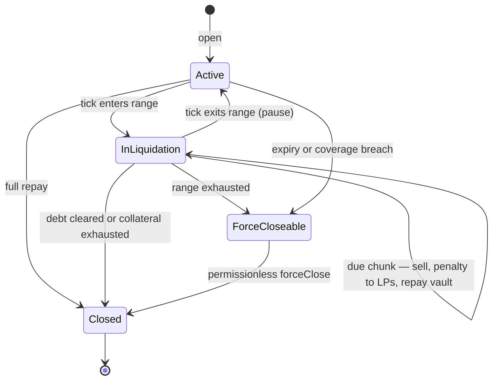
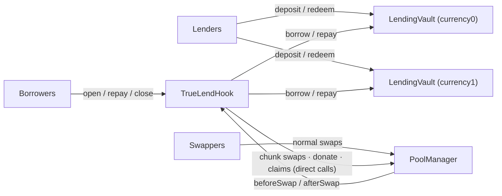

# TrueLend v2 — Design Specification

TrueLend is a lending protocol built as a Uniswap v4 hook. It has no oracle: the pool's own price decides everything, and liquidation happens *inside* the pool as a gradual, rate-limited conversion of collateral — not as a one-shot seizure by a keeper.

This document is the build specification. The background — prior art, why this mechanism is the right (and essentially only) AMM-native one, manipulation economics, and derivations — lives in [RESEARCH.md](RESEARCH.md).

---

## 1. The idea in one page

**The problem.** Oracle-based lending (Aave, Compound) inherits three weaknesses from its price feed: the feed can lag or be manipulated; only oracle-listed assets can be markets; and because a liquidation is a single all-or-nothing event triggered by that feed, protocols keep liquidation thresholds low (50–80%) and liquidations cascade — each forced sale pushes the price down, triggering the next.

**The thesis.** If the lending market lives inside the AMM pool itself, the pool price *is* the truth — there is nothing to feed, lag, or spoof. And liquidation doesn't have to be an event at all. It can be a *process*: while the price sits in a danger zone, the position leaks collateral slowly; if the price recovers, the leaking stops.

**The mechanism.** Every loan gets a **liquidation range** — a band of ticks starting at the price where the loan hits its liquidation threshold (LT). Nothing happens while the pool trades outside the range. When the pool tick is inside it, the hook sells the position's collateral in **small, time-paced chunks** into the pool (at most ~1% of the position per minute, scaled by how deep into the range the price is and how thin the pool is). Each chunk's proceeds repay the debt; a small penalty per chunk is donated to the pool's LPs, paying them for absorbing the flow. If the tick leaves the range, decay pauses with whatever collateral remains.

Because selling is rate-limited, no liquidation can crater the price and set off the next one — the cascade channel is capped by construction. Because the trigger is the pool's own tick, there is no oracle to attack; pushing the price into someone's range just starts a slow, bounded, pausable process while paying two-way fees. This is what lets borrowers choose LTs as high as 99% (on sufficiently deep pools).

**What surrounds the mechanism** — the parts v1 didn't have: lenders deposit into per-pool ERC-4626 vaults and earn utilization-based interest; borrow-time checks use a manipulation-resistant internal price (the one moment a price check is needed); everything the hook does per swap is strictly gas-bounded; and a permissionless `forceClose` backstops the soft mechanism when a position outlives its range, its term, or its interest coverage.

---

## 2. A loan, end to end

Running example used throughout: the pool is ETH/USDC, ETH trades at **$2,500**. Alice deposits **1 ETH** of collateral and borrows **1,800 USDC** (LTV = 72%) choosing **LT = 90%**.

### 2.1 Opening

The liquidation *start* price is where debt equals LT × collateral value:

```
P_liq = debt / (LT × collateral) = 1800 / (0.90 × 1) = $2,000
```

The liquidation range runs from $2,000 down to $2,000/√2 ≈ **$1,414** (default width: price factor √2 ≈ 3,466 ticks; per-pool configurable). The hook registers two trigger ticks — range start and range end — pulls Alice's ETH, borrows 1,800 USDC from the USDC vault, and sends it to her minus an origination fee. Before any of that, it checks the *manipulation-resistant* price, not raw spot (§6): if someone pumped ETH this block, the borrow is priced as if they hadn't.

### 2.2 While the loan is healthy

ETH stays above $2,000: the hook does nothing for this position — no per-swap accounting, no storage touches. Alice can repay (partially or fully) at any time; full repayment returns her ETH.

Interest accrues against her debt via the vault's borrow index. The loan carries a **term** (default 180 days) and was opened with enough headroom that interest at the rate ceiling cannot outgrow the range's coverage before expiry.

### 2.3 Price enters the range — decay

ETH drops to $1,900. The swap that pushed the tick past the $2,000 trigger flips the position to `inLiquidation` (detected in `afterSwap` by walking the trigger ticks crossed by that swap — work proportional to triggers crossed, not positions open).

From now on, each swap's `afterSwap` (and anyone calling `poke()`) executes **due chunks**:

```
chunk = (collateralRemaining / 100)                  ← base: 1% of what's left
        × min(timeSinceLastChunk / 60s, cap)         ← at most one base-chunk per minute
        × (1 + depthIntoRange)                       ← $1,900 is 17% deep → ×1.17
        × (1 + positionValue / activeLiquidity)      ← thin pool → faster
        clamped to [MIN_CHUNK, min(MAX_CHUNK, remaining)]
```

Concretely: the first chunk sells ≈ 0.0117 ETH (~$22) into the pool, receives USDC, donates a penalty of ≈ 0.45% of proceeds (~$0.10) to in-range LPs, and repays ~$22 of Alice's debt. At this pace the position would take ≈ 85 minutes to decay fully — and every chunk *reduces* debt, which is deleveraging, not loss: Alice's remaining position is smaller but healthier.

**Why this can't cascade:** the pool never sees more than a bounded trickle from any position per interval (`MAX_CHUNK` is also capped as a fraction of active liquidity). A crash liquidating many positions at once produces many trickles, not one avalanche.

### 2.4 Price recovers — pause

ETH bounces to $2,050 after ten chunks. The tick re-crosses the trigger; the position flips back to healthy with ~0.9 ETH of collateral and ~$220 less debt. Nothing else happens — no penalty for having visited the range beyond the per-chunk penalties already paid. Time spent in liquidation is remembered and scales future penalties (lingering is discouraged economically, not by confiscation).

### 2.5 The backstop — `forceClose`

Three conditions end the soft treatment, making the position closable by **anyone** (small reward, paid from the penalty):

1. **Range exhausted**: the tick passed $1,414 with collateral still left — price outran the pacing, so pacing no longer protects anyone. Remaining collateral is sold in one bounded swap.
2. **Expiry**: the term passed without repayment.
3. **Coverage breach**: accrued interest approaches what the remaining collateral can repay even in the best case.

Shortfalls, if any, hit the **bad-debt waterfall**: vault reserve buffer → pro-rata haircut of lenders' accrued interest → pro-rata haircut of principal. Declared in the contract, so lenders can price the tail.

### 2.6 Lifecycle summary



---

## 3. System architecture



**`TrueLendHook`** — the hook and the lending core in one contract; one deployment serves many pools with per-pool config. Hook permissions and what each callback does:

| Callback | Job |
|---|---|
| `afterInitialize` | initialize oracle state and `lastTick` for the pool |
| `beforeSwap` | write one truncated-oracle observation using the **pre-swap** tick (§6) |
| `afterSwap` | walk trigger ticks crossed by this swap → toggle positions in/out of liquidation; execute up to `MAX_CHUNKS_PER_SWAP` due chunks; update `lastTick` |

User entrypoints (`open`, `repay`, `close`, `poke`, `forceClose`) are ordinary external functions; when they need pool operations they call `poolManager.unlock()` themselves. Inside `beforeSwap`/`afterSwap` the manager is *already* unlocked, so the hook calls `swap`/`donate` **directly** — calling `unlock()` there reverts, which is the single bug that prevented every v1 liquidation (appendix A).

**`LendingVault`** (×2 per pool — either currency is borrowable; collateral is always the other). ERC-4626 with three restrictions: only the hook can `borrow`/`repayFor`; utilization is hard-capped; a slice of interest accumulates as a first-loss reserve. Lenders are fully passive — deposit and earn; no price placement, no active management.

**Libraries.** `LiqRangeMath` (range placement, both borrow directions, decimals-safe Q96 — §8.3 of RESEARCH.md), `ChunkMath` (the pacing formula), `TruncatedOracle` (ring buffer + median + widen-only extremes).

There is no separate router contract: v1's router added an unauthenticated registry and an extra token hop for nothing.

---

## 4. The liquidation engine, precisely

**Trigger detection.** The hook keeps, per pool: `lastTick`, a bitmap of ticks that are some position's range-start or range-end, and per-tick position lists. In `afterSwap` it walks only the ticks in the interval `(lastTick, newTick]` that are set in the bitmap. Cost is O(triggers actually crossed). A swap crossing no trigger tick costs a few hundred gas of overhead.

**Chunk execution.** Positions currently in liquidation sit in a per-pool ring queue with a round-robin cursor, so no position starves and no swap pays for more than `MAX_CHUNKS_PER_SWAP` (default 2) chunk executions. `poke(poolId)` lets anyone execute up to 10 more — this also covers quiet markets, where no swaps means no `afterSwap` (v1 had this stall latently; the chunk pacing formula's time multiplier makes missed intervals catch up, capped).

**One chunk does:** `swap` the chunk of collateral into the pool (a direct call from `afterSwap`; the hook's own callbacks are skipped by v4's `noSelfCall`, so there is no recursion and v1's reentrancy flag is deleted) → `donate` the penalty to in-range LPs → keep proceeds as ERC-6909 claims → repay the vault → update the position and emit.

**Penalty (per chunk):**

```
penalty = proceeds × BASE_PENALTY(0.5%) × (LT / 100) × min(1 + timeInLiq/1h, 5)
```

Scales with the risk the borrower chose and with how long LPs have been absorbing the flow; capped so late decay isn't confiscatory. Routed via `donate()` — this is the "LPs replace keepers and get paid for it" half of the protocol's pitch. (`donate` pays whoever is in range at that instant and can be JIT-diluted; acceptable for an incentive stream — it is never a solvency input.)

**Settlement plumbing.** All hook balances live as PoolManager ERC-6909 claims (no ERC-20 round-trips per chunk); `CurrencySettler` wraps mint/burn vs transfer/settle; `clear()` discards dust deltas.

---

## 5. The lending side

**Interest.** Utilization-kinked, per vault: `rate = 0% + 4%·U` up to the 80% kink, then `+100%·(U − 80%)` above it, with a **hard borrow cap at U = 90%**. The cap is load-bearing, not cosmetic: chunk repayments arrive *from* the pool and lender withdrawals must always clear; a fully-utilized vault would jam both. Reserve factor: 10% of interest into the first-loss buffer. A governance-free fallback (Ajna-style ±10% drift per 12h) can replace fixed slopes later without touching the rest of the system.

**Debt accounting.** Positions hold borrow *shares*; a per-vault borrow index accrues on every touch. The **rate ceiling** used in the open-time coverage check bounds how fast debt can possibly grow, which is what makes the term + coverage backstop sound.

**Why terms.** Without an oracle, the one thing that erodes a position that price never touches is interest. A fixed term (default 180 days) plus an interest reserve in the coverage check turns that unbounded risk into a bounded one, and `forceClose` at expiry/coverage-breach enforces it permissionlessly. (Timeswap generalizes this lesson; RESEARCH.md §3.3.)

---

## 6. Origination — the only price-sensitive moment

Liquidation needs no price input: the pool tick *is* the trigger. The attackable moment is **borrow time** — pump the pool for one block, borrow against inflated collateral, let the price revert, leave bad debt. Post-merge, 1–2 blocks of arbitrary price cost an adversary roughly fees (multi-block proposers; RESEARCH.md §4). Defenses, all internal:

| Check at `open` | Blocks |
|---|---|
| Collateral valued at **worse-of(spot, truncated median)** — observations written in `beforeSwap` with per-update tick movement clamped to ±9,116 ticks, read as a median | single/few-block price spikes never reach the borrow price |
| **Widen-only extremes**: per-interval min/max ticks only ever widen the borrow-side bound | spike-and-revert *within* one interval still poisons the bound |
| Minimum gap between filtered price and range start | borrowing straight into one's own liquidation range |
| No originations until the pool's observation window has filled | attacker-seeded pools fabricating their own "history" |
| Origination fee = max(1 week of interest, 5 bps); minimum position size; per-block borrow cap; aggregate per-tick-region exposure cap | rate games, dust griefing, Sybil-split size caps |

---

## 7. Parameters

Defaults; ★ = to be set/validated by the Phase 6 modeling notebook (the governing inequality is in RESEARCH.md §6.5: the LT→100% gap must cover chunk slippage + penalty + interest reserve + adverse drift during decay).

| Parameter | Default | One-line rationale |
|---|---|---|
| Max LT ★ | 99% deep pools; 90–95% thin (tiered by depth) | gap must absorb the §6.5 terms; depth sets slippage |
| Range width ★ | √2 in price (≈3,466 ticks) | wider = gentler decay per price move, longer recovery window |
| TARGET_CHUNKS / CHUNK_INTERVAL ★ | 100 / 60 s | ≥ ~25 min full decay even at max multipliers — the cascade cap |
| MIN / MAX_CHUNK ★ | per-pool, value-based; MAX also ≤ bps of active liquidity | bounds per-chunk price impact |
| BASE_PENALTY ★ | 0.5% × LT-factor × time-factor (≤5×) | LP compensation ∝ chosen risk and carry time |
| Term | 180 days | bounds interest-erosion risk |
| IRM | 0% base, 4% slope to 80% kink, 100% after, cap 90% U | §5 |
| Reserve factor | 10% of interest | waterfall step 1 |
| forceClose reward | 0.1% of proceeds (from penalty) | pays the permissionless closer |
| Dust minimum | ~$1k equivalent | dust positions rot uncloseable |
| MAX_CHUNKS_PER_SWAP / PER_POKE | 2 / 10 | hard per-swap gas bound |

---

## 8. Build plan

| Phase | Deliverable | Done when |
|---|---|---|
| 0 | Repo hygiene: re-pin `lib/v4-periphery` (currently a broken submodule), adopt tagged periphery or OZ `uniswap-hooks`, strip debug code, CI green | `forge test` runs clean from fresh clone |
| 1 | `LiqRangeMath`, `ChunkMath`, `TruncatedOracle` | fuzz vs reference math; 6/8/18-decimal pairs; both directions |
| 2 | `LendingVault` | 4626 conformance + IRM + caps + index unit tests |
| 3 | Hook skeleton: `open`/`repay`/`close` on a live local pool | integration happy-path |
| 4 | Liquidation engine: trigger bitmap, queue, direct-swap chunks, `poke`, penalty donation | scenario tests: enter/decay/pause/resume/full-decay, multi-position, quiet market |
| 5 | Backstops: `forceClose` (all 3 triggers), waterfall, rewards | invariant + fuzz suite (below) |
| 6 | Deploy script (HookMiner), demo, README, **parameter notebook** | modeled defaults for ★ rows |

**Invariants (Phase 5 suite):** (a) vault assets + hook claims + Σ collateral valued at range-end ≥ Σ liabilities − declared waterfall capacity; (b) chunk execution never violates pacing bounds; (c) exit-range always pauses decay; (d) no flow strands funds in the hook; (e) per-swap hook gas is bounded regardless of position count.

---

## Appendix A — What v1 got wrong (and the v2 correction)

| # | v1 | Why it failed | v2 |
|---|---|---|---|
| 1 | `poolManager.unlock()` inside `afterSwap` to run chunks | `unlock()` reverts `AlreadyUnlocked` mid-swap — **no chunk ever executed**; try/catch in tests hid it | direct `swap()` from the callback (manager already unlocked) |
| 2 | Hook lends tokens it was pre-minted in tests | no lender side existed | ERC-4626 vaults, interest, utilization |
| 3 | `repayDebt()` credits without pulling tokens, callable by anyone | free debt cancellation | real transfers + access control |
| 4 | Loops over all positions & ticks every swap | gas bomb / DoS | trigger bitmap + bounded queue + `poke()` |
| 5 | `sqrt(rawRatio) << 96` for the liquidation tick | not a valid `sqrtPriceX96`; only near-correct for 18/18-decimals near price 1 | Q96 form, RESEARCH.md §6.3 |
| 6 | `_estimateNewTick` price-impact guessing in `beforeSwap` | unreliable with concentrated liquidity; already abandoned in v1 | deleted; `beforeSwap` only writes the oracle |
| 7 | `_inLiquidationSwap` reentrancy flag | unnecessary — v4's `noSelfCall` skips a hook's own callbacks | deleted |
| 8 | Unauthenticated `setLendingRouter`; `console.log` in prod | — | router removed; hygiene pass |

## Appendix B — v4 facts this design relies on

Verified against the pinned v4-core in this repo and current upstream. (1) Callbacks run with the manager unlocked; `swap`/`modifyLiquidity`/`donate`/`mint`/`burn`/`take`/`settle`/`clear` are directly callable; deltas must net zero only when the *outer* unlock returns. (2) `noSelfCall`: hook-initiated pool calls skip the hook's callbacks. (3) `afterSwap` does not receive the pre-swap tick — hence stored `lastTick`. (4) The PoolManager is itself the ERC-6909 claims token; claims persist across transactions. (5) `donate()` requires active in-range liquidity and pays whoever is in range at that instant. (6) Oracle examples (Geomean/TruncGeo) write observations in `beforeSwap` with the pre-swap tick; truncation constant 9,116 ticks/update. (7) Hook flags live in the low 14 bits of the address — HookMiner + CREATE2; constructor args are part of the init-code hash. (8) `BaseHook` now lives in OpenZeppelin `uniswap-hooks`; pin a tagged v4-periphery or adopt OZ. (9) EIP-1153 transient storage ⇒ Cancun+ chains only.
