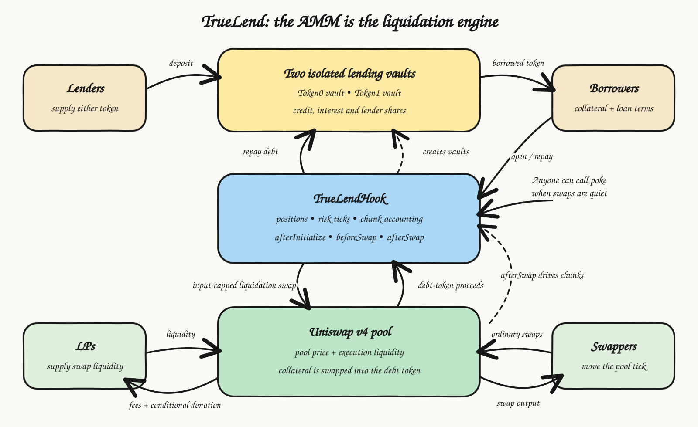

# TrueLend

**Oracleless + Keeperless Lending Protocol with AMM-native gradual liquidations and liquidation thresholds up to 99%.**

TrueLend is a Uniswap v4 hook that turns one two-token AMM pool into two
isolated lending markets. The pool provides the price, the execution venue and
the liquidity for liquidation. The hook converts risky collateral into the debt
token in small chunks instead of handing the full position to a keeper.

🏆 **First place — Uniswap Hook Incubator Cohort 7 Hookathon**

TrueLend is also the lending and liquidation engine behind
**[TruePerp](https://github.com/queenleoa/TruePerp)**, a 10x physical perpetuals
protocol built for the hackathon demo.



## Why is this important?

Oracle dependence is one of DeFi's largest risk surfaces. Price-oracle attacks
are the most frequent attack type in a large academic survey of DeFi incidents,
and external feeds restrict lending markets to assets already supported by the
oracle network [1].

Liquidation is the second problem. Conventional lending waits for a position to
cross one threshold. A keeper then sells a large amount of collateral into an
external market. During a sharp price move, that sale pushes the price further,
triggers more liquidations and creates a liquidation spiral [2, 3].

TrueLend changes both parts:

- the Uniswap pool tick replaces the external price feed;
- liquidation happens across a range instead of at one binary threshold;
- the hook sells bounded collateral chunks through the same pool;
- active LP liquidity is the counterparty to those swaps and receives the
  liquidation donation; and
- ordinary swaps drive the process, while anyone can call `poke` when the pool
  is quiet.

The result is a lending market in which liquidation starts earlier, happens
gradually and repays debt on every completed step. This is what opens the design
space for 90–99% liquidation thresholds and high leveraged exposure.

## The protocol in one sentence

> Lenders supply either pool token, borrowers post one token and borrow the
> other, and the hook uses the pool's own tick and liquidity to gradually swap
> collateral into the debt token when the position becomes risky.

The roles are separate:

| Component | What it does |
|---|---|
| Lending vault | Supplies the borrowed asset and records lender shares, debt, interest and reserves |
| TrueLend hook | Owns collateral, stores positions, checks risk ticks and accounts for repayment |
| Uniswap pool | Sets the market price and fills collateral-to-debt liquidation swaps |
| LPs | Supply the inventory that absorbs each swap; active LPs earn swap fees and liquidation donations |
| Swappers | Move the tick through ordinary trading and trigger `afterSwap` processing |
| Permissionless callers | Call `poke` in quiet markets and `forceClose` when a backstop condition is reached |

The vault is the **credit provider**. The Uniswap pool is the **liquidation
counterparty**. The hook connects them. There is no keeper vault and no
privileged liquidator.

## One pool creates two lending markets

TrueLend only lends the two assets inside its Uniswap pool. An ETH/USDC pool
therefore creates these two directions:

| Collateral | Debt | Risky price move | Gradual liquidation swap |
|---|---|---|---|
| ETH | USDC | ETH price falls | sell ETH collateral for USDC and repay USDC debt |
| USDC | ETH | ETH price rises | spend USDC collateral to buy ETH and repay ETH debt |

BTC, SOL or another asset needs its own pool and its own pair of isolated
vaults. Initializing a pool with the hook deploys one vault for token0 and one
for token1. Risk and bad debt remain inside that pool's vaults.

Native-ETH pools use WETH inside the hook and vault accounting, then wrap and
unwrap at the protocol boundary.

## Opening a loan

Two definitions explain the position:

```text
LTV = debt value / collateral value
LT  = the chosen LTV used to place the gradual-liquidation start tick
```

The borrower chooses the LT. Opening LTV cannot exceed 95% of that LT:

```text
maximum opening LTV = 0.95 × chosen LT
```

For example, a borrower posts $1,000 of collateral, borrows $855 and chooses a
90% LT:

```text
opening LTV = $855 / $1,000 = 85.5%
liquidation starts when $855 / collateral value = 90%
collateral value at range entry = $950
```

The 5% headroom stops a new position from opening directly against its
liquidation boundary.

The start and end ticks are calculated from the opening debt and remain fixed
for the life of the position. Interest changes live debt; the coverage and
expiry backstops handle that change.

The complete opening flow is:

1. A lender deposits token0 or token1 into its isolated vault and receives
   vault shares.
2. The borrower approves collateral, chooses the debt amount and selects an LT.
3. The hook values the collateral at the borrower-adverse price from the pool's
   current tick and recent tick history.
4. The hook escrows the collateral and the opposite-token vault sends the loan
   to the borrower.
5. The position registers a soft-liquidation start tick and an adverse range-end
   tick.

## How pricing works without an external oracle

Liquidation does not wait for Chainlink, a reporter network or a separate mark
price. The current Uniswap tick determines whether a position is safe, inside
its liquidation range or beyond its backstop boundary.

Opening a loan uses a pool-local price history so one favorable spot swap cannot
create extra borrowing power:

- `beforeSwap` records the **pre-swap** tick;
- observations are spaced by at least 60 seconds;
- each observation is truncated to a maximum movement of 9,116 ticks from the
  previous observation;
- the filter uses the median of nine observations and retains adverse interim
  extremes; and
- the hook takes the worse of filtered history and current spot for the
  borrower.

Borrowing begins after the nine-observation ring is ready. The pool supplies
the entire price history; no external feed enters the decision.

## Tick-driven gradual liquidation

Each position receives a liquidation range. The default width is 3,466 ticks,
approximately a √2 price span.

- ETH collateral / USDC debt: the adverse range runs from the LT price down
  toward `LT price / √2`.
- USDC collateral / ETH debt: the adverse range runs from the LT price up toward
  `LT price × √2`.


*This is the short-side direction. The hook swaps USDC collateral into ETH
through LP liquidity, in the same direction as an ordinary ETH buy. The long
side reverses the assets and direction.*

There is no passive “inverse LP position.” The hook performs active swaps. When
the tick enters the range, the first chunk becomes due immediately. Later
chunks are paced by four inputs:

```text
base chunk = remaining collateral / 100

chunk = base chunk
      × missed-interval catch-up
      × depth inside the liquidation range
      × position pressure relative to pool depth

chunk cap = 1% of estimated range depth from current active liquidity
```

The catch-up multiplier is capped at 5x. Depth and pressure each scale from 1x
to 2x. The range-depth estimate keeps chunk input proportional to current
active liquidity. A zero estimate means zero chunk.

Every filled chunk follows the same accounting:

1. update the position before external calls;
2. swap collateral into the debt token through Uniswap;
3. carve a permissionless caller reward from the penalty on a `poke`;
4. donate the remaining penalty to active LPs;
5. send net proceeds to the lending vault and burn debt shares; and
6. return any surplus to the borrower when debt reaches zero.

If active LP liquidity is absent after the swap, the donation is zero and those
proceeds repay more debt instead.


*The position decays while price is inside the range. A recovery moves it back
to the safe state; an adverse move deeper into the range accelerates repayment.*

## The three hook callbacks

TrueLend concentrates the core mechanism in three Uniswap v4 callbacks.

### `afterInitialize`

Creates one isolated lending vault for each pool token, enables the market,
installs the default risk settings and writes the first pool-price observation.

### `beforeSwap`

Records the tick before the user's swap changes it. This preserves a pool-local
history that a single swap cannot write and immediately use as trusted opening
price data.

### `afterSwap`

Walks the risk boundaries crossed by the swap, updates affected positions and
executes at most two due liquidation chunks. It also scans positions already in
the active queue, so a position keeps decaying without crossing a new boundary
on every swap.

Each trigger walk is gas-bounded to eight ticks and 32 position refreshes, with
a saved cursor for the next walk. The engine performs one walk before queue
processing and one after it. A trigger tick holds at most 32 positions.

`poke` runs the same engine for up to ten chunks and pays its caller from the
existing liquidation penalty. It is a permissionless liveness path, not a
privileged keeper role.

## Recovery and terminal backstops

Completed chunks are final because they have already repaid debt. When the safe
boundary refresh is processed, future chunks stop and the position keeps its
remaining collateral.

`forceClose` becomes available when:

1. price passes the adverse end of the range with collateral remaining;
2. the default 180-day loan term expires; or
3. live collateral value, after the effective coverage haircut, falls below
   live debt.

The closing sale has a 1,000-tick price bound. Thin liquidity produces a partial
fill, leaves the remaining collateral in the position and makes the position
available for another attempt.

If the final proceeds do not cover the debt, the vault uses reserves first. Any
remaining shortfall reduces the value of lender shares in that isolated vault.

## Why higher LTs create leverage

Leveraged borrowing is an infinite geometric series in its simplest form. If a
position repeatedly borrows a fraction `r` of new collateral, total long
exposure approaches:

```text
1 + r + r² + r³ + ... = 1 / (1 - r)
```


*The diagram applies a 90% borrow fraction to every new round, so the geometric
series converges to 10x at a constant price. TrueLend's `LeverageRouter` creates
one economically equivalent position with an atomic borrow and swap, not a
chain of nested loans. The on-chain collateral amount is the actual pool
output after fees and price impact.*

The opening headroom connects LT to gross long exposure:

| Chosen LT | Maximum opening LTV | Geometric-series gross exposure |
|---:|---:|---:|
| 90% | 85.50% | 6.90x |
| 95% | 90.25% | 10.26x |
| 99% | 94.05% | 16.81x |

The router flash-borrows the debt token from the PoolManager, swaps it into more
collateral, combines the swap output with trader margin, opens one TrueLend
position and settles the flash with the vault loan in one transaction.

[TruePerp](https://github.com/queenleoa/TruePerp) packages this mechanism as a
10x expiry-free long and short trading product with a dedicated frontend.

## Lender and LP economics

Lenders receive vault shares. Their share value grows as interest accrues on
outstanding debt. The default utilization curve is:

| Vault utilization | Borrow APR |
|---:|---:|
| 0% | 0% |
| 80% kink | 4% |
| 90% hard cap | 54% |

Borrowing above 90% utilization reverts. Ten percent of accrued interest enters
the vault reserve; the rest increases lender-owned assets.

LPs receive two separate forms of payment:

- the pool's normal swap fees; and
- liquidation-penalty donations when their liquidity is active after a chunk.

LPs provide execution liquidity. They do not own the loans and do not directly
absorb a lending-vault shortfall.


*Faster liquidation reduces the time exposed to adverse price movement but
raises execution cost. The parameter model searches for the lowest combined
cost inside the lender-safety constraints.*

## Contracts

| Contract | Role |
|---|---|
| [`TrueLendHook`](src/TrueLendHook.sol) | lending core, collateral custody, risk ticks, gradual liquidation and backstops |
| [`LendingVault`](src/LendingVault.sol) | per-token lender shares, borrow index, utilization rate, reserves and loss accounting |
| [`VaultFactory`](src/VaultFactory.sol) | deploys the two isolated vaults when a pool initializes |
| [`LiqRangeMath`](src/libraries/LiqRangeMath.sol) | LTV checks, decimal-safe price conversion, liquidation ranges and force-close health |
| [`ChunkMath`](src/libraries/ChunkMath.sol) | time × depth × pressure chunk sizing and penalty calculation |
| [`TruncatedOracle`](src/libraries/TruncatedOracle.sol) | pool-local median observations, truncation, adverse extremes and warm-up gate |
| [`TriggerIndex`](src/libraries/TriggerIndex.sol) | tick bitmap and position buckets for bounded boundary processing |
| [`TrueLendLens`](src/periphery/TrueLendLens.sol) | position, pool, lending-state and opening-quote reads for the UI |
| [`LeverageRouter`](src/periphery/LeverageRouter.sol) | atomically opens and closes leveraged spot positions owned by the trader |

## Live demo

The contracts and seeded `dUSD/dETH` demo market are deployed on **Unichain
Sepolia (chain ID 1301)**. The dashboard reads the deployed contracts directly;
there is no indexer or backend.

```bash
cd ui
npm ci
npm run dev
```

Open `http://localhost:3000`, connect MetaMask and switch to Unichain Sepolia.
The dashboard shows the pool tick, active liquidation ranges, completed chunks,
LP donations, vault utilization, lending and borrowing.

The complete frontend guide and demo addresses are in [`ui/README.md`](ui/README.md)
and [`ui/lib/contracts.ts`](ui/lib/contracts.ts).

## Deployments

| Network | Contract | Address |
|---|---|---|
| Unichain Sepolia (1301) | TrueLendHook | [`0xa731511a83D523A1df04e988873725BEE7cA90c0`](https://sepolia.uniscan.xyz/address/0xa731511a83D523A1df04e988873725BEE7cA90c0) |
| Unichain Sepolia (1301) | VaultFactory | [`0x2aAF432336Ea0D8b91398D32D0898317EfB6b420`](https://sepolia.uniscan.xyz/address/0x2aAF432336Ea0D8b91398D32D0898317EfB6b420) |
| Unichain Sepolia (1301) | TrueLendLens | [`0xa8ed6128aD792485F6F5E9490C3dE630870e0cF4`](https://sepolia.uniscan.xyz/address/0xa8ed6128aD792485F6F5E9490C3dE630870e0cF4) |
| Unichain Sepolia (1301) | LeverageRouter | [`0xB359c6a4b7A07f4944438d8e5d2FeC9e8E4aaCBc`](https://sepolia.uniscan.xyz/address/0xB359c6a4b7A07f4944438d8e5d2FeC9e8E4aaCBc) |
| Unichain Sepolia (1301) | PoolManager | [`0x00B036B58a818B1BC34d502D3fE730Db729e62AC`](https://sepolia.uniscan.xyz/address/0x00B036B58a818B1BC34d502D3fE730Db729e62AC) |

## Build and test

```bash
git clone --recursive https://github.com/queenleoa/TrueLend.git
cd TrueLend
forge build
forge test --offline
```

Current verification: **97 tests passed, 0 failed** across unit, fuzz,
integration, native-ETH, periphery and invariant suites.

Test map:

- [`test/libraries/`](test/libraries/): liquidation math, chunk math and pool-local
  price history;
- [`test/LendingVault.t.sol`](test/LendingVault.t.sol): shares, rates, accrual,
  utilization and loss accounting;
- [`test/TrueLendHook.t.sol`](test/TrueLendHook.t.sol): open, repay, gradual
  liquidation, recovery, `poke` and `forceClose`;
- [`test/Periphery.t.sol`](test/Periphery.t.sol): lens and leverage router;
- [`test/NativePool.t.sol`](test/NativePool.t.sol): native-ETH lifecycle; and
- [`test/TrueLendInvariants.t.sol`](test/TrueLendInvariants.t.sol): accounting
  invariants under randomized action sequences.

## Deploy

```bash
export POOL_MANAGER=0x...
export WALLET_ADDRESS=0x...

forge script script/Deploy.s.sol --rpc-url "$RPC_URL" --broadcast
```

The script mines an address carrying the `afterInitialize | beforeSwap |
afterSwap` hook flags, then deploys the factory, hook, lens and leverage router.
Initializing a Uniswap v4 pool with that hook creates its two lending vaults and
enables the market.

## Research and documentation

- [WHITEPAPER.md](WHITEPAPER.md): the formal protocol paper and equations;
- [DESIGN.md](DESIGN.md): the complete architecture, state transitions and
  accounting rules;
- [PARAMETERS.md](PARAMETERS.md): the risk objective, parameter derivations and
  LT tiers;
- [RESEARCH.md](RESEARCH.md): prior art, oracle manipulation, AMM mechanics and
  the rejected passive-range design;
- [notebooks/RESULTS.md](notebooks/RESULTS.md): Monte Carlo results;
- [notebooks/BACKTEST.md](notebooks/BACKTEST.md): historical replay across major
  stress periods;
- [docs/TrueLend-Whitepaper.pdf](docs/TrueLend-Whitepaper.pdf): rendered paper;
  and
- [AUDIT.md](AUDIT.md): internal code review, verified properties and open
  findings.

## Status

TrueLend v2 includes the lending vaults, leverage router, pool-local price
history, bounded trigger index, adaptive chunk engine, terminal backstops,
Unichain Sepolia deployment and live dashboard. The current internal review is
recorded in [AUDIT.md](AUDIT.md). External review and the remaining audit fixes
are the next development stage.

## References

1. Zhou et al., [*SoK: Decentralized Finance (DeFi) Attacks*](https://arxiv.org/abs/2208.13035).
2. Qin et al., [*An Empirical Study of DeFi Liquidations: Incentives, Risks, and Instabilities*](https://arxiv.org/abs/2106.06389).
3. Warmuz et al., [*Toxic Liquidation Spirals*](https://arxiv.org/abs/2212.07306).
4. Adams et al., [*Uniswap v4 Core*](https://app.uniswap.org/whitepaper-v4.pdf).
