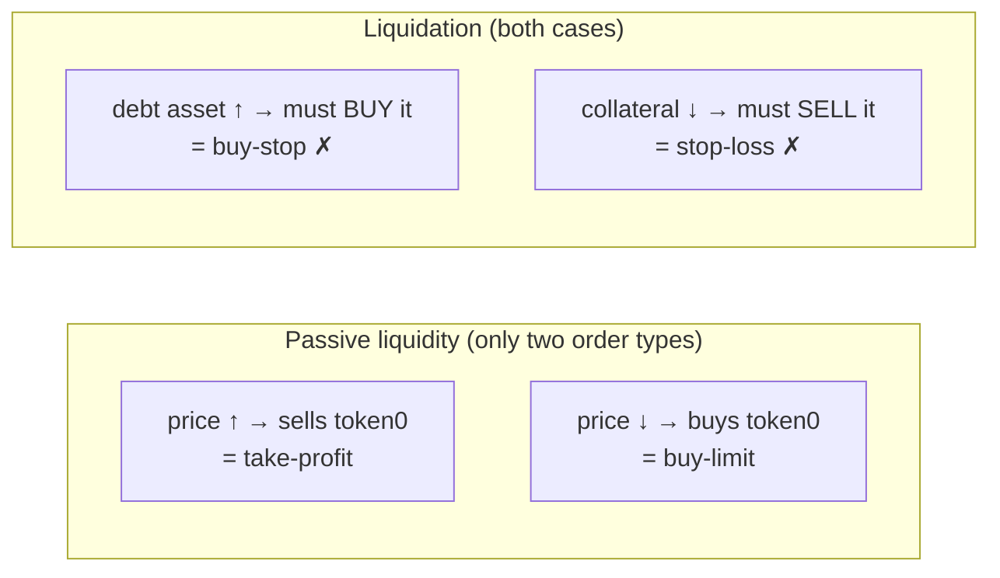
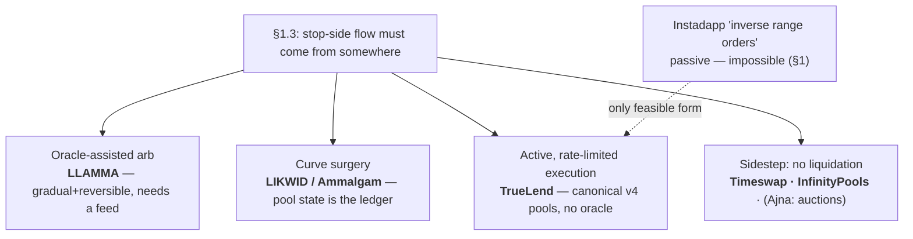

# TrueLend v2 — Research Report

This report is the background for [DESIGN.md](DESIGN.md). It answers four questions, in order:

1. **Can a Uniswap pool liquidate a loan by itself, passively?** No — and the proof of that "no" organizes the entire design space (§1–2).
2. **What have other protocols done about it, and what do they teach?** (§3)
3. **What does an oracle-free protocol actually have to defend against?** (§4)
4. **What math does the implementation stand on?** (§6)

Section 5 documents an alternative architecture that was evaluated and rejected during this redesign, so the reasoning isn't lost.

---

## 1. The central question: can the AMM liquidate passively?

The most elegant version of AMM-native lending would be: park the borrower's collateral in the pool as a liquidity position spanning the liquidation zone, and let ordinary trading convert it into the debt asset as the price moves against the loan. No keeper, no executor, no gas — the market itself performs the liquidation.

This idea has a name — Instadapp called it an **inverse range order** — and it does not work. Understanding *why* it can't work takes one page and pays for itself: it explains what LLAMMA's oracle is really for, why LIKWID rebuilt the curve, and why TrueLend's chunk engine is not a workaround but the correct mechanism.

### 1.1 What a liquidity position does as price moves

A Uniswap position with liquidity `L` over price range `[P_a, P_b]` holds a mix of the two tokens that depends **only on the current price** (prices quoted as token1 per token0):

| Where price is | Position holds |
|---|---|
| below `P_a` | 100% token0 |
| above `P_b` | 100% token1 |
| inside | a mix that shifts continuously between the two |

Follow one traversal. Price **rises** through the range. Rising price means swappers are *buying token0* from the pool — and what they buy comes out of in-range positions. So as price rises, a position **sells token0 and accumulates token1**. Symmetrically, as price falls, a position **buys token0 with its token1**.

That is the whole story, and it is one-directional in a specific sense: **passive liquidity always trades *against* the price move.** It sells what's getting expensive and buys what's getting cheap. As an order type, a range position gives you exactly two things:

- a **take-profit** (sell my token0 as it appreciates through the band), or
- a **buy-limit** (buy token0 with my token1 as it dips through the band).

Uniswap's own documentation draws the line explicitly: *"you cannot use a Uniswap v3 LP position as a stop loss to sell into a falling market, and you can't use it to acquire an asset on its upside"* ([Range Orders — Uniswap docs](https://docs.uniswap.org/concepts/protocol/range-orders), [support article](https://support.uniswap.org/hc/en-us/articles/20980601560717-What-is-a-range-order), [Loesch](https://medium.com/@odtorson/how-to-use-uniswap-v3-as-a-limit-order-machine-a529cf369dd)).

### 1.2 Liquidation is the trade passive liquidity can't make

Now write down what liquidating a loan requires, in both possible configurations of an ETH/USDC market:

**Case A — collateral ETH, debt USDC.** The loan sours when **ETH falls**. Liquidation must **sell ETH as it falls** to recover USDC. But as ETH falls, passive positions do the opposite: they *buy* ETH. To place ETH in a band below spot hoping it converts to USDC on the way down is precisely the stop-loss the docs say doesn't exist — worse, it can't even be minted: a band below spot only accepts token1 (USDC), not the ETH you'd want to sell.

**Case B — collateral USDC, debt ETH.** The loan sours when **ETH rises** (the debt gets more expensive). Liquidation must **buy ETH as it rises** with the USDC collateral. As ETH rises, passive positions *sell* ETH — again the opposite side — and a band above spot only accepts token0 (ETH), not the USDC you'd want to convert.



Liquidation is always a **stop order** — it trades *with* the price move. Passive AMM liquidity is always the **limit side** — it trades against the move. The two never overlap, in either borrow direction. This is not an engineering limitation of v4; it is what a constant-function market maker *is*.

### 1.3 The impossibility, stated once

> An AMM position can only be counter-momentum **with respect to the pool's own price**. To supply momentum-side flow — to sell what's falling or buy what's rising — someone must either (a) *tell* the pool that the market moved, which is an oracle, or (b) *execute* the trade, which is an agent: a keeper, or a hook.
>
> Therefore: **oracle-free passive liquidation cannot exist.** Oracle-free liquidation must be *active*. The design freedom is only in *how* the active execution is shaped — and TrueLend shapes it as rate-limited, pausable, in-range chunks.

### 1.4 What Instadapp's "inverse range order" actually was

The [Instadapp post](https://blog.instadapp.io/oracleless-lending-protocol-on-uniswap-v4/) (mid-2023) proposed the passive version anyway, by inventing a new primitive: the inverse range order is described as *"similar to a **negative position**, matching a user's LP positions with an inverse order"* that *"acts as a sort of 'reserve'"* — for a loan against ETH, *"an inverse range order of ETH is created on the USDC side of liquidity."*

"Negative position" is the tell. The construct needs a position that *consumes* the conversion other LPs would undergo — negative liquidity — and no such primitive exists in v4: position liquidity is non-negative, in-range liquidity backs real reserves, and no hook flag lets one position absorb another's fills. The post's own phrasing ("with Uniswap's introduction of inverse range orders") anticipated a Uniswap feature that never shipped. Nothing was ever built. This matches TrueLend's own hackathon experience of attempting it against real v4 and finding no way through.

What a v4 hook *can* do instead — the only two honest translations:

1. **Piggyback via custom accounting** (`beforeSwapReturnDelta`): inject the borrower's collateral sale into other people's swaps as they push the price toward the liquidation zone. Feasible, but every swapper crossing that zone gets worse execution (routers will notice and route around the pool), the fills are unpaced, and economically it is still active selling — just hidden inside someone else's trade. It also violates a v1 design commitment: *the user's swap proceeds unaffected*.
2. **Execute in `afterSwap`**: after a swap settles, the hook sells a bounded chunk of collateral against the pool's in-range liquidity. The LPs are the counterparty — exactly the "reserve" role Instadapp assigned them — and TrueLend pays them the penalty for it via `donate()`, which is Instadapp's "penalty rate to LPs" built from a primitive that exists.

Option 2 is TrueLend's chunk engine. The lineage is worth stating plainly: **inverse range orders (unimplementable) → their only sound v4 realization is rate-limited hook-executed conversion with LP compensation → which is the hackathon design.**

---

## 2. The design space that impossibility creates

Every gradual-liquidation protocol must answer §1.3 somehow. There are exactly three answers on the table, plus a family that dodges the question:

| Answer | How it manufactures the stop-side trade | Who does it | Cost |
|---|---|---|---|
| **Import direction from an oracle** | quote worse-than-market prices around the oracle so arbitrageurs profitably perform the conversion | Curve LLAMMA | oracle dependency; borrower pays the arb subsidy |
| **Rebuild the curve** | virtual/mirror reserves make the pool itself track debt; liquidation conditions come from reserve state | LIKWID, Ammalgam | non-canonical pools; whole-new-AMM risk surface |
| **Execute, rate-limited** | a hook sells bounded chunks against in-range LPs, paying them a penalty | **TrueLend** | execution is active (gas, pacing design); solvency is probabilistic within a modeled buffer |
| *Avoid liquidation entirely* | maturities/options (Timeswap), worst-case collateral (InfinityPools), auctions (Ajna) | — | capital inefficiency or keeper games |



TrueLend's cell — *gradual, reversible-by-pause, oracle-free, on unmodified v4 pools* — is empty in the market today. That is the pitch, now with the feasibility argument to back it.

---

## 3. Prior art, by what it teaches

### 3.1 Curve LLAMMA — the oracle-assisted cousin, and the benchmark for "gradual"

([whitepaper](https://resources.curve.finance/pdf/curve-stablecoin.pdf) · [explainer](https://docs.curve.finance/developer/crvusd/llamma-explainer) · [soft-liquidation docs](https://resources.curve.finance/crvusd/advanced-liquidation/))

LLAMMA (crvUSD's liquidation AMM) is the only battle-tested gradual liquidation system, and it is TrueLend's closest relative — same goals, opposite answer to §1.3.

**How it works.** Collateral is spread across 4–50 adjacent ~1%-wide price bands. As price falls through a band, that band's collateral converts to crvUSD; if price recovers, it converts back ("soft liquidation" and "de-liquidation" — the reversibility TrueLend also wants). The conversion is driven by an external EMA oracle: LLAMMA quotes prices that *over-react* to the oracle (internal price moves ~cubically versus it), so whenever the oracle moves, LLAMMA is briefly the worst-priced venue in the market and **arbitrageurs are paid to do the converting**. That is the oracle manufacturing the stop-side flow — a working instance of §1.3(a).

**What it costs.** The arb subsidy comes out of the borrower: ~1% of collateral for a 10%-below-threshold excursion held 3 days (whitepaper simulation); 1–2% per episode empirically; losses compound with volatility since every band round-trip pays the spread twice.

**What it proves and warns.**
- Gradual + reversible liquidation is *proven UX* at billion-dollar scale — borrowers accept small continuous costs to escape binary liquidation.
- Finer steps → smaller per-episode loss. TrueLend's analogue of band count is chunk pacing.
- **Even with an oracle actively forcing conversion, gap-through happens**: the Oct 2025 CRV LlamaLend market ate ~$700K of bad debt when price outran rebalancing ([post-mortem](https://gov.curve.finance/t/llamalend-sdola-long2-post-mortem/11020) covers the earlier sDOLA case). A hard backstop behind the soft mechanism is therefore non-negotiable — hence TrueLend's `forceClose`.
- Model losses against **realized variance**, not price level: choppy sideways markets bleed soft-liquidation positions that never "really" fell.

### 3.2 The curve-surgery branch — LIKWID, Ammalgam, GammaSwap

These protocols avoid the oracle by making the pool's own state the risk ledger. They validate oracle-free lending economics; their techniques transfer even though TrueLend keeps the canonical curve.

**LIKWID** ([docs](https://docs.likwid.fi/)) replaces `xy=k` with `(x+x′)(y+y′)=k`, where the primed values are borrowed "mirror" reserves. Price, borrow caps, and liquidation conditions all derive from (time-smoothed) reserve state; liquidating positions pay a continuous penalty to LPs. Started as a Uniswap-Foundation-granted v4 hook team, later moved to its own AMM on Monad — evidence of how far from canonical v4 this route pulls.

**Ammalgam** ([docs](https://docs.ammalgam.xyz)) is a DEX+lender in one pair, and contributes the best *defensive toolkit* in the space:
- Solvency prices are a **range, not a point**: min/max over {spot, ~50-block geometric mean, ~1-week geometric mean}, always using the bound *against* the borrower at open and *for* the borrower at liquidation.
- **Widen-only extremes**: per-interval min/max ticks that can only widen the risk range — a spike-and-revert inside one interval still counts against the next borrower.
- **Bootstrap gating**: no borrows until all price windows have filled after pool creation.
- **Depth-tied leverage**: debt is grossed up by the slippage of unwinding it against the pool's own liquidity (`D_in = ceil(L·D/(L−D))`), making "manipulate, borrow, exit" self-defeating; plus saturation tranches so the cap can't be dodged by splitting positions across addresses.
- **Zero-bonus liquidation gradient**: eligibility begins *before* the threshold with zero liquidator bonus, growing smoothly after — so a manipulated trigger hands the attacker nothing.

TrueLend adopts all five (DESIGN.md §6; the last one arrives naturally since chunk liquidation has no atomic bonus at all).

**GammaSwap** ([docs](https://docs.gammaswap.com)) lends LP tokens and measures *both* debt and collateral in invariant units `√(x·y)` — which swaps cannot change (fees only raise K). Solvency becomes first-order immune to price manipulation, and there is no liquidation price at all, only a "time to liquidation" driven by interest. Lesson: denominate in invariant units wherever a quantity is naturally 50:50 (not TrueLend's case — token-vs-token debt needs a price at origination — but the *aspiration* explains why liquidation-by-tick-crossing, which needs no valuation, is the manipulation-resistant part of TrueLend, and origination, which needs one, is the part to armor). Also from GammaSwap: cap borrow rates, and make origination fees climb steeply past ~80% utilization.

### 3.3 The sidestep branch — no liquidation at all

**Timeswap** ([whitepaper](https://timeswap.io/whitepaper.pdf)): fixed-strike, fixed-maturity pools; a defaulting borrower simply forfeits collateral, so lending is knowingly selling a put; a three-variable AMM discovers the interest rate with no oracle. Lesson TrueLend takes: **maturities convert unbounded tail risk into bounded, priceable risk.** Interest is the one force that erodes a position without price moving — a term plus an interest-reserve check bounds it cleanly (DESIGN.md §5). Timeswap's cost — liquidity fragmented across every (strike, maturity) pair — is why TrueLend uses one term ladder per pool, not bespoke terms per position.

**InfinityPools** ([docs](https://docs.infinitypools.finance/protocol-overview/introduction)): traders borrow LP ranges themselves; because a range's composition at every possible price is known in advance, requiring collateral equal to the worst case makes the loan safe at all prices — no oracle, no liquidation, leverage ≈ price/(price − strike). Two takeaways: range math yields price-independent worst-case bounds (TrueLend uses the same closed forms to size `forceClose`), and — from its ~$140K TVL — **mechanism elegance does not create liquidity; passive-capital UX does.** TrueLend keeps lenders strictly passive for this reason.

**Ajna** ([whitepaper](https://www.ajna.finance/pdf/Ajna_Protocol_Whitepaper_01-11-2024.pdf)) is oracle-free but not liquidation-free: lenders deposit at the highest collateral price they'll accept (7,388 buckets), solvency compares debt to the marginal lender's price, and liquidation is a bonded kick plus 72-hour Dutch auction where wrong kicks lose their bond. Adopted from Ajna: the **origination fee as a manipulation tax** (max of one week's interest, 5 bps), **minimum position sizes** (dust breaks every averaging trick an oracle-free system relies on), and the adoption warning that mirrors InfinityPools': forcing lenders to manage price placement caps growth. Its bad-debt rule — most optimistic lenders eat losses first — is principled but inapplicable where lenders don't express prices; TrueLend's waterfall (reserve → interest haircut → principal haircut) borrows instead from Panoptic's yield-before-principal ordering.

**Panoptic** (perps-style options from Uniswap liquidity; [paper](https://arxiv.org/abs/2204.14232), [liquidations](https://panoptic.xyz/docs/panoptic-protocol/liquidations)) contributes the **internal-median defense**: solvency is never checked at raw spot but at a median over a ring buffer of the pool's own recent ticks that the protocol maintains itself — essential on v4, where pools have no built-in oracle. TrueLend's `TruncatedOracle` is this pattern plus Uniswap's truncation. Also: cap liquidation bonuses (kills manipulate-for-bonus), and haircut counterparties' *yield* before principal.

### 3.4 Adjacent but not on-point

**Numoen** (bespoke-CFMM power perps, oracle-free, dead — elegance ≠ adoption). **Particle / Marginal / Itos**: the borrow-the-LP branch; Marginal depends on a v3 TWAP. **Bunni v2's am-AMM**: state of the art on recapturing LVR/MEV for LPs — relevant someday if TrueLend pools attract toxic-flow problems, not to the lending design. **Hookathon/UHI lending hooks** (e.g. Milady Bank): conventional oracle-or-keeper designs; none do gradual in-band conversion.

### 3.5 Everything adopted, in one place

From LLAMMA: hard backstop behind the soft mechanism; model against variance. From Ammalgam: worse-of range pricing, widen-only extremes, bootstrap gating, depth-tied and Sybil-resistant caps, zero-bonus triggers. From GammaSwap: rate caps; steep late-utilization origination fees. From Timeswap: terms + interest reserve. From InfinityPools: worst-case range math for `forceClose`; passive-lender UX. From Ajna: origination fee, dust minimums. From Panoptic: internal median oracle; yield-before-principal haircuts; capped closure incentives.

---

## 4. What an oracle-free lender must actually defend

### 4.1 Threat model for price manipulation

Moving a v4 pool's spot across `[√P, √P′]` against constant liquidity `L` costs `Δy = L(√P′ − √P)` of capital exposure plus ~2× fees on the round trip — large for deep pools, and the classic analysis of *TWAP* manipulation made it astronomical (Uniswap's example: shifting a 30-minute USDC/ETH TWAP by 20% with two controlled blocks ≈ $709B of cost, [source](https://blog.uniswap.org/uniswap-v3-oracles)).

Post-merge, that comfort is gone for short horizons: a block proposer with **consecutive slots** can set any price at the end of block N and unwind at the top of N+1 with zero arbitrage exposure — cost collapses to fees. Consecutive-slot proposers are routine (a 1%-stake validator sees 3-in-a-row roughly every five months; [ChainSecurity](https://www.chainsecurity.com/blog/oracle-manipulation-after-merge), [measurement](https://arxiv.org/pdf/2501.12827)). **Design assumption: an adversary can buy 1–2 blocks of arbitrary pool price for approximately the swap fees.**

### 4.2 Where that bites, and where it doesn't

**Liquidation is the safe side, structurally.** Pushing the price into a victim's range starts a *rate-limited* decay: bounded loss per interval, penalty flowing to LPs, fully pausable the moment the attacker lets go. There is no bonus to farm (no atomic liquidation exists) and no forced one-shot sale to sandwich. The attacker pays two-way fees and slippage to inflict a small, partially recoverable cost — an attack with negative expected value. This is the deep reason gradual liquidation and oracle-freedom belong together.

**Origination is the exposed side.** One manipulated block at `open` mints real bad debt: pump collateral price → borrow at inflated valuation → let price revert. Every origination defense in DESIGN.md §6 maps to a specific move available to the 1–2-block adversary of §4.1:

| Adversary move | Defense that kills it |
|---|---|
| spike spot in the borrow block | value collateral at worse-of(spot, truncated median); truncation (±9,116 ticks/observation, ~2.49×) means a spike needs ~15 *sustained, arb-bleeding* blocks to reach the median |
| spike and revert within one observation interval | widen-only per-interval extremes still record the excursion against the borrower |
| seed a fresh pool with fake history | no originations until the observation window fills |
| grind rates or split positions to dodge caps | origination fee ≥ a week of interest; utilization hard cap; aggregate per-tick-region caps; dust minimum |

### 4.3 Interest-rate design in one paragraph

Utilization-kinked curves (Aave-shape) are the standard because the kink defends a *liquidity buffer*: near-full utilization must be punitively expensive, since repayments and withdrawals need free assets to clear — in TrueLend's case chunk proceeds also settle through the vault, so the buffer is doubly load-bearing; hence a **hard** cap at 90% on top of the steep slope. Ajna demonstrates a governance-free alternative (multiplicative ±10% drift each 12h toward target utilization) that can replace mis-set slopes later without touching anything else. A **rate ceiling** is required regardless — it is what makes the open-time interest-reserve check meaningful (§6.5).

---

## 5. The rejected alternative, for the record

During this redesign, an architecture was evaluated that would have replaced chunk execution entirely: deploy the borrower's collateral *as a passive liquidity position* spanning the liquidation band, let ordinary flow convert it, harvest "guaranteed geometric-mean proceeds" on full traversal, and treat reversals as automatic de-liquidation.

It fails on §1 grounds, completely: the conversion it relies on runs in the stop direction, which passive liquidity cannot fill — in either borrow configuration — and the band it requires cannot even be minted single-sided in the needed orientation. The geometric-mean fill formula it quoted is real math for the *take-profit* traversal (kept in §6.2 because `forceClose` sizing uses it), applied to the wrong direction. In practice the position would convert when the loan got *safer* and sit inert as it got riskier.

The evaluation wasn't wasted. Everything direction-agnostic it produced was kept and is now in DESIGN.md: the ERC-4626 vault + IRM design, the truncated-median oracle and the full origination defense stack, the trigger-tick bitmap and bounded per-swap execution, ERC-6909 claims settlement, the decimals-safe Q96 range math, terms + coverage backstop, the bad-debt waterfall, and the v4 mechanics verification (DESIGN.md Appendix B). One genuinely useful fragment survives as a possible future feature: a **take-profit range order on the safe side** of a position (auto-deleverage into strength) *is* implementable — it just isn't liquidation.

---

## 6. Math reference

### 6.1 Notation

Price `P` = token1 per token0. `sqrtPriceX96 = √P · 2⁹⁶` (Q96). Ticks: `P = 1.0001^tick`. A position is `(L, [t_a, t_b])` with composition as in §1.1. Implementation uses `TickMath` / `SqrtPriceMath` / `FullMath` exclusively — token decimals never appear in formulas (they live inside amounts).

### 6.2 Passive fill prices (take-profit direction — used by `forceClose` sizing only)

Single-sided token0 amount `X` in `[P_a, P_b]` above spot, fully traversed upward, yields `Y = X · √(P_a·P_b)` of token1 — execution at the band's geometric mean. Mirror case: token1 amount `Y` below spot, traversed downward, yields `X = Y / √(P_a·P_b)`. These are the only passive conversions that exist; neither is the liquidation direction (§1.2).

### 6.3 Liquidation range placement (decimals-safe)

Collateral `C` (token0 here; mirror case symmetrical), debt `D` (token1), threshold `LT`. Liquidation begins where debt equals LT × collateral value:

```
C · P_liq · LT = D        ⟹        P_liq = D / (LT · C)
```

Compute in √-space with mulDiv to stay exact for any token decimals:

```
sqrtP_liq_X96 = sqrt( FullMath.mulDiv(D, 2^192, LT_bps · C / 10^4) )   // conceptually; ordered to avoid overflow
tickStart     = TickMath.getTickAtSqrtPrice(sqrtP_liq_X96)              // round toward borrower safety
tickEnd       = tickStart − RANGE_WIDTH                                 // range extends downward in this case
```

(The v1 bug for reference: `sqrt(rawRatio) << 96` treats `√ratio · 2⁹⁶` as a sqrtPriceX96, which is only coincidentally close for 18/18-decimal pairs near price 1.)

### 6.4 Chunk pacing

```
eligible : (now − lastChunk) ≥ CHUNK_INTERVAL  and  tick inside [tickStart, tickEnd]
depth    = distance into range / range width               ∈ [0, 1]
pressure = position value / active-liquidity value          ∈ [0, 1] (clamped)
chunk    = (C_rem / TARGET_CHUNKS)
           · min((now − lastChunk)/CHUNK_INTERVAL, T_CAP)
           · (1 + depth) · (1 + pressure)
           clamped to [MIN_CHUNK, min(MAX_CHUNK, C_rem)]
```

Reading it: ~1% of remaining collateral per minute at baseline; missed intervals catch up (capped); danger-depth and pool-thinness each at most double the pace; `MAX_CHUNK` is additionally capped as a fraction of active liquidity so **no chunk can meaningfully move the price** — that cap is the anti-cascade guarantee in formula form. Full decay of a position takes ≥ ~25 minutes even with every multiplier maxed, ~100 minutes typically.

### 6.5 The solvency buffer (what the modeling notebook optimizes)

The lender is made whole if, by the time a position fully decays (or is force-closed), cumulative proceeds cover debt plus interest. To first order the **gap between LT and 100%** must absorb four costs:

```
gap  ≳  s + π + i(T) + μ

s     average slippage+fees of chunk sales across the range
π     penalty share (goes to LPs, not lenders)
i(T)  interest reserve to term at the rate ceiling
μ     adverse price drift over the decay duration τ  —  μ ~ σ·√τ
```

The tension the notebook sweeps: faster pacing (smaller τ) shrinks the drift term `μ` but raises the impact term `s`; wider ranges lower `s` per tick but lengthen τ. Output: `TARGET_CHUNKS`, `CHUNK_INTERVAL`, `RANGE_WIDTH`, and the max-LT tier per pool depth such that `gap` covers the sum at (say) 99th-percentile historical volatility. This is the quantitative core of the "financial modelling" workstream and the analogue of LLAMMA's empirical ~1%-per-10%-excursion loss law.

### 6.6 Penalty

```
penalty = proceeds · BASE_PENALTY · (LT / 100) · min(1 + timeInLiq/1h, 5)
```

Scales with chosen risk (LT) and with how long LPs have carried the flow; capped at 5× so prolonged decay isn't confiscatory; routed to in-range LPs via `donate()`, minus the poke/forceClose reward sliver.

### 6.7 Manipulation cost quick-reference

Spot move across `[√P, √P′]` at constant `L`: capital `Δy = L(√P′−√P)` (token1 side) or `Δx = L(1/√P − 1/√P′)`. TWAP over window `W` moved by factor `p` while controlling `k` blocks needs spot at `p^{W/k}`. With truncation at 9,116 ticks per observation, recorded price moves at most ~2.49× per observation regardless of spot — reaching a target multiple `m` takes ~`log₂.₄₉(m)` consecutive manipulated observations, each bleeding arbitrage.

---

## 7. Sources

**Uniswap mechanics** — [v4-core](https://github.com/Uniswap/v4-core) · [Range orders (docs)](https://docs.uniswap.org/concepts/protocol/range-orders) · [Range orders (support)](https://support.uniswap.org/hc/en-us/articles/20980601560717-What-is-a-range-order) · [Loesch — v3 as a limit-order machine](https://medium.com/@odtorson/how-to-use-uniswap-v3-as-a-limit-order-machine-a529cf369dd) · [Truncated oracle hook](https://blog.uniswap.org/uniswap-v4-truncated-oracle-hook) · [v3 oracle manipulation analysis](https://blog.uniswap.org/uniswap-v3-oracles) · [JIT liquidity study](https://blog.uniswap.org/jit-liquidity) · [Custom accounting guide](https://developers.uniswap.org/contracts/v4/guides/custom-accounting) · [v4-template](https://github.com/Uniswap/v4-template) · [OpenZeppelin uniswap-hooks](https://github.com/OpenZeppelin/uniswap-hooks) · [saucepoint/v4-stoploss](https://github.com/saucepoint/v4-stoploss)

**Protocols** — [Instadapp: Oracleless Lending on v4](https://blog.instadapp.io/oracleless-lending-protocol-on-uniswap-v4/) · [crvUSD whitepaper](https://resources.curve.finance/pdf/curve-stablecoin.pdf) · [LLAMMA explainer](https://docs.curve.finance/developer/crvusd/llamma-explainer) · [Soft liquidations](https://resources.curve.finance/crvusd/advanced-liquidation/) · [IntoTheBlock on crvUSD losses](https://medium.com/intotheblock/crvusd-liquidating-them-softly-20079dcb527d) · [LlamaLend post-mortem](https://gov.curve.finance/t/llamalend-sdola-long2-post-mortem/11020) · [LIKWID](https://docs.likwid.fi/) · [Ajna whitepaper](https://www.ajna.finance/pdf/Ajna_Protocol_Whitepaper_01-11-2024.pdf) · [Block Analitica on Ajna auctions](https://blockanalitica.substack.com/p/ajna-liquidation-analysis) · [Timeswap whitepaper](https://timeswap.io/whitepaper.pdf) · [InfinityPools](https://docs.infinitypools.finance/protocol-overview/introduction) · [Panoptic paper](https://arxiv.org/abs/2204.14232) · [Panoptic liquidations](https://panoptic.xyz/docs/panoptic-protocol/liquidations) · [GammaSwap](https://docs.gammaswap.com) · [Ammalgam](https://docs.ammalgam.xyz) · [Bunni v2](https://docs.bunni.xyz/docs/v2/technical/overview/)

**Economics** — [LVR (Milionis–Moallemi–Roughgarden–Zhang)](https://arxiv.org/pdf/2208.06046) · [a16z LVR explainer](https://a16zcrypto.com/posts/article/lvr-quantifying-the-cost-of-providing-liquidity-to-automated-market-makers/) · [Euler TWAP attack-cost model](https://github.com/euler-xyz/uni-v3-twap-manipulation/blob/master/cost-of-attack.tex) · [ChainSecurity — oracle manipulation post-merge](https://www.chainsecurity.com/blog/oracle-manipulation-after-merge) · [Multi-block MEV measurement](https://arxiv.org/pdf/2501.12827) · [JIT attacks (IACR 2023/973)](https://eprint.iacr.org/2023/973.pdf) · [Aave IRM (RareSkills)](https://www.rareskills.io/post/aave-interest-rate-model)
