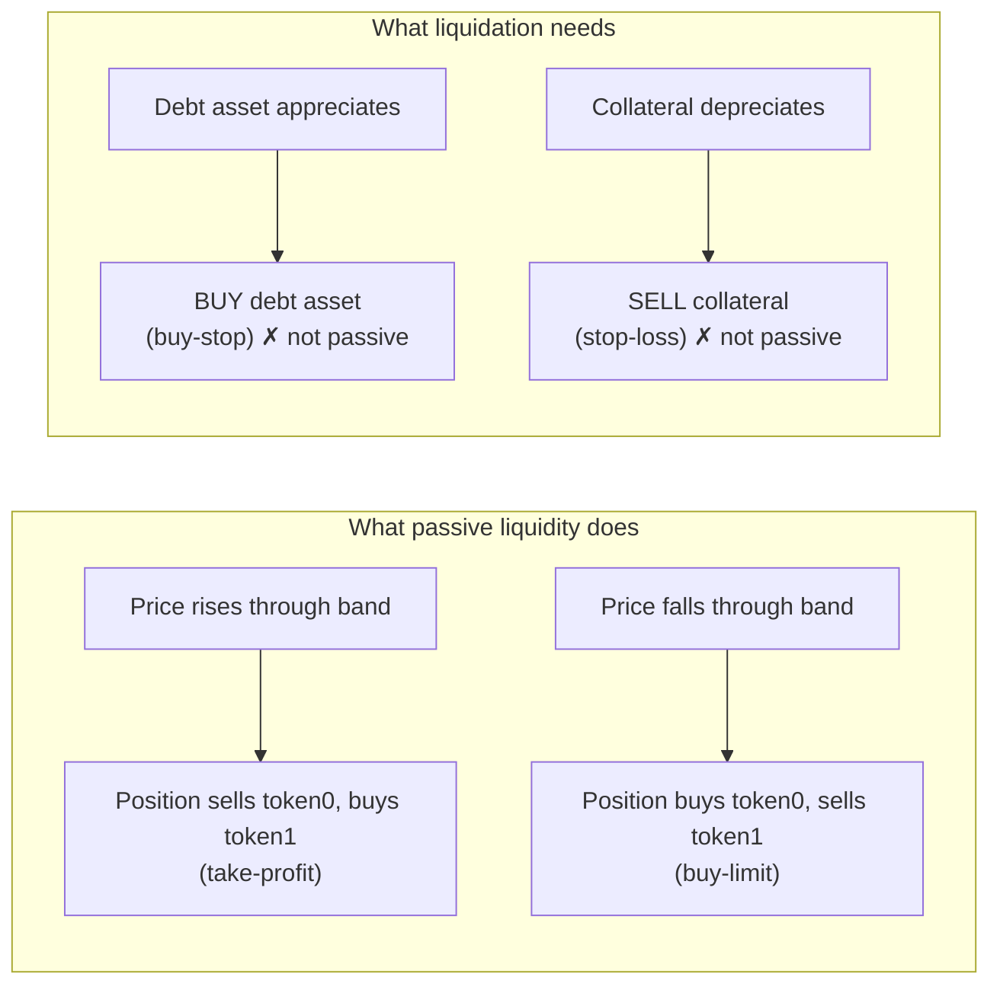
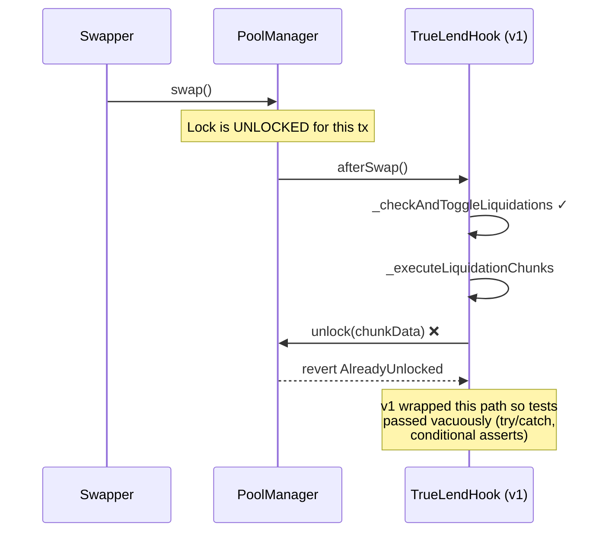
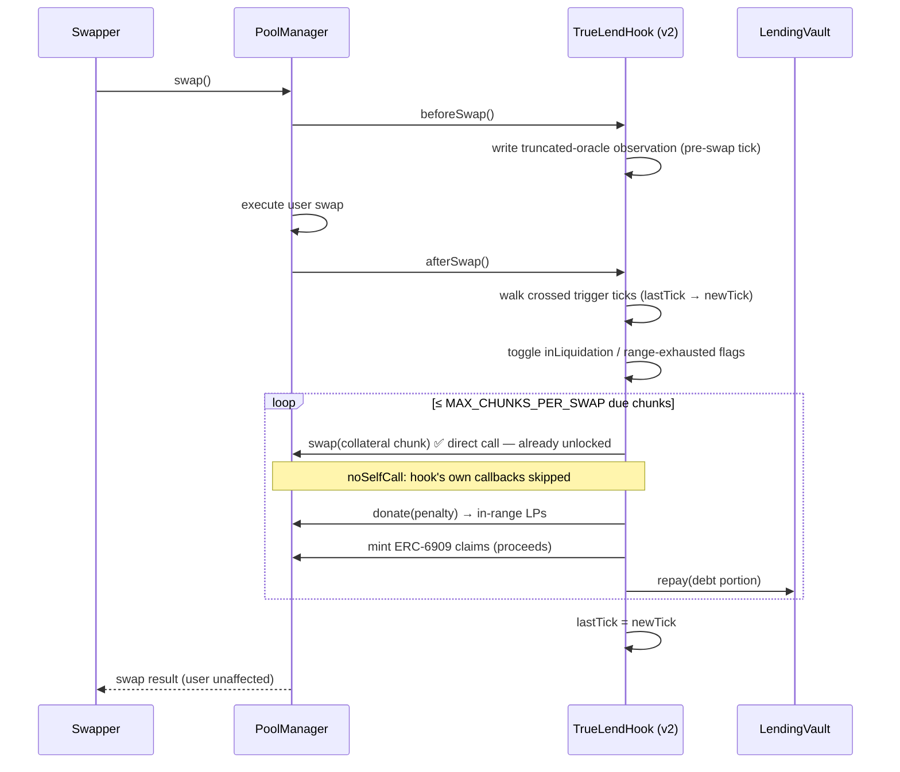
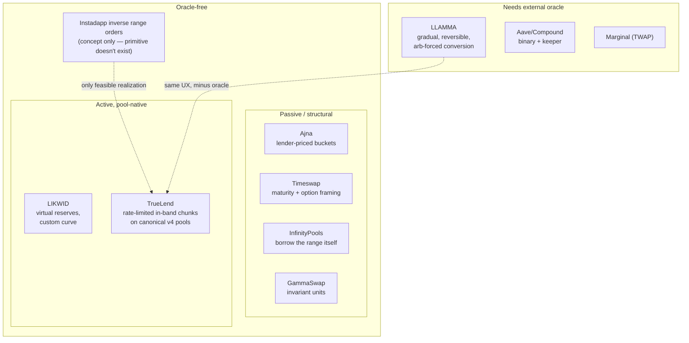
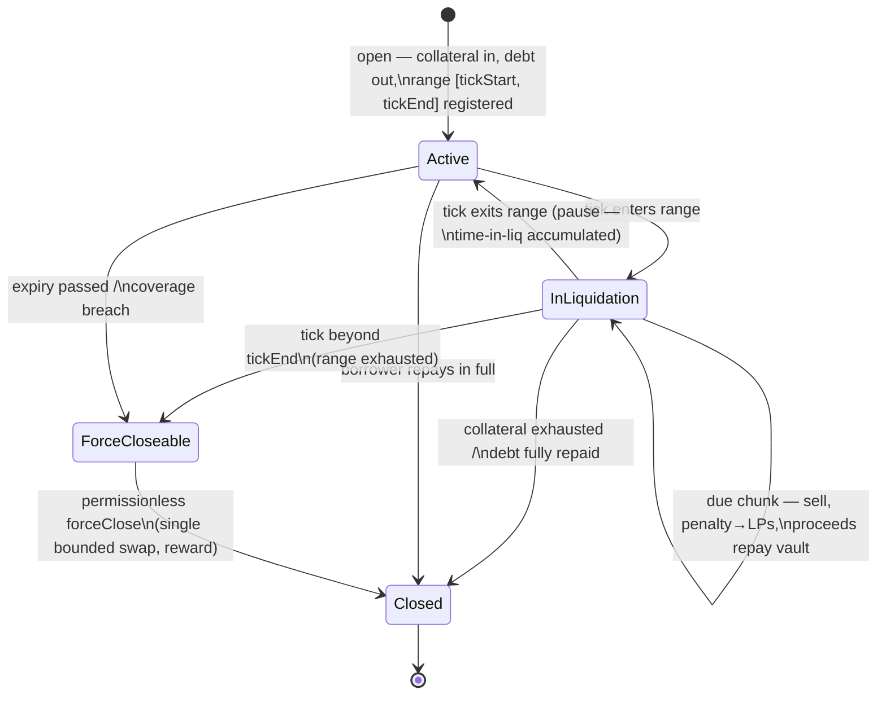

# TrueLend v2 — Research Report

Companion to [DESIGN.md](DESIGN.md). Everything here is background: prior art, Uniswap v4 mechanics, the inverse-range-order feasibility question, the comparison between the two candidate liquidation architectures, manipulation economics, and the math the implementation will rest on.

---

## 0. Executive summary

1. **The chunk mechanism is not a workaround — it is the only AMM-native way to do oracle-free gradual liquidation.** Passive Uniswap liquidity can only convert *against* the direction of price movement (take-profit side). Liquidation requires converting *with* the price movement (stop-loss side). Therefore liquidation can never be implemented as a passive LP position on the v4 curve; it must be *executed* — and rate-limited hook-executed conversion (TrueLend's chunks) is exactly that, with LLAMMA-grade gradualism but no oracle. §1 proves this; the user discovered it empirically during the hackathon when "inverse range orders" turned out not to be possible on v4.
2. **v1's only fatal bug was mechanical**: `unlock()` inside `afterSwap` always reverts (`AlreadyUnlocked`); the fix is calling `poolManager.swap()` directly from the callback. Everything else v1 lacked (lender side, real repayment, bounded gas, safe math) is completion work, not redesign. §3.
3. **Prior art triangulates TrueLend's position precisely**: Curve's LLAMMA does gradual/reversible liquidation *with* an oracle (its amplified quoting needs an external reference); Instadapp *proposed* the oracle-free version via "inverse range orders" but that primitive does not exist in v4 and the post never shipped; LIKWID went oracle-free by abandoning tick liquidity for virtual reserves. TrueLend = LLAMMA's UX, oracle-free, on canonical v4 pools. §4.
4. **The attackable moment in an oracleless lending hook is origination, not liquidation.** One manipulated block can mint bad debt at borrow time; at liquidation time manipulation just triggers rate-limited chunk sales and costs the attacker fees. Defense stack (truncated internal oracle, worse-of pricing, widen-only extremes, bootstrap gating, caps) in §5.
5. **Parameters that need financial modeling** (Phase 6 notebook): LT tiers vs pool depth, chunk pacing constants, penalty curve, IRM slopes, range width. The governing inequality: the LT→100% buffer must absorb traversal drift + chunk slippage + penalty + interest reserve. §7 and math in §8.

---

## 1. The inverse-range-order question (verified)

### 1.1 What passive liquidity can and cannot do

Uniswap position composition is a deterministic function of price. For liquidity `L` over `[P_a, P_b]` (prices as token1/token0, `√P` notation):

```
P ≤ P_a :  amount0 = L·(1/√P_a − 1/√P_b)          (100% token0)
P ≥ P_b :  amount1 = L·(√P_b − √P_a)              (100% token1)
in range:  amount0 = L·(1/√P − 1/√P_b),  amount1 = L·(√P − √P_a)
```

As price **rises** through a range, swappers are buying token0, so the position **sells token0 → token1**. As price **falls**, the position **buys token0 ← token1**. Passive liquidity always trades **against** the move — it is structurally the mean-reversion side. Uniswap's own docs state the consequence: range orders support **take-profit and buy-limit only**; *"you cannot use a Uniswap v3 LP position as a stop loss to sell into a falling market, and you can't use it to acquire an asset on its upside"* ([Uniswap docs — Range Orders](https://docs.uniswap.org/concepts/protocol/range-orders), [Uniswap support](https://support.uniswap.org/hc/en-us/articles/20980601560717-What-is-a-range-order), [Loesch — Uniswap as a limit-order machine](https://medium.com/@odtorson/how-to-use-uniswap-v3-as-a-limit-order-machine-a529cf369dd)).

### 1.2 Liquidation is always on the forbidden side

Check both borrow directions:

| Case | Collateral | Debt | Liquidation trigger | Required conversion | AMM-passive conversion in that price move |
|---|---|---|---|---|---|
| A | USDC (token1) | ETH (token0) | ETH appreciates (tick ↑) | sell USDC → **buy ETH as it rises** | positions **sell** ETH as it rises ✗ |
| B | ETH (token0) | USDC (token1) | ETH depreciates (tick ↓) | **sell ETH as it falls** → USDC | positions **buy** ETH as it falls ✗ |

Liquidation must trade **with** momentum (a stop order) in *both* configurations; passive liquidity trades against it in both. It is not even possible to *mint* the position that would help: single-sided deposits force the wrong asset on the relevant side (a band above spot accepts only token0; below spot only token1).



**Deeper statement:** an AMM can only be counter-momentum *with respect to its own price* — to supply momentum-side liquidity you need either an external reference telling you the market moved (an oracle: this is exactly why LLAMMA needs one, §4.1) or an agent actively executing (a keeper — or a hook). Oracle-free **passive** liquidation cannot exist. Oracle-free **active, in-band, rate-limited** liquidation is TrueLend.

### 1.3 What Instadapp's "inverse range order" actually was

The [Instadapp post](https://blog.instadapp.io/oracleless-lending-protocol-on-uniswap-v4/) (mid-2023; site now intermittently down, content verified via search index and two independent research passes) describes the inverse range order as *"similar to a **negative position**, matching a user's LP positions with an inverse order. The inverse order acts as a sort of **'reserve'**"* — when borrowing against ETH, *"an inverse range order of ETH is created on the USDC side of liquidity."*

A *negative* liquidity position — one that consumes LP-side conversion flow instead of adding its own — **does not exist in v4**. `modifyLiquidity` takes non-negative position liquidity; aggregate in-range liquidity backs real reserves; there is no primitive by which a hook position "absorbs" the conversion that in-range LPs would otherwise undergo. The post is a design concept written around a primitive Uniswap never shipped ("with Uniswap's introduction of 'inverse range orders'" — an introduction that didn't happen), and no implementation followed. This matches the hackathon experience: it is not possible on v4 as a passive construct.

Two ways a v4 hook *can* approximate it, and what they really are:

1. **Custom-accounting piggyback** (`beforeSwapReturnDelta`): on every swap moving price toward the liquidation zone, the hook injects extra sell-flow of the borrower's collateral into the swap. Feasible — but it (a) worsens every swapper's execution (routers will route around the pool), (b) executes at spot mid-swap with no pacing guarantee, and (c) is economically identical to selling chunks, just hidden inside other people's swaps. v1's stated goal — *"user's swap proceeds unaffected"* — rules this out deliberately.
2. **Hook-executed conversion in `afterSwap`** — sell collateral against the pool's (in-range LP) liquidity after the user's swap settles, rate-limited. **This is the chunk model.** The LPs are the counterparty (they absorb the collateral at band prices), which is precisely the role Instadapp's "reserve" assigned them — and TrueLend pays them for it with the penalty donation, which is Instadapp's "penalty rate to LPs," implemented with a primitive that actually exists (`donate()`).

So the design lineage is: *inverse range orders (not implementable) → their only sound v4 realization = rate-limited hook-executed conversion with LP compensation = TrueLend's chunk engine.* The hackathon design was the correct translation of the idea into v4's real capabilities.

---

## 2. The two candidate architectures, compared honestly

During this redesign I initially proposed replacing chunks with "collateral deployed as a passive range order in the liquidation band." That proposal was **wrong**, and not merely stylistically: it assumed the collateral could sit in a band on the liquidation side and convert to the debt asset as price moved adversely. Per §1, that conversion direction is exactly the one passive liquidity cannot perform — the band it required cannot even be minted single-sided in the needed orientation, and the "geometric-mean proceeds" formula I quoted (`C/√(P_a·P_b)`) applies to traversal in the *opposite* (take-profit) direction. The design would have parked collateral in a position that converts when the loan gets *safer* and does nothing when it gets riskier.

| Dimension | Chunk model (v1/v2, the design) | Passive range-order model (my proposal) |
|---|---|---|
| Feasibility on v4 | ✅ direct `swap()` in `afterSwap`, verified | ❌ requires momentum-side passive fills — impossible (§1) |
| Conversion driver | time-paced hook execution while in range | (intended) organic flow — in the direction flow cannot fill |
| Anti-cascade property | rate-limited selling: bounded fraction of any position per interval | (claimed) counter-pressure — but on the wrong side to matter |
| Reversibility | pause on range exit; sold chunks stay sold | (claimed) automatic re-conversion — again wrong direction |
| Solvency ex ante | probabilistic; buffer must cover traversal slippage (§8.5) | (claimed) closed-form geomean proceeds — formula misapplied |
| Keeper needs | none required; optional `poke()` accelerates quiet markets | none (moot) |
| LP compensation | penalty per chunk via `donate()` | in-band fee earnings (moot) |

**What survives from that detour** (all direction-agnostic, all in DESIGN.md): the ERC-4626 lender vaults + kinked IRM; the truncated-median internal oracle and origination hardening; trigger-tick bitmap + bounded per-swap work; ERC-6909 claims settlement; decimals-safe Q96 math; term/coverage backstop and bad-debt waterfall; the invariant test plan; and the full v4-mechanics verification (§6).

One footnote for completeness: a *take-profit* range order on the safe side of a position (auto-deleveraging into strength) **is** feasible and could someday be a borrower-opt-in feature. It is not liquidation and is out of scope.

---

## 3. Why v1 never executed a liquidation (root-cause chain)



`PoolManager.unlock()` reverts if the (single, global, transient) lock is already open — and during any swap it is. The correct v2 flow:



Secondary v1 defects and their fixes are tabulated in DESIGN.md §1: missing lender side → vaults; token-less `repayDebt` → real transfers + access control; unbounded loops → trigger bitmap + bounded queue + `poke()`; `sqrt(raw)<<96` → proper Q96 (§8.3); dead estimation heuristic → deleted.

---

## 4. Prior-art landscape and lessons

### 4.1 Curve LLAMMA (crvUSD / LlamaLend) — the oracle-dependent cousin
([whitepaper](https://resources.curve.finance/pdf/curve-stablecoin.pdf) · [explainer](https://docs.curve.finance/developer/crvusd/llamma-explainer) · [soft-liquidation docs](https://resources.curve.finance/crvusd/advanced-liquidation/))

- Collateral spread across N = 4–50 geometric price **bands** (width 1/A, A ≈ 100 ⇒ ~1% bands). In-band, collateral converts gradually to crvUSD as price falls and **re-converts on recovery** ("soft liquidation" / "de-liquidation") — the same UX TrueLend targets.
- **The engine is an oracle**: LLAMMA's internal quote is a function of an external EMA price `p_o`, deliberately over-reacting (`p_AMM ∝ p_o³/p²`), so when the oracle moves, LLAMMA quotes *worse-than-market* prices and **pays arbitrageurs to perform the conversion**. This is how it manufactures momentum-side liquidity — by importing the market's direction from the oracle (cf. §1.2's impossibility for oracle-free passive designs).
- Cost: borrower loses the arb spread; whitepaper simulation ≈ **1% of collateral for a 10% dip below threshold over 3 days**; empirical soft-liquidation loss ~1–2%/episode; losses grow with realized variance (each band round-trip pays the spread twice).
- **Hard backstop exists and is necessary**: health < 0 → external liquidator repays and seizes. Even with an oracle pushing conversion, gap-through produced bad debt (Oct 2025 CRV LlamaLend ≈ $700K; sDOLA post-mortem).
- Lessons for TrueLend: (a) gradual + reversible is proven UX; (b) more/narrower effective steps ⇒ smaller per-episode loss — chunk pacing is our analogue; (c) a hard backstop (`forceClose` past range end) is non-negotiable; (d) losses scale with volatility — model the LT buffer against realized variance, not price level.

### 4.2 Instadapp inverse range orders — the unshipped blueprint
([post](https://blog.instadapp.io/oracleless-lending-protocol-on-uniswap-v4/)) — covered in §1.3. Feature set it promised — LT 50–99% chosen by borrower, rates scaling with LT, 0% atomic penalty replaced by continuous decay penalty to LPs, LP triple revenue (fees + penalty + lending) — is essentially TrueLend's feature set; the mechanism it assumed doesn't exist, the mechanism that delivers it is the chunk engine.

### 4.3 LIKWID — oracle-free margin via virtual reserves
([docs](https://docs.likwid.fi/) · Uniswap-Foundation-granted v4 hook team, later moved to Monad)
Replaces `xy=k` with `(x+x′)(y+y′)=k` where `x′,y′` are borrowed "mirror" reserves; price, borrow limits and liquidation conditions derive from (time-smoothed) reserve state; positions in liquidation pay a continuous penalty to LPs. Confirms: oracle-free lending needs either curve surgery (their route, off-canon pools) or active in-band execution (TrueLend's route, canonical pools). Their time-smoothed reference + deviation-scaled dynamic fees echo our truncated-oracle origination defense.

### 4.4 Ajna — oracle-free by lender-expressed prices
([whitepaper](https://www.ajna.finance/pdf/Ajna_Protocol_Whitepaper_01-11-2024.pdf))
7,388 price buckets ~0.5% apart; lenders deposit at the highest collateral valuation they'll accept; a loan is solvent iff `collateral · LUP ≥ 1.04 · debt` where LUP is the marginal lender's price. Liquidation = bonded kick + 72h Dutch auction; wrong kicks lose the bond (auction clearing above the Neutral Price slashes it); bad debt settles against the highest (most optimistic) buckets first. Rates: governance-free ±10% steps every 12h off dual EMAs (MAU vs TU).
**Lessons**: origination fee = max(week of interest, 5 bps) and deposit fees as manipulation taxes (adopted); minimum loan size — dust kills every oracle-free averaging trick (adopted); bad-debt-to-most-optimistic-capital is a clean waterfall principle; and the adoption warning — lenders forced to actively manage price placement capped Ajna's TVL; TrueLend keeps lenders passive (vault deposit only).

### 4.5 Timeswap — maturity instead of liquidation
(v2 whitepaper) Fixed-strike, fixed-maturity pools; borrower default = walking away from a put struck at K; lenders knowingly sell that put; a 3-variable AMM `(x+y)·z = L²` prices interest per second with no oracle. **Lessons**: terms/maturities bound tail risk cleanly (adopted: 180d default term + interest reserve); "lender risk = short put" must be explicit in docs; per-(strike, maturity) fragmentation is the cost of fixed terms — one term-ladder per pool, not per position, if fragmentation bites.

### 4.6 InfinityPools — borrow the LP position itself
([docs](https://docs.infinitypools.finance/protocol-overview/introduction)) Traders borrow concentrated-liquidity ranges; because an LP position's worst-case composition over all prices is known ex ante, collateral = max shortfall ⇒ fully collateralized at every price, **no oracle, no liquidations**, leverage ≈ price/(price − strike). **Lessons**: range math gives price-independent worst-case bounds — we use the same closed forms for `forceClose` sizing; and the supply-side warning: elegant mechanisms without passive-capital UX get ~$140K TVL.

### 4.7 Panoptic — pool-history solvency checks
(whitepaper · v1.1/v4 code) Options as moved Uniswap liquidity; premium streams from realized fee growth ("streamia"). Solvency checked at an **internal median tick** (ring buffer maintained by the protocol itself, medianized over multiple observations) — never raw spot; liquidations blocked when |TWAP − spot| too wide; liquidation bonus capped; shortfalls haircut counterparty premia deterministically. **Lessons**: the internal-median pattern is our `TruncatedOracle`; haircut-yield-before-principal ordering in the waterfall; cap liquidation bonuses to kill manipulation-for-bonus.

### 4.8 GammaSwap — invariant-unit accounting
([docs](https://docs.gammaswap.com)) Debt and collateral both denominated in liquidity-invariant units `√(x·y)`, which swaps cannot change (fees only raise K) ⇒ flash manipulation can't move LTV; there is no liquidation *price*, only "time to liquidation" via interest. **Lessons**: where a quantity can be measured in invariant units, do so — spot drops out; utilization-based origination fees rising steeply past ~80% deter utilization attacks; rate caps (they use 1500% APY) bound the interest-runaway path our coverage trigger also guards.

### 4.9 Ammalgam — price-*range* solvency and depth-tied leverage
([docs](https://docs.ammalgam.xyz)) DEX+lending in one pair; six claim tokens; solvency uses **min/max over {spot, ~50-block geomean, ~1-week geomean}**, always the bound *against* the borrower at open and *for* the borrower at liquidation; `PriceExtremes` records per-interval min/max ticks and can only **widen**; borrows gated until windows fill after pool creation; debt grossed up by unwind slippage `D_in = ceil(L·D/(L−D))` (leverage physically bounded by pool depth); 100-tick saturation tranches with penalties to stop Sybil-split cascades; liquidation is a continuous Dutch gradient (eligible at 60% LTV with zero bonus, break-even 75%) so manipulated triggers earn liquidators nothing. **Lessons adopted**: worse-of range pricing, widen-only extremes, bootstrap gating, aggregate (not just per-position) depth caps, and the philosophical confirmation that LT must be a decreasing function of manipulability.

### 4.10 Others, briefly
**Numoen** (oracle-free power perps from a bespoke CFMM — elegant, dead: mechanism ≠ adoption). **Particle / Marginal / Itos** (LP-borrowing branch; Marginal is TWAP-dependent). **Bunni v2 am-AMM** (auction-managed fee capture — state of the art on the LVR problem; relevant if TrueLend pools ever suffer JIT/toxic-flow issues). **Milady Bank & other UHI lending hooks** (conventional oracle or keeper designs; none do gradual in-band conversion).

### 4.11 Positioning map



---

## 5. Manipulation economics and the origination defense stack

**Cost to move a v4 price**: within constant liquidity `L`, pushing `√P → √P′` requires `Δy = L·(√P′ − √P)`; round-trip cost ≈ 2·fee·notional + arb leakage, scaling with the integral of liquidity across traversed ticks. Uniswap's v3 analysis: moving a 30-min USDC/ETH TWAP 20% with 2 controlled blocks ≈ $709B; but **post-merge multi-block proposers collapse this** — consecutive slots let an attacker set a price in block N and unwind at the top of N+1 with zero arb exposure (a 1%-stake validator gets 3 consecutive slots ~every 5 months). Design assumption: **an adversary can print 1–2 blocks of arbitrary price for ~fees**.

Where that bites an oracleless lender, and the defenses (all in DESIGN.md §6):

| Moment | Attack | Defense |
|---|---|---|
| Borrow | pump collateral 1 block → overborrow → revert price | value collateral at **worse-of(spot, truncated median)**; truncation clamps recorded movement to ±9116 ticks (~2.49×) per update, so a spike needs ~15 sustained (arb-bleeding) blocks to enter the median; **widen-only per-interval extremes** poison the borrow bound even after reversion; min gap to `tickStart`; per-block borrow caps; origination fee |
| Pool creation | seed pool, fabricate its "history," borrow instantly | no origination until the observation window has filled |
| Liquidation | shove price into a victim's range | triggers *rate-limited* chunks only (bounded per-interval loss), penalty flows to LPs, and reversal pauses decay — attacker pays two-way fees to inflict a bounded, partially-recoverable cost. Zero atomic liquidation bonus ⇒ no bounty to farm (Ammalgam's zero-bonus-gradient logic) |
| Rate/utilization games | wash-borrow to spike rates | utilization hard cap, origination fee ≥ week of interest, kinked slopes |
| Sybil-split size caps | many small positions instead of one big one | aggregate saturation-style caps per tick region (Ammalgam), dust minimum |

**Why liquidation itself needs no price input**: the trigger is the pool's own tick crossing `tickStart` — by definition the state in which the collateral is actually convertible at those prices in this venue. There is nothing to "feed."

---

## 6. Uniswap v4 mechanics — verified facts the implementation relies on

Verified against pinned `v4-core` in this repo and the current upstream (`Uniswap/v4-core` main, Apr 2026):

1. **Lock semantics** — `unlock()` reverts `AlreadyUnlocked` if the global transient lock is open (PoolManager.sol L104–114). Inside any hook callback the manager is already unlocked: `swap`, `modifyLiquidity`, `donate`, `take`, `settle`, `mint`, `burn`, `clear` are all callable **directly** (`onlyWhenUnlocked`). All per-address currency deltas must be zero when the *outer* unlock returns (`NonzeroDeltaCount`), not per call.
2. **`noSelfCall`** — current `Hooks.sol` skips a hook's own callbacks (and delta application) when the hook itself is `msg.sender` to the PoolManager. Chunk swaps cannot recurse; v1's `_inLiquidationSwap` flag is obsolete.
3. **The archived TWAMM example has the same bug v1 had** (`unlock` from `beforeSwap`); the archived LimitOrder example shows the correct pattern (direct `modifyLiquidity` + ERC-6909 `mint` inside `afterSwap`). Copy LimitOrder's lock handling, never TWAMM's.
4. **`afterSwap` does not receive the pre-swap tick** — store `lastTick` per pool (`afterInitialize`, then each `afterSwap`); read the new tick via `StateLibrary.getSlot0`. Crossed-window walk: half-open interval between old and new tick, over a hook-side bitmap of trigger ticks (O(triggers crossed)).
5. **ERC-6909 claims** — PoolManager is itself the claims token (`currency.toId()`); `mint(self, id, amt)` converts a positive delta into a persistent claim balance (no ERC-20 pull), `burn` pays debts; `CurrencySettler` wraps both; `clear()` waives dust. Gas-optimal treasury for a hook that transacts every swap.
6. **`donate()`** — accrues to *currently in-range* liquidity via `feeGrowthGlobal`; reverts if no active liquidity; JIT-frontrunnable (donations are announced by the swap that triggers them) — acceptable for an incentive stream, never for solvency; callable from `afterSwap`.
7. **Fee mechanics on hook-owned positions** — `modifyLiquidity(liquidityDelta=0)` pokes fees; reverts `CannotUpdateEmptyPosition` on empty positions. (v2 uses hook-owned positions nowhere in the liquidation path — only relevant if a future feature parks funds as LP.)
8. **Custom accounting** (`beforeSwapReturnDelta`/`afterSwapReturnDelta`) — lets a hook charge/inject amounts in specified/unspecified currencies around a swap; this is the primitive the "piggyback" variant of inverse range orders would use (§1.3), rejected for worsening swapper execution. Not used in v2.
9. **Oracle placement** — GeomeanOracle/TruncGeoOracle write observations in `beforeSwap` with the **pre-swap tick**; truncation constant `MAX_ABS_TICK_MOVE = 9116`. v2 mirrors this.
10. **Deploy/deps** — hook flags live in the low 14 bits of the address; `HookMiner.find` + canonical CREATE2 factory; constructor args are part of the init-code hash (changing them invalidates the mined salt). `BaseHook` left v4-periphery main (canonical home now OpenZeppelin `uniswap-hooks`, which also maintains `LimitOrderHook` and `LiquidityPenaltyHook`); pin a tagged periphery release or adopt OZ in Phase 0. This repo's `lib/v4-periphery` is a broken submodule (files on disk, not git-tracked) — re-pin. EIP-1153 ⇒ Cancun+ chains only.

---

## 7. The lending protocol around the liquidation engine

### 7.1 Interest rates
Utilization-kinked (Aave-shape): `r(U) = base + slope1·min(U, U*) + slope2·max(U − U*, 0)`; defaults `base 0%, slope1 4%, U* 80%, slope2 100%`, **hard borrow cap at U = 90%** — the cap is load-bearing: chunk repayments and lender withdrawals must always clear, and at 100% utilization liquidation proceeds have nowhere to settle cleanly. Reserve factor 10% of interest → first-loss buffer. Ajna's governance-free multiplicative drift (±10%/12h) is the fallback if fixed slopes prove mis-set; a rate **ceiling** feeds the coverage check (§8.5).

### 7.2 Position lifecycle



### 7.3 Bad-debt waterfall
`vault reserve buffer → haircut accrued interest (pro-rata) → haircut principal shares (pro-rata)` — declared in the contract so lenders can price the tail (Panoptic's yield-before-principal ordering; Ajna's optimist-pays-first is inapplicable since our lenders don't express prices).

---

## 8. Math appendix

### 8.1 Notation
Pool price `P` = token1 per token0; `√P` in Q96 (`sqrtPriceX96 = √P · 2⁹⁶`); tick `t`: `P = 1.0001^t`. Position `(L, [t_a, t_b])` composition as in §1.1. All implementation math via `TickMath` / `SqrtPriceMath` / `FullMath` / `LiquidityAmounts` — decimals never appear explicitly (they live inside token amounts).

### 8.2 Take-profit fill price (kept for reference, with its correct direction)
A single-sided token0 deposit `X` in `[P_a, P_b]` **above** spot, fully traversed **upward**, yields token1:
`Y = X·√(P_a·P_b)` — execution at the geometric mean `√(P_a P_b)`.
Symmetrically, token1 `Y` in a band **below** spot traversed **downward** yields `X = Y/√(P_a·P_b)`.
These are the only two passive conversions that exist (take-profit / buy-limit); neither is the liquidation direction (§1.2). Retained because `forceClose` and safe-side auto-deleverage (future feature) price off them.

### 8.3 Liquidation range placement (decimals-safe)
Loan: collateral `C` (token1), debt `D` (token0), threshold `LT ∈ (0,1]`. Liquidation starts where `debtValue = LT · collateralValue`:

`D · P_liq = LT · C  ⟹  P_liq = LT · C / D`

Implementation without floating point or decimal assumptions — work in √-space:

```
sqrtP_liq_X96 = sqrt( LT_bps · C · 2¹⁹² / (D · 10⁴) )        // FullMath.mulDiv + sqrt, Q96 out
tickStart     = TickMath.getTickAtSqrtPrice(sqrtP_liq_X96)    // rounded toward safety
tickEnd       = tickStart + RANGE_WIDTH                        // e.g. ln(√2)/ln(1.0001) ≈ 3466 ticks
```

Direction B (collateral token0, debt token1): `P_liq = D / (LT · C)` and the range extends downward (`tickEnd = tickStart − RANGE_WIDTH`). v1's `sqrt(rawRatio) << 96` gave `√(P)·2⁹⁶` only when `C/D` was a small integer ratio in equal decimals — the Q96 form above is exact for any pair.

### 8.4 Chunk pacing (v1 formula, bps-normalized)
```
due(t)   = (t − lastChunk) ≥ CHUNK_INTERVAL
depth    = clamp((tick − tickStart)/(tickEnd − tickStart), 0, 1)        // direction-adjusted
pressure = clamp(positionCollateralValue / activeLiquidityValue, 0, 1)
chunk    = clamp( (C_rem/TARGET_CHUNKS) · min((t−lastChunk)/CHUNK_INTERVAL, T_CAP)
                  · (1 + depth) · (1 + pressure),  MIN_CHUNK, min(MAX_CHUNK, C_rem) )
```
Properties: full decay takes ≥ `TARGET_CHUNKS · CHUNK_INTERVAL / (max multipliers)` even if price camps in-range (≈ 25 min at defaults' extreme, ≈ 100 min typical — the anti-cascade rate limit); deeper adversity or thinner books accelerate; `MAX_CHUNK ≤ x bps of active liquidity` bounds per-chunk impact.

### 8.5 Solvency buffer (the modeling target)
Let `s` = average execution slippage+fees of chunk sales across the range, `π` = penalty share, `i(T)` = interest reserve to term at the rate ceiling, `μ` = adverse drift while decaying. Lender wholeness at full decay requires approximately:

`(1 − LT_gap) · (1 − s − π) · (1 − μ) ≥ D·(1+i(T)) / (C · P_liq)`  ⟹  the LT→100% gap must satisfy
`gap ≳ s + π + i(T) + μ  (first order)`

`μ` is the volatility term: with decay duration `τ` (from §8.4 pacing) and volatility `σ`, `μ ~ σ·√τ` in expectation-shortfall terms — this is the LLAMMA-like "loss quadratic in excursion" analogue and the core of the Phase 6 notebook: choose `TARGET_CHUNKS`, `CHUNK_INTERVAL`, `RANGE_WIDTH`, and the max-LT tier per pool depth so `gap` covers `s + π + i + μ` at, say, 99th-percentile historical σ. Faster decay ⇒ smaller `μ` but larger `s` (impact); the notebook sweeps this tradeoff.

### 8.6 Penalty (v1 shape, capped)
`penalty = proceeds · BASE_PENALTY · (LT/100) · min(1 + timeInLiq/1h, TIME_CAP)` → `donate()` to in-range LPs (minus the poke/settlement reward sliver). Rationale: scales with the risk the borrower chose (LT) and with how long LPs carried the decay flow; capped so late-stage decay isn't confiscatory.

### 8.7 LVR / adverse-selection context (why fees don't rescue passive designs)
`LVR = (σ²/8) · V` per unit time for constant-product value `V`; concentrated positions multiply both fees and LVR by the concentration factor; JIT strips ~85% of passive fee share on benign flow where it strikes. Included for completeness: it quantified why the passive proposal's "fees offset the borrower's cost" argument was weak *even before* the direction analysis killed the design outright.

### 8.8 Manipulation cost reference
Moving spot across `[√P, √P′]` in constant `L`: `Δy = L(√P′−√P)`, `Δx = L(1/√P − 1/√P′)`; TWAP shift by factor `p` over window `W` holding `k` blocks needs spot moved to `p^(W/k)`; truncation at ±9116 ticks/update ⇒ recorded price moves ≤ 2.49×/observation regardless of spot — an attacker must sustain (and bleed arb) for ~`log_{2.49}(target)` observations.

---

## 9. Sources

**Uniswap mechanics**: [v4-core](https://github.com/Uniswap/v4-core) (PoolManager.sol, Hooks.sol, Position.sol, StateLibrary.sol) · [Range orders — docs](https://docs.uniswap.org/concepts/protocol/range-orders) · [Range orders — support](https://support.uniswap.org/hc/en-us/articles/20980601560717-What-is-a-range-order) · [Loesch, limit-order machine](https://medium.com/@odtorson/how-to-use-uniswap-v3-as-a-limit-order-machine-a529cf369dd) · [Truncated oracle hook](https://blog.uniswap.org/uniswap-v4-truncated-oracle-hook) · [v3 oracle manipulation costs](https://blog.uniswap.org/uniswap-v3-oracles) · [JIT study](https://blog.uniswap.org/jit-liquidity) · [custom accounting guide](https://developers.uniswap.org/contracts/v4/guides/custom-accounting) · [v4-template deploy script](https://github.com/Uniswap/v4-template) · [OZ uniswap-hooks](https://github.com/OpenZeppelin/uniswap-hooks) · [saucepoint v4-stoploss](https://github.com/saucepoint/v4-stoploss)

**Prior art**: [Instadapp oracleless lending](https://blog.instadapp.io/oracleless-lending-protocol-on-uniswap-v4/) · [crvUSD whitepaper](https://resources.curve.finance/pdf/curve-stablecoin.pdf) · [LLAMMA explainer](https://docs.curve.finance/developer/crvusd/llamma-explainer) · [soft liquidations](https://resources.curve.finance/crvusd/advanced-liquidation/) · [IntoTheBlock on crvUSD losses](https://medium.com/intotheblock/crvusd-liquidating-them-softly-20079dcb527d) · [sDOLA post-mortem](https://gov.curve.finance/t/llamalend-sdola-long2-post-mortem/11020) · [LIKWID docs](https://docs.likwid.fi/) · [Ajna whitepaper](https://www.ajna.finance/pdf/Ajna_Protocol_Whitepaper_01-11-2024.pdf) · [Block Analitica Ajna liquidations](https://blockanalitica.substack.com/p/ajna-liquidation-analysis) · [Timeswap whitepaper](https://timeswap.io/whitepaper.pdf) · [InfinityPools docs](https://docs.infinitypools.finance/protocol-overview/introduction) · [Panoptic paper](https://arxiv.org/abs/2204.14232) · [Panoptic liquidations](https://panoptic.xyz/docs/panoptic-protocol/liquidations) · [GammaSwap docs](https://docs.gammaswap.com) · [Ammalgam docs](https://docs.ammalgam.xyz) · [Bunni v2](https://docs.bunni.xyz/docs/v2/technical/overview/) · [Monad on LIKWID](https://blog.monad.xyz/blog/amm-that-could-lend)

**Economics**: [LVR paper (MMRZ)](https://arxiv.org/pdf/2208.06046) · [a16z LVR explainer](https://a16zcrypto.com/posts/article/lvr-quantifying-the-cost-of-providing-liquidity-to-automated-market-makers/) · [Euler TWAP attack cost](https://github.com/euler-xyz/uni-v3-twap-manipulation/blob/master/cost-of-attack.tex) · [ChainSecurity post-merge oracle attacks](https://www.chainsecurity.com/blog/oracle-manipulation-after-merge) · [multi-block MEV measurement](https://arxiv.org/pdf/2501.12827) · [JIT attacks (IACR 2023/973)](https://eprint.iacr.org/2023/973.pdf) · [Aave IRM](https://www.rareskills.io/post/aave-interest-rate-model) · [ADL trilemma](https://arxiv.org/html/2512.01112v2)
