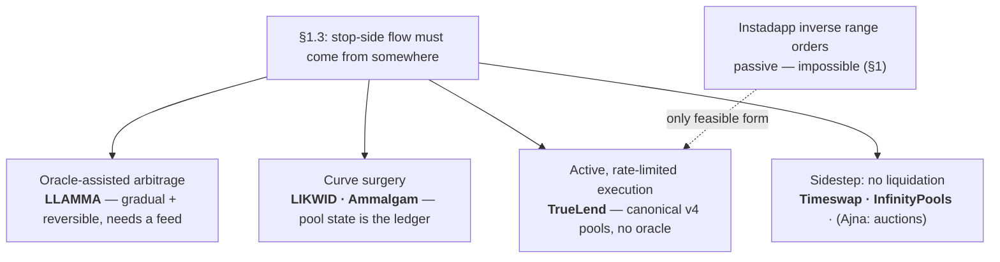

# TrueLend — Research Report

This report is the background for [DESIGN.md](DESIGN.md): the reasoning that selected TrueLend's mechanism over every alternative. It is organized as one argument, built in order. First we ask whether an AMM can liquidate a loan *by itself*, with no outside help — and prove that it cannot (§1). That impossibility sorts every existing protocol into exactly four families, which gives us a map of the design space (§2) and a reading list: what each prior protocol did about the same obstacle, and what it teaches (§3). We then examine what an oracle-free protocol actually has to defend against (§4), record for posterity an alternative architecture that was evaluated and rejected during this redesign (§5), and close with the mathematics the implementation stands on (§6) and an appendix on extending the same engine to perpetuals.

Vocabulary follows [DESIGN.md](DESIGN.md), which defines every protocol term as it introduces it; research-side terms (arbitrageur, TWAP, first-passage, and so on) are defined here at first use.

---

## 1. The central question: can the AMM liquidate passively?

Imagine the most elegant version of AMM-native lending anyone could propose. The borrower's collateral is not held in escrow by a contract — it is deposited *into the pool itself*, as liquidity spanning the prices where the loan would be in trouble. If the price deteriorates, ordinary trading converts the collateral into the debt token automatically, piece by piece, with no keeper, no executor, and no gas spent by anyone. If the price recovers, trading converts it back. The pool liquidates the loan, and un-liquidates it, by itself.

This idea is so natural that it has been independently proposed more than once — Instadapp named it the **inverse range order** in 2023 — and it was the first thing tried in TrueLend's own hackathon build. It does not work, and cannot be made to work. Understanding exactly why is the most valuable page in this report, because the impossibility is what forces every design that follows.

### 1.1 What a liquidity position does as the price moves

A Uniswap position is a deposit of tokens spread across a chosen price range. Which token the position holds at any moment is not up to its owner — it is a mechanical function of where the current price sits. For a position with liquidity $L$ over the range $[P_a, P_b]$ (prices quoted as token1 per token0):

$$
\text{amount}_0 = L\left(\frac{1}{\sqrt{P}} - \frac{1}{\sqrt{P_b}}\right), \qquad
\text{amount}_1 = L\left(\sqrt{P} - \sqrt{P_a}\right), \qquad P \in [P_a, P_b],
$$

with the position holding 100% token0 below the range and 100% token1 above it.

Now follow one price traversal and ask who is trading with whom. When the price *rises*, it rises because swappers are buying token0 from the pool — and what they buy comes out of the in-range positions. So as the price rises, every position is **selling token0**. Symmetrically, as the price falls, every position is **buying token0**. This is not a design choice that could have gone another way; it is what "providing liquidity" means. Passive liquidity is structurally the counterparty to every trade, which makes it structurally the *mean-reversion* side of every move: it sells what is getting expensive and buys what is getting cheap.

As an order type, then, a liquidity position offers its owner exactly two services. Deposit token0 above the current price, and it will be sold off as the price rises through the range — a **take-profit**. Deposit token1 below the current price, and it will buy token0 as the price dips — a **buy-limit**. Uniswap's own documentation draws the boundary explicitly: an LP position *cannot* function as a stop-loss — it cannot sell into a falling market, and it cannot buy into a rising one.

### 1.2 Liquidation is precisely the forbidden trade

What does liquidating a loan require? Write it down for both possible configurations of an ETH/USDC market, and the problem appears immediately:

| Collateral | Debt | The loan sours when… | Liquidation must… | Passive liquidity instead… |
|---|---|---|---|---|
| ETH | USDC | ETH **falls** | **sell ETH as it falls** | *buys* ETH as it falls ✗ |
| USDC | ETH | ETH **rises** (the debt appreciates) | **buy ETH as it rises** | *sells* ETH as it rises ✗ |

Liquidation is always a **stop order**: it must trade *with* the direction of the move, selling collateral into weakness or buying the debt asset into strength. In both configurations that is exactly the trade passive liquidity cannot make. The mismatch is even physical: the position that would help cannot be *minted*, because a single-sided deposit below the current price only accepts token1, and above it only token0 — the wrong token on the relevant side, in both cases.

### 1.3 The impossibility, stated once

> An AMM position can only trade counter to the movement of the pool's own price. To supply flow *with* the movement — to sell what is falling or buy what is rising — someone must either (a) tell the pool that the outside market has moved, which is an **oracle**, or (b) execute the trade as an agent: a keeper, or a hook. **Oracle-free passive liquidation therefore cannot exist.** An oracle-free liquidation must be *active* — the only freedom is in how gently the activity is shaped.

TrueLend shapes it as rate-limited, pausable, in-range chunks. But before designing that, it is worth seeing what everyone else did when they hit this same wall.

### 1.4 What the "inverse range order" actually proposed — and why v4 can't express it

Instadapp's 2023 post proposed the passive version anyway, by imagining a new primitive. Their inverse range order is described as "similar to a **negative position**, matching a user's LP positions with an inverse order" that "acts as a sort of *reserve*" — for a loan against ETH, "an inverse range order of ETH is created on the USDC side of liquidity."

"Negative position" is the tell. The construct requires a position that *absorbs* the conversion other LPs would undergo — negative liquidity — and no such primitive exists in Uniswap v4: position liquidity is non-negative, in-range liquidity backs real reserves, and no hook capability lets one position soak up another's fills. The post's own phrasing ("with Uniswap's introduction of inverse range orders") anticipated a Uniswap feature that never shipped, and nothing was ever built. This matches TrueLend's hackathon experience of attempting the construction against real v4 and finding no way through.

There are exactly two honest ways a v4 hook can *approximate* the idea, and examining them shows why the second is TrueLend:

1. **Piggyback on other people's swaps** (custom accounting): whenever a swap pushes the price toward a liquidation zone, the hook injects extra sell-flow of the borrower's collateral into that swap. Feasible — but every swapper crossing the zone gets worse execution than they quoted (routers would learn to avoid the pool), the fills follow no pacing, and economically it is still active selling, merely hidden inside someone else's trade.
2. **Execute after other people's swaps**: once a swap settles, the hook sells a small, bounded chunk of collateral against the pool's liquidity, in the same transaction, leaving the swapper's own execution untouched. The LPs are the counterparty — exactly the "reserve" role Instadapp assigned them — and TrueLend pays them a penalty for it via v4's native `donate()`, which is Instadapp's "penalty rate to LPs" built from a primitive that actually exists.

The lineage is worth stating plainly: *inverse range orders (unimplementable) → their only sound v4 realization is rate-limited hook-executed conversion with LP compensation → which is TrueLend's chunk engine.*

---

## 2. The design space the impossibility creates

Every gradual-liquidation protocol in production or proposal is one answer to §1.3. There are four:

| Answer | How the stop-side flow gets made | Example | What it costs |
|---|---|---|---|
| **Import direction from an oracle** | quote deliberately worse-than-market prices around the feed, so profit-seeking **arbitrageurs** (traders who correct price gaps between venues) perform the conversion | Curve LLAMMA | the oracle dependency; the borrower pays the arbitrage subsidy |
| **Rebuild the AMM's curve** | add virtual "borrowed" reserves to the invariant so the pool's own state tracks debt | LIKWID, Ammalgam | non-canonical pools; an entirely new AMM risk surface |
| **Execute actively, rate-limited** | a hook sells bounded chunks against in-range liquidity | **TrueLend** | execution is active; solvency is a modeled buffer rather than a closed form |
| **Avoid liquidation entirely** | fixed maturities, worst-case collateralization, or auctions | Timeswap, InfinityPools, Ajna | capital inefficiency, or keeper games reappear elsewhere |

TrueLend's cell — gradual, reversible-by-pause, oracle-free, on unmodified Uniswap pools — was empty before this protocol. The next section walks the other cells, because nearly every defensive mechanism TrueLend uses was learned from someone in them.

---

## 3. Prior art, organized by what it teaches

### 3.1 Curve LLAMMA — the oracle-assisted cousin, and the benchmark for "gradual"

LLAMMA, the liquidation engine behind Curve's crvUSD, is the only gradual liquidation system with years of production history, and it is TrueLend's closest relative: the same goals, the opposite answer to §1.3.

Its collateral sits in a stack of narrow price bands (about 1% wide each). As the price falls through a band, that band's collateral converts to crvUSD; if the price recovers, it converts back — Curve calls these "soft liquidation" and "de-liquidation," and they are precisely the reversibility TrueLend also wants. But the conversion is not performed by organic trading. LLAMMA's internal quote is a function of an external oracle price, engineered to *over-react* to it: when the oracle falls, LLAMMA briefly becomes the worst-priced venue in the market, and arbitrageurs profit by doing the converting. That is §1.3 option (a) in its purest form — the oracle manufactures the stop-side flow, and the arbitrageurs' profit is the borrower's cost. Curve's own numbers put that cost around 1% of collateral for a 10%-below-threshold excursion held three days, growing with volatility, since every band the price re-crosses pays the spread twice.

What LLAMMA proves and warns: gradual, reversible liquidation is *proven user experience* at billion-dollar scale — borrowers demonstrably accept a small continuous cost to escape the guillotine. Finer steps mean smaller per-episode losses (TrueLend's analogue of band count is its chunk pacing). And most soberingly: **even with an oracle actively forcing conversion, price gaps still outran it** — a 2025 LlamaLend market took ~$700K of bad debt when the market moved faster than rebalancing. The lesson TrueLend takes verbatim is that a gradual mechanism must carry a hard backstop behind it, and its loss path must be explicit.

### 3.2 The curve-surgery family — LIKWID, Ammalgam, GammaSwap

These protocols avoid the oracle by rebuilding the market itself, so that the pool's own state *is* the risk ledger.

**LIKWID** replaces the constant-product invariant with $(x + x')(y + y') = k$, where the primed values are borrowed "mirror" reserves: price, borrow limits, and liquidation conditions all derive from (time-smoothed) reserve state, and liquidating positions pay a continuous penalty to LPs. It began as a Uniswap-Foundation-granted v4 hook team and ended up building its own AMM on another chain — a measure of how far from canonical pools this route pulls.

**Ammalgam** merges a DEX and a lender into one pair contract, and contributes the best *defensive toolkit* in the space, four pieces of which TrueLend adopts at origination. Solvency prices are treated as a **range, not a point** — the worse (for the borrower) of spot, a ~50-block average, and a ~week average. Per-interval price *extremes* are recorded and can only ever **widen** the risk bounds, so a spike-and-revert still counts against the next borrower. New pools are **gated** from borrowing until their price history fills. And maximum leverage is tied to the pool's own depth, with aggregate (not merely per-position) exposure caps, so the cap cannot be dodged by splitting a position across addresses. Ammalgam also arrives independently at a principle TrueLend shares: liquidation triggers should carry **no atomic bonus** for the trigger-puller, so that a manipulated trigger farms nothing.

**GammaSwap** lends LP tokens and measures *both* debt and collateral in units of the pool invariant $\sqrt{xy}$ — a quantity no swap can change (fees only increase it). Solvency becomes immune to price manipulation, and there is no liquidation price at all, only a "time to liquidation" driven by interest. The trick needs positions that are naturally balanced 50:50, so it cannot transfer to token-vs-token debt directly — but its spirit survives in TrueLend as the observation that *the liquidation trigger itself needs no valuation* (a tick crossing is a fact, not an estimate), leaving origination as the only moment to armor.

### 3.3 The sidestep family — no liquidation at all

**Timeswap** gives loans a fixed strike and a fixed maturity; a borrower who walks away simply forfeits the collateral, so lending is knowingly selling a put option, priced by the pool with no oracle anywhere. Its lesson for TrueLend is the **term**: a maturity converts unbounded tail risk into bounded, priceable risk — which is exactly why TrueLend loans expire, since interest is the one force that erodes a position without the price moving. Its cost — liquidity fragmented across every strike-and-maturity pair — is why TrueLend uses one term per pool rather than bespoke terms per loan.

**InfinityPools** lets traders borrow LP *positions* themselves; because a range's composition at every possible price is known in advance, requiring collateral equal to the worst case makes the loan safe everywhere, with no oracle and no liquidation. Two takeaways: closed-form worst-case range math (TrueLend uses the same forms to size its backstop sales), and a market warning — the protocol's elegance did not create liquidity, and its TVL stayed negligible. Mechanism design does not substitute for a passive-capital experience, which is why TrueLend keeps lenders strictly passive.

**Ajna** is oracle-free but not liquidation-free: lenders deposit at the highest collateral price they will accept, solvency compares debt against the marginal lender's price, and liquidation runs as a bonded auction where a wrongful trigger loses its bond. TrueLend adopts its economics of friction — an **origination fee** as a manipulation tax and a **minimum position size** (dust breaks every averaging defense an oracle-free system leans on) — and treats its adoption history as the same warning InfinityPools gives: forcing lenders to actively manage prices caps growth.

**Panoptic** (perpetual options built from Uniswap liquidity) contributes one specific tool: it checks solvency not at spot but at a **median over a ring of the pool's own recent ticks**, maintained by the protocol itself — essential on v4, where pools have no built-in oracle. TrueLend's price filter is this pattern plus Uniswap's truncation research. Panoptic also orders its loss-sharing so accrued *yield* is haircut before anyone's principal — the shape TrueLend's waterfall follows (reserves, which are accumulated interest, absorb losses before lender principal).

### 3.4 Everything adopted, in one paragraph

From LLAMMA: the hard backstop behind the soft mechanism, and modeling losses against realized variance rather than price levels. From Ammalgam: worse-of range pricing, widen-only extremes, the bootstrap gate, depth-tied and Sybil-resistant caps, zero-bonus triggers. From GammaSwap: valuation-free triggers, rate ceilings, steep late-utilization pricing. From Timeswap: terms. From InfinityPools: worst-case range math, and lenders-stay-passive. From Ajna: origination fees and dust minimums. From Panoptic: the internal median filter and yield-before-principal loss ordering.

---

## 4. What an oracle-free lender actually has to defend

### 4.1 The threat model: assume the price can lie, briefly

Moving a pool's spot price is not free — pushing it requires capital exposure plus fees, scaled by the pool's depth — and the classical analysis of manipulating a **TWAP** (a time-weighted average price) made long-window manipulation astronomically expensive. That comfort died with Ethereum's move to proof-of-stake. A validator who proposes two *consecutive* blocks can set any price at the end of the first and unwind it at the top of the second, exposed to no arbitrage in between, paying roughly swap fees. Consecutive-slot proposers are routine — a 1%-stake validator sees three in a row every few months. The honest modern assumption, which this design makes everywhere, is: **an adversary can buy one or two blocks of arbitrary pool price for approximately the cost of the fees.**

### 4.2 Why liquidation is the safe side, and origination the exposed one

Here the design's shape pays for itself. Suppose the adversary shoves the price into a victim's liquidation range. What have they bought? A *rate-limited* decay begins: bounded loss per interval, penalties flowing to LPs, and the whole process pausing the moment the adversary stops holding the price there. There is no liquidation bonus to collect (no atomic liquidation exists) and no forced one-shot sale to trade against. The attacker pays two-way fees and slippage to inflict a small, partially recoverable cost on someone else — an attack with *negative* expected value. Gradualness is not just borrower-friendly; it is what makes the oracle-free trigger safe to expose.

Origination has no such structural protection: a manipulated valuation at open mints real bad debt (pump the collateral's price, borrow against the inflated value, let it revert). Every opening defense in [DESIGN.md §6](DESIGN.md) maps to a specific move available to the two-block adversary:

| Adversary's move | The defense that kills it |
|---|---|
| spike the spot price in the borrow block | collateral valued at the **worse of** spot and the truncated median — the clamp (±9,116 ticks per observation) means a spike needs many sustained, arbitrage-bleeding minutes to reach the record |
| spike and revert *within* one observation interval | widen-only extremes record the excursion against the borrower anyway |
| create a fresh pool with a fabricated history | no borrowing until the observation ring has filled |
| grind rates or split positions to dodge size caps | origination fee, utilization hard cap, minimum position size |

### 4.3 A note on interest-rate design

Utilization-kinked curves are the industry standard because the kink defends a *liquidity buffer* — near-full utilization must be punitively expensive, since withdrawals and repayments need free cash to clear. TrueLend's version is stricter than most (a **hard** cap at 90% on top of the steep slope) for a reason specific to this design: liquidation proceeds themselves settle through the vault, so the buffer is part of the liquidation machinery, not just depositor convenience. A rate **ceiling** exists as well, because the opening health margin must be sized against the worst rate a position could ever face.

---

## 5. The road not taken (recorded so it stays not-taken)

During this redesign, an architecture was seriously evaluated that would have replaced chunk execution entirely: deposit the borrower's collateral as a passive liquidity position spanning the liquidation band, let ordinary flow convert it, and treat reversals as automatic de-liquidation — with "guaranteed" proceeds computable in closed form.

It fails on §1 grounds, completely. The conversion it relies on runs in the stop direction, which passive liquidity cannot fill, in either borrow configuration; the band it requires cannot even be minted single-sided in the needed orientation; and the closed-form proceeds formula it quoted (the geometric-mean fill of a fully traversed range) is real mathematics for the *take-profit* direction, applied to the wrong traversal. In practice the position would convert when the loan got *safer* and sit inert as it got riskier.

The evaluation still paid rent: everything direction-agnostic it produced was kept — the vault design, the price filter and its opening rules, the trigger bitmap, the term-and-backstop structure, the loss waterfall. And one fragment survives as a legitimate future feature: a take-profit range order on the *safe* side of a position (automatic deleveraging into strength) is exactly the order type the AMM does offer, and composes naturally as opt-in periphery.

---

## 6. Mathematical reference

Notation: price $P$ = token1 per token0; $\sqrt{P}$ is stored in Q96 fixed point; ticks satisfy $P = 1.0001^t$. Implementation uses exact full-width integer math throughout — token decimals never appear in formulas because they live inside raw amounts.

**6.1 Passive fill prices** (take-profit direction — used only to size backstop sales). A single-sided amount $X$ of token0 in $[P_a, P_b]$ above spot, fully traversed upward, yields $Y = X\sqrt{P_a P_b}$ of token1 — execution at the geometric mean of the band. The mirror case yields $X = Y/\sqrt{P_a P_b}$. These are the only two passive conversions that exist; neither is the liquidation direction.

**6.2 Liquidation range placement.** For collateral $C$ (token0) and debt $D$ (token1) at threshold $\mathrm{LT}$, liquidation begins where debt equals $\mathrm{LT}$ × collateral value:

$$
C \cdot P_{liq} \cdot \mathrm{LT} = D \quad\Longrightarrow\quad P_{liq} = \frac{D}{\mathrm{LT}\cdot C},
$$

computed in $\sqrt{P}$-space with 512-bit intermediate multiplication so it is exact for any decimal pair; the tick is rounded toward earlier triggering, and the range extends a configured width further in the adverse direction. (v1's bug, for the record: it computed $\sqrt{\text{ratio}} \cdot 2^{96}$ directly, which is only coincidentally close for 18/18-decimal pairs near price 1.)

**6.3 Chunk pacing.** With remaining collateral $C_{rem}$, target count $N$, interval $\tau$, elapsed time $\Delta t$, depth-into-range $d \in [0,1]$ and position-to-depth pressure $\rho \in [0,1]$:

$$
\text{chunk} = \frac{C_{rem}}{N} \cdot \min\!\Big(\frac{\Delta t}{\tau},\,5\Big)\cdot(1+d)(1+\rho),
\qquad \text{capped at } 1\% \text{ of measured in-range depth.}
$$

Read as behavior: about 1% of the remainder per minute at baseline; missed intervals catch up (capped); danger-depth and pool-thinness each at most double the pace; and the depth cap means **no chunk can meaningfully move the price** — the anti-cascade property as a formula. Full decay takes roughly 100 minutes typically, and at least ~25 even with every multiplier maxed.

**6.4 Penalty.** Per chunk: $\text{penalty} = \text{proceeds} \times 0.5\% \times \frac{\mathrm{LT}}{100\%} \times \min(1 + t_{inLiq}/1\text{h}, 5)$ — scaling with the risk the borrower chose and the time LPs have carried the flow, capped so prolonged decay is not confiscatory.

**6.5 Why guaranteed coverage caps LT — the calculation that reshaped the design.** Demand that a worst-case instant gap to the far edge of the range, with all chunks filling there, must still repay the debt. Proceeds of full conversion at the range edge are $\approx C \cdot P_{liq}/f$ for range factor $f$, so the demand becomes

$$
\frac{1}{\mathrm{LT}\sqrt{f}} \ge 1 + i + h
$$

(interest reserve $i$, execution haircut $h$), which caps $\mathrm{LT}$ near 50–70% for any reasonable values — the conservative regime the protocol exists to escape. This is why TrueLend prices the tail (penalties, reserves, a declared waterfall) instead of forbidding it, and why the buffer inequality below is a *modeling* target rather than an on-chain check.

**6.6 The buffer inequality.** Over a decay episode of duration $T$, the gap between LT and 100% must absorb execution costs $s$, penalties $\pi$, episode interest $i(T)$, and 99th-percentile adverse drift $\mu \sim z_{0.99}\,\sigma\sqrt{T}$:

$$
1 - \mathrm{LT} \;\gtrsim\; s + \pi + i(T) + \mu.
$$

Faster pacing shrinks $\mu$ but raises $s$; wider ranges lower $s$ per tick but lengthen $T$. Locating the optimum per pool tier is the parameter-modelling workstream — [PARAMETERS.md](PARAMETERS.md) carries the full derivations, calibrations, and first-cut tier tables.

**6.7 Manipulation cost quick-reference.** Moving spot across $[\sqrt{P}, \sqrt{P'}]$ against constant liquidity $L$ requires $\Delta y = L(\sqrt{P'}-\sqrt{P})$. Moving a $W$-window average by factor $p$ while controlling $k$ blocks needs spot at $p^{W/k}$. With the ±9,116-tick truncation, each observation moves at most ~2.49× regardless of spot, so reaching a multiple $m$ takes $\log_{2.49} m$ consecutive manipulated observations, each bleeding arbitrage.

---

## 7. Sources

**Uniswap mechanics** — [v4-core](https://github.com/Uniswap/v4-core) · [Range orders (docs)](https://docs.uniswap.org/concepts/protocol/range-orders) · [Range orders (support)](https://support.uniswap.org/hc/en-us/articles/20980601560717-What-is-a-range-order) · [Loesch — v3 as a limit-order machine](https://medium.com/@odtorson/how-to-use-uniswap-v3-as-a-limit-order-machine-a529cf369dd) · [Truncated oracle hook](https://blog.uniswap.org/uniswap-v4-truncated-oracle-hook) · [v3 oracle manipulation analysis](https://blog.uniswap.org/uniswap-v3-oracles) · [JIT liquidity study](https://blog.uniswap.org/jit-liquidity) · [Custom accounting guide](https://developers.uniswap.org/contracts/v4/guides/custom-accounting) · [OpenZeppelin uniswap-hooks](https://github.com/OpenZeppelin/uniswap-hooks) · [saucepoint/v4-stoploss](https://github.com/saucepoint/v4-stoploss)

**Protocols** — [Instadapp: Oracleless Lending on v4](https://blog.instadapp.io/oracleless-lending-protocol-on-uniswap-v4/) · [crvUSD whitepaper](https://resources.curve.finance/pdf/curve-stablecoin.pdf) · [LLAMMA explainer](https://docs.curve.finance/developer/crvusd/llamma-explainer) · [Soft liquidations](https://resources.curve.finance/crvusd/advanced-liquidation/) · [IntoTheBlock on crvUSD losses](https://medium.com/intotheblock/crvusd-liquidating-them-softly-20079dcb527d) · [LlamaLend post-mortem](https://gov.curve.finance/t/llamalend-sdola-long2-post-mortem/11020) · [LIKWID](https://docs.likwid.fi/) · [Ajna whitepaper](https://www.ajna.finance/pdf/Ajna_Protocol_Whitepaper_01-11-2024.pdf) · [Block Analitica on Ajna auctions](https://blockanalitica.substack.com/p/ajna-liquidation-analysis) · [Timeswap whitepaper](https://timeswap.io/whitepaper.pdf) · [InfinityPools](https://docs.infinitypools.finance/protocol-overview/introduction) · [Panoptic paper](https://arxiv.org/abs/2204.14232) · [Panoptic liquidations](https://panoptic.xyz/docs/panoptic-protocol/liquidations) · [GammaSwap](https://docs.gammaswap.com) · [Ammalgam](https://docs.ammalgam.xyz) · [Bunni v2](https://docs.bunni.xyz/docs/v2/technical/overview/)

**Economics** — [LVR (Milionis–Moallemi–Roughgarden–Zhang)](https://arxiv.org/pdf/2208.06046) · [a16z LVR explainer](https://a16zcrypto.com/posts/article/lvr-quantifying-the-cost-of-providing-liquidity-to-automated-market-makers/) · [Euler TWAP attack-cost model](https://github.com/euler-xyz/uni-v3-twap-manipulation/blob/master/cost-of-attack.tex) · [ChainSecurity — oracle manipulation post-merge](https://www.chainsecurity.com/blog/oracle-manipulation-after-merge) · [Multi-block MEV measurement](https://arxiv.org/pdf/2501.12827) · [Aave IRM (RareSkills)](https://www.rareskills.io/post/aave-interest-rate-model)

---

## Appendix: could the chunk engine liquidate perps?

Short answer: **yes — a perp on this engine is a looped TrueLend loan, and the liquidation mechanism carries over unchanged.** What changes is vocabulary and one periphery contract.

**The construction.** A leveraged long on ETH margined in USDC is, stripped of branding, *hold ETH, owe USDC* — which is a TrueLend position. Leverage comes from looping: deposit ETH, borrow USDC, buy ETH with it, add that to the collateral, repeat — and a small periphery "LeverageRouter" can do the whole loop atomically in one transaction. The result is a single hook position where exposure is the total ETH held, margin is what the trader actually funded, and leverage $= 1/(1-\mathrm{LTV})$: 94% LTV is ~17×, 98% is 50×. A short is the mirror image, in the direction the hook already supports.

**The dictionary.** Initial margin = $1-\mathrm{LTV}$ at open. **Maintenance margin = $1-\mathrm{LT}$** — an LT-99 position runs 1% maintenance margin. The bankruptcy price is the range's far edge, and the range interior becomes a *progressive auto-deleveraging zone*: losses realize gradually through the band instead of via one-shot ADL. The funding rate emerges with no funding oracle at all: long open interest borrows the USDC vault while short open interest borrows the ETH vault, so a skew in open interest becomes a skew in utilizations becomes a rate differential — funding discovered by the same kink curve that prices ordinary borrowing.

**Why the margin still cannot sit "in the range" passively.** The question "couldn't the perp's margin be deposited into the band and liquidate itself?" has the same answer §1 forced for loans: a long's liquidation requires selling ETH as ETH falls — the stop-side trade passive liquidity cannot make, for margin exactly as for collateral. That is precisely why the chunk engine is the transferable asset here: it is a liquidation mechanism for *any* levered claim whose collateral and debt are the pool's two tokens.

**What would need building** (deliberately not in v1): the LeverageRouter (~150 lines); a perp-profile pool config (higher opening headroom for higher max leverage, shorter or no term, tighter ranges); and honest framing — this is fully-collateralized isolated margin with a hard bankruptcy floor (no negative balances, no socialized ADL), which is a feature, but it is margin trading, not a CEX perp, and should be sold as such. The same parameter model applies with a leverage axis: at 50× the range is ~2% wide and pacing constants matter far more.
