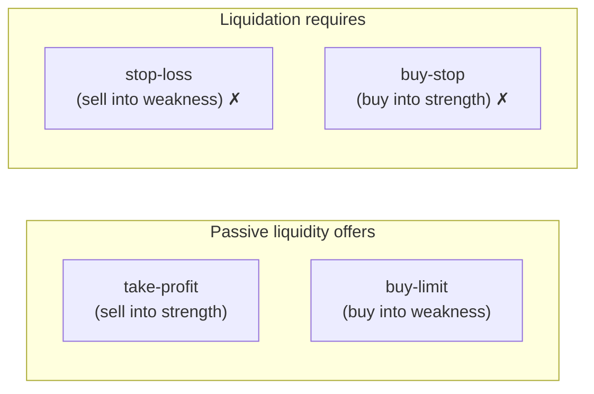
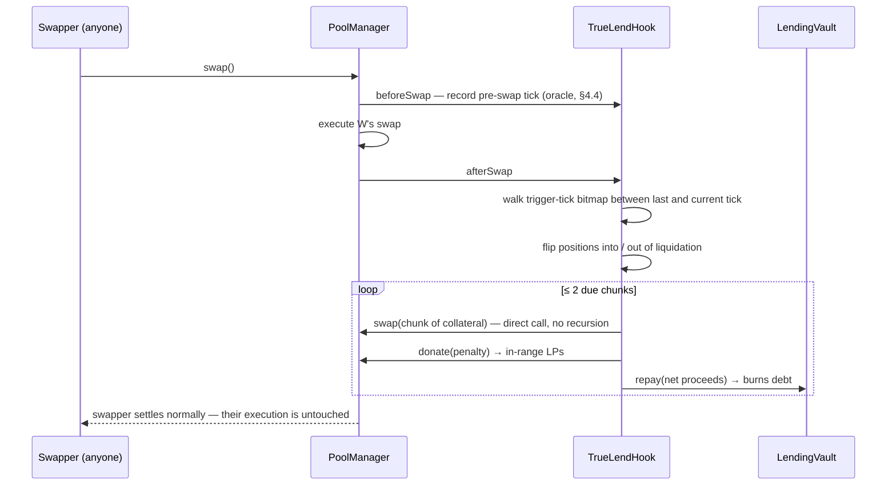
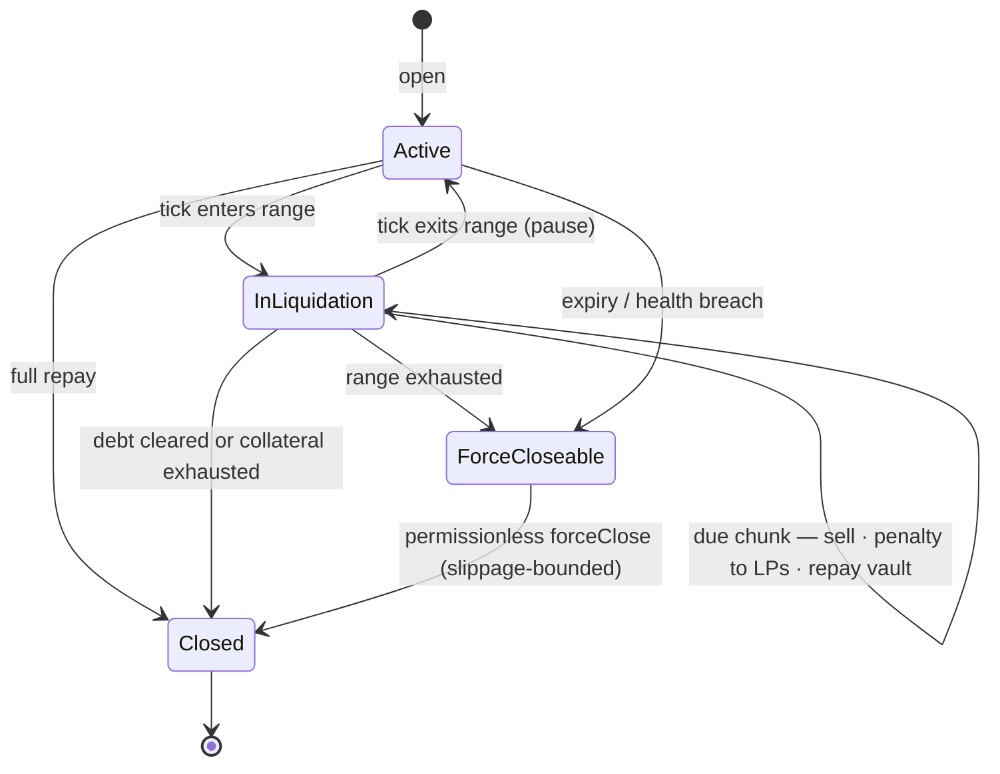
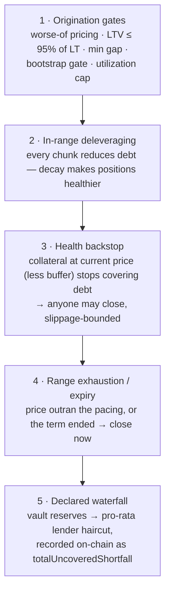

# TrueLend: Oracleless Lending with AMM-Native Gradual Liquidation

**Version 2.0 · July 2026**

---

## Abstract

Overcollateralized lending in decentralized finance rests on two fragile pillars: external price oracles, which import latency and manipulation risk into every solvency decision, and binary liquidations, which convert individual insolvency into systemic cascades. TrueLend removes both. Built as a Uniswap v4 hook, it uses the pool's own tick as its only price signal, and replaces the liquidation *event* with a liquidation *process*: while the pool price sits inside a position's liquidation range, the position's collateral is sold into the pool in small, rate-limited chunks that repay its debt; when the price recovers, the process pauses. We show that this active, in-range execution is not one design choice among many but the **only** mechanism class available to an oracle-free lender on a constant-function market maker — passive liquidity is mathematically incapable of performing a liquidation — and we present the complete protocol built around it: per-pool lender vaults with utilization-priced interest, a manipulation-resistant internal price for the single moment one is needed, a layered solvency framework with a declared loss waterfall, and strict per-swap gas bounds. Because liquidation is gradual, reversible, and executed at the pool's own prices, borrowers can safely select liquidation thresholds as high as 99%. The protocol is implemented, tested (86 tests including randomized invariants and native-ETH pools), and deployed on Unichain Sepolia.

---

## 1. Introduction

A collateralized lending protocol must answer one question continuously: *is this position still worth more than its debt?* The dominant designs (Aave, Compound, and their descendants) answer it with an external price feed, and act on the answer with a discrete event — when the feed says a position has crossed its liquidation threshold, a keeper repays the debt and seizes the collateral at a discount, all at once.

Each half of that architecture carries a structural cost.

**The oracle half** imports an attack surface and a listing bottleneck. Feeds lag volatile markets; they can be manipulated at their sources; and only assets with robust feeds can become collateral at all. The protocol's solvency logic is only as good as an input it does not control. Because that input is uncertain, protocols compensate with conservative liquidation thresholds — typically 50–80% — leaving large safety margins idle.

**The event half** creates reflexivity. A binary liquidation dumps an entire position onto the market at once; the sale moves the price; the move triggers the next liquidation. Cascades of this shape have marked every major deleveraging in DeFi's history. The keeper network that executes these events is itself infrastructure that must exist, stay funded, and win gas auctions at the worst possible moments.

TrueLend is a redesign of both halves at once, made possible by Uniswap v4's hook architecture, which lets a lending protocol live *inside* the venue where its collateral trades.

**Contributions.**

1. **An impossibility observation that organizes the design space** (§3): passive AMM liquidity can only trade against the direction of price movement, while liquidation always requires trading with it. Oracle-free *passive* liquidation therefore cannot exist; every gradual-liquidation design must either import direction from an oracle (Curve's LLAMMA), rebuild the AMM's curve (LIKWID, Ammalgam), or execute actively. TrueLend takes the third path on unmodified v4 pools — the only cell of that matrix previously empty.
2. **A conditional TWAMM liquidation engine** (§4.2): collateral is sold in time-paced, depth-scaled chunks *only while* the pool tick is inside the position's liquidation range, by code running inside ordinary swaps' hook callbacks. No keeper is required for liveness; the market's own activity performs liquidations, and every seller-side flow the engine can produce is bounded per interval — the cascade channel is capped by construction.
3. **A complete oracle-free lending market around the engine** (§4.3–4.4): passive lender vaults with utilization-kinked rates, and a hook-internal truncated-median price used at exactly one moment (origination), hardened against the post-merge single-block adversary.
4. **A layered solvency framework with priced, declared tail risk** (§5): we show why guaranteed worst-case coverage is incompatible with high liquidation thresholds, and replace it with a ladder of backstops terminating in an explicit loss waterfall — which is what makes borrower-selected thresholds up to 99% sound to offer.

---

## 2. Preliminaries: Uniswap v4 in four facts

Four facts about the venue carry the whole construction. Readers fluent in v4 can skim; nothing else about the AMM is assumed.

First, prices and ticks. A pool between `token0` and `token1` quotes one price — how much token1 a unit of token0 buys — and tracks it on a logarithmic grid of **ticks**, $P = 1.0001^t$, so a move of a hundred ticks is very nearly a one-percent move. A rising tick means token0 appreciating.

Second, liquidity is *concentrated*: each provider chooses a price range, and their capital trades (and earns fees) only while the current price is inside it. Consequently a liquidity position's composition — how much of it currently sits in token0 versus token1 — is a deterministic function of the current price alone. Section 3 leans entirely on this fact.

Third, a pool may name a **hook**: a contract the pool calls before and after every swap and at initialization, with its permissions encoded in its address. Two properties matter here: during a swap callback the pool's manager is already unlocked, so the hook itself may execute swaps or donations *directly*; and hook-initiated calls do not re-trigger the hook's own callbacks, so doing this is recursion-safe.

Fourth, v4 provides `donate()`: a native way to credit value to exactly the liquidity providers currently in range. This is the payment rail TrueLend uses for its liquidation penalties.

---

## 3. Why liquidation cannot be passive

The most elegant conceivable version of AMM-native lending would deposit the borrower's collateral *as pool liquidity* spanning the liquidation zone, letting ordinary trading convert it into the debt asset as the price deteriorates. This idea has circulated as the "inverse range order" (Instadapp, 2023). It cannot be built, and understanding why determines everything downstream.

### 3.1 Positions trade against the move

A position $(L, [P_a, P_b])$ holds, as a function of price:

$$
\text{amount}_0 = L\left(\frac{1}{\sqrt{P}} - \frac{1}{\sqrt{P_b}}\right), \qquad
\text{amount}_1 = L\left(\sqrt{P} - \sqrt{P_a}\right), \qquad P \in [P_a, P_b],
$$

with the position 100% token0 below the range and 100% token1 above it. Consider a rising price: swappers are buying token0, and what they buy comes out of in-range positions — so as price rises, every position **sells token0**. As price falls, every position **buys token0**. Passive liquidity is structurally the mean-reversion side of every trade. As an order type it offers exactly two things: a *take-profit* (sell what is appreciating) and a *buy-limit* (buy what is dipping). Uniswap's documentation states the negative space plainly: an LP position cannot function as a stop-loss.

### 3.2 Liquidation is the forbidden trade

Write down what liquidation requires, in both configurations of an ETH/USDC market:

| Collateral | Debt | Position sours when | Liquidation must | Passive liquidity does |
|---|---|---|---|---|
| ETH | USDC | ETH **falls** | **sell ETH as it falls** | *buys* ETH as it falls ✗ |
| USDC | ETH | ETH **rises** | **buy ETH as it rises** | *sells* ETH as it rises ✗ |

Liquidation is always a **stop order** — it trades *with* momentum. In both directions it is exactly the trade passive liquidity cannot make; the required position cannot even be minted, since single-sided deposits force the wrong token on the relevant side of spot.

### 3.3 The impossibility, and the design space it creates

> An AMM position can only be counter-momentum with respect to the pool's own price. Supplying momentum-side flow requires either an external reference that says the market has moved — an oracle — or an agent that executes the trade. **Oracle-free passive liquidation cannot exist.** Oracle-free liquidation must be active.

Every gradual-liquidation protocol in production or proposal is a response to this constraint:

| Response | Mechanism | Example | Cost |
|---|---|---|---|
| Import direction from an oracle | quote worse-than-market around the feed so arbitrageurs perform the conversion | Curve LLAMMA | oracle dependency; borrower pays the arb subsidy |
| Rebuild the curve | virtual/mirror reserves make pool state itself the ledger | LIKWID, Ammalgam | non-canonical pools, new AMM risk surface |
| **Execute actively, rate-limited** | a hook sells bounded chunks against in-range liquidity | **TrueLend** | execution is active; solvency is a modeled buffer, not a closed form |
| Avoid liquidation entirely | maturities, worst-case collateral, auctions | Timeswap, InfinityPools, Ajna | capital inefficiency or keeper games |

TrueLend's cell — gradual, reversible, oracle-free, on unmodified Uniswap pools — was empty. The remainder of this paper is the protocol that fills it.

---

## 4. The protocol

### 4.1 Positions and liquidation ranges

A position is opened by depositing collateral in one pool currency and borrowing the other from that side's lender vault. The borrower selects a **liquidation threshold** $\mathrm{LT} \in [50\%, 99\%]$. The **liquidation start price** is where debt equals $\mathrm{LT}$ times collateral value. For collateral $C$ in token0 and debt $D$ in token1:

$$
D = \mathrm{LT}\cdot C \cdot P_{liq} \;\;\Longrightarrow\;\; P_{liq} = \frac{D}{\mathrm{LT}\cdot C},
$$

and symmetrically $P_{liq} = \mathrm{LT}\cdot C / D$ when collateral is token1. The implementation computes $\sqrt{P_{liq}}$ in Q96 with full-width multiplication, so the formula is exact for any token-decimal pair. The **liquidation range** runs from the tick of $P_{liq}$ (rounded toward earlier triggering, aligned to tick spacing) a further $w$ ticks in the adverse direction — default $w = 3466$, a price factor of $\sqrt{2}$. Two properties of the range matter:

- **Below/above spot by construction**: opening requires initial LTV $\le 95\%$ of the chosen LT at a manipulation-resistant price (§4.4), which keeps the range a safe distance from spot at open — at LT 99% the borrower may take ≈94% LTV, with liquidation beginning after a ≈5% adverse move.
- **The far edge is a bankruptcy line**: past it, gradual treatment has failed and the backstop applies (§5).

**Worked example.** ETH at \$2,500; Alice deposits 1 ETH, borrows 1,800 USDC (LTV 72%) at LT 90%. Then $P_{liq} = 1800/0.9 = \$2{,}000$, and the range spans \$2,000 down to \$2,000/\sqrt{2} ≈ \$1,414$.

### 4.2 Gradual liquidation: a conditional TWAMM

While the pool tick is inside a position's range, the hook sells the collateral in **chunks**. The engine is a TWAMM — one large order executed as many small time-spaced slices — with two modifications that turn it into a liquidation machine: the order is *implied* (sell this position's collateral), and it *runs only while the tick is in range*, pausing on exit and resuming on re-entry.

**Pacing.** A chunk is due at most once per interval $\tau$ (default 60 s) per position:

$$
\text{chunk} \;=\; \underbrace{\frac{C_{rem}}{N}}_{\text{base: }1\%\text{ of remaining}}
\times\; \underbrace{\min\!\left(\frac{\Delta t}{\tau},\, 5\right)}_{\text{missed-interval catch-up}}
\times\; \underbrace{(1 + d)}_{\substack{\text{depth into}\\\text{range} \in [0,1]}}
\times\; \underbrace{(1 + \rho)}_{\substack{\text{position size /}\\\text{book depth} \in [0,1]}}
$$

clamped to $[\,\text{min},\, \min(\text{cap},\, C_{rem})\,]$, where the cap is 1% of the token depth of current in-range liquidity measured across the position's own range, re-measured in the same transaction that sells — **no single chunk can meaningfully move the price**. "Thinner books produce smaller chunks" means proportional *to the pool's depth, not to the position*: a thin venue gets smaller absolute slices (bounded impact is preserved everywhere), while the $\rho$ term quickens the cadence, so decay proceeds as more, smaller steps. There is likewise no stranded remainder: decay normally ends when the *debt* reaches zero (the final chunk's excess proceeds route to the borrower and remaining collateral goes home); every chunk is clamped to what remains, so the last slice is simply smaller; and for true dust the base becomes the whole remainder, finishing the position in one chunk. With defaults ($N = 100$), full decay takes ≈100 minutes typically and ≥25 minutes even with every multiplier at its cap. This bound is the anti-cascade property in closed form: a crash that puts many positions in range produces many independent trickles, never an avalanche, because *each* position's sell flow is capped per interval.

**Execution.** Chunks run lazily inside ordinary swaps:

The swapper whose trade crossed the trigger pays a bounded gas surcharge and unknowingly *is* the liquidation infrastructure; the chunk trades against the pool's LP liquidity in the same transaction. Detection is $O(\text{boundaries crossed})$: positions register their two range-boundary ticks in a per-pool bitmap, and `afterSwap` walks only set bits between the previous and current tick (capped at 8 ticks and 32 position updates per swap, with a persisted resume point). A permissionless `poke()` executes pending chunks in quiet markets — and pays its caller a reward carved out of the penalty flow, so keepers have a standing financial incentive without any privilege. (A rebate to *swappers* is not implementable at the hook layer: the hook observes the router's address, not the end trader's, so a rebate would strand with routers; the poke incentive is the workable form of the same idea.) The catch-up multiplier makes missed intervals self-correcting.

**Penalty.** Each chunk donates a fee to the pool's in-range LPs:

$$
\text{penalty} = \text{proceeds} \times 0.5\% \times \frac{\mathrm{LT}}{100\%} \times \min\!\left(1 + \frac{t_{inLiq}}{1\,\mathrm{h}},\, 5\right)
$$

LPs replace keepers as the compensated absorbers of liquidation flow — the higher the risk the borrower chose and the longer LPs have carried the decay, the more they earn. There is deliberately **no atomic liquidation bonus**: a manipulated trigger hands an attacker nothing to farm.

**Reversibility.** Price exits the range → decay pauses with whatever remains; time-in-liquidation is remembered (it scales future penalties) but nothing further is confiscated. Every chunk *repays debt*, so a position that decays is deleveraging — smaller but healthier — which is qualitatively different from an oracle-lender's liquidation loss.

### 4.3 The lending market

Each pool initialized with the hook automatically receives two **LendingVaults**, one per currency; either side is borrowable with the other as collateral. Lenders are strictly passive: deposit, receive shares, earn.

**Accounting.** Interest needs no per-position bookkeeping. Each vault maintains a single *borrow index* — a number that starts at one and grows continuously at the current rate — and a position's debt is simply its debt-share count multiplied by the index. Lender shares, in turn, price against the vault's total assets (cash plus outstanding debt, reserves excluded), with a virtual-offset conversion that blunts share-inflation attacks; every rounding decision favors the vault.

**Rates.** A kinked utilization curve: $r(U) = 4\%\cdot U/80\%$ up to the kink at $U^* = 80\%$, then $+100\%$ slope above it, with a **hard borrow cap at $U = 90\%$**. The cap is load-bearing rather than cosmetic: chunk repayments settle through the vault and lender withdrawals must always clear, so free liquidity is an invariant, not a preference. Ten percent of all interest accrues to a per-vault **reserve** — the first tranche of the loss waterfall (§5).

**Terms.** Interest is the one force that erodes a position without price moving, so loans carry a term (default 180 days). Open-time headroom (LTV ≤ 95% of LT) absorbs ordinary accrual; the health backstop (§5) catches the rest; expiry makes stale positions permissionlessly closable.

### 4.4 Price integrity without an oracle

Liquidation needs no price input at all — the pool tick *is* the trigger, and by definition the state in which collateral actually converts at those prices in this venue. The single price-sensitive moment is **origination**: pump the pool for one block, borrow against inflated collateral, let the price revert, leave bad debt. Post-merge, a block proposer with consecutive slots can set an arbitrary price for 1–2 blocks at a cost of roughly swap fees; the design assumes this adversary.

The hook maintains its own filtered price and values collateral at the **worse of spot and the filter**:

- **Truncation**: one observation per 60 s, written in `beforeSwap` with the *pre-swap* tick (a swap can never record its own price), movement clamped to ±9,116 ticks (~2.49×) per observation — Uniswap's truncated-oracle constant. A spike must be *sustained across many arb-bleeding observations* before it reaches the record.
- **Median-of-9**: a minority of corrupted observations is ignored entirely.
- **Widen-only extremes**: the raw min/max tick seen within recent intervals also bounds the borrow-side price — a spike-and-revert *inside* one interval still counts against the next borrower.
- **Bootstrap gate**: no originations until the ring is fully populated (~9 minutes after pool creation); attacker-seeded pools cannot fabricate their own history.

Three further gates apply at opening: a minimum distance between the filtered price and the range start, a minimum position size, and the 95%-of-LT headroom on opening LTV.

An attacker who pumps spot changes nothing about their borrowing power; an attacker who shoves the price into a victim's range merely starts a rate-limited, pausable, penalty-paying decay and hands two-way fees to LPs — an attack with negative expected value.

---

## 5. Solvency

### 5.1 Why guaranteed coverage is the wrong goal

It is tempting to demand that even a worst-case traversal — price gapping instantly to the far edge of the range, all chunks filling there — must repay the debt. That demand has a closed form, and it is fatal to the product: proceeds from full conversion at the range edge are approximately $C \cdot P_{liq}/f$ for range factor $f$, so coverage requires roughly

$$
\frac{1}{\mathrm{LT}\cdot \sqrt{f}} \;\ge\; 1 + i + h,
$$

which caps LT near 50–70% for any reasonable interest reserve $i$ and haircut $h$ — recreating exactly the conservative-threshold regime TrueLend exists to escape. High thresholds are possible *because* the worst case is instead handled by a priced, layered backstop structure. The residual tail is not ignored; it is charged for (LT-scaled penalties, utilization interest, reserves) and its loss path is declared in the contract.

### 5.2 The solvency ladder

Layer 3–4 closes (`forceClose`) are permissionless, pay the caller a reward from the penalty flow, and are **slippage-bounded**: the sale may move the price at most ~10%; in a drained or manipulated book it fills partially or not at all, the remainder stays as collateral, and the close is retried as liquidity returns. A fire sale into an empty book is structurally impossible. Whatever shortfall survives all layers extinguishes against vault reserves first, then socializes pro-rata through the lender share price, with the lifetime uncovered amount recorded on-chain — lenders can price the tail they are underwriting.

### 5.3 The buffer inequality (parameterization target)

To first order, the gap between LT and 100% must absorb four costs across a decay episode of duration $T$:

$$
1 - \mathrm{LT} \;\gtrsim\; s + \pi + i(T) + \mu, \qquad \mu \sim \sigma\sqrt{T},
$$

where $s$ is chunk execution slippage and fees, $\pi$ the penalty share, $i(T)$ interest over the episode, and $\mu$ adverse drift at volatility $\sigma$. Faster pacing shrinks $\mu$ but raises $s$; wider ranges lower $s$ per tick but lengthen $T$. This tradeoff has been swept per pool tier (PARAMETERS.md; results in notebooks/RESULTS.md): Monte-Carlo acceptance yields $\mathrm{LT}_{max}$ of 99% (stable), 95% (major), and 88–90% (long-tail), and a historical replay of the six major crash weeks since 2021 through the same episode engine — with walk-forward re-acceptance on trailing data only — validates the major tier ex-ante and ex-post, shows stable LT 99 to be exactly a no-depeg bet (a multi-percent depeg gaps through a 1% cushion; depeg-aware sizing is ≈96.5%), and bounds long-tail listings by position size against measured book depth rather than by LT (notebooks/BACKTEST.md). Borrower cost in deep replayed episodes (73 bps median) lands on the correct side of LLAMMA's empirically measured soft-liquidation loss curve (≈100 bps).

---

## 6. Security considerations

| Vector | Defense |
|---|---|
| Single/multi-block price manipulation at borrow | worse-of(spot, truncated median) + widen-only extremes + bootstrap gate (§4.4) |
| Manipulation-forced liquidation of a victim | rate-limited pausable decay, no atomic bonus, penalties to LPs — negative EV for the attacker |
| Gas-bombing swappers via lending state | hard bounds: ≤8 trigger ticks + ≤32 position updates per walk, ≤2 chunks per swap; persisted resume points; permissionless `poke` absorbs deferred work |
| Dust-position pileups on one tick | per-pool minimum borrow size (owner-set); bounded walks |
| LP withdrawal + backstop fire sale | forceClose slippage bound with partial fill and retry |
| Reentrancy via token callbacks | checks-effects-interactions in all selling paths; reentrancy guards on all user entrypoints; v4 `noSelfCall` prevents hook recursion |
| Vault share inflation | virtual-offset share pricing; vault-favoring rounding throughout |
| Governance | owner powers limited to per-pool config; recommended behind a timelock |

**Scope assumptions (v1):** standard ERC-20 tokens — no fee-on-transfer, rebasing, or transfer-hook tokens. **Native-ETH pools are fully supported** by bridging the native side to canonical WETH at the hook boundary: `open` and `repay` are payable (raw ETH is wrapped on arrival), vaults hold WETH, chunk settlement unwraps/wraps against the PoolManager, and *all user-facing payouts are WETH* — deliberately, since paying raw ETH to borrowers inside swap callbacks would let a reverting `receive()` block the very transactions that close a position. Cancun-capable chains (transient storage).

**Tested invariants** (randomized action sequences over open/repay/swap/poke/forceClose): the hook holds exactly the sum of open positions' collateral; position debt shares reconcile with vault totals; vault balances cover tracked reserves; utilization never exceeds its cap; lender value falls below principal only through the declared waterfall.

---

## 7. Parameters

| Set by | Parameters |
|---|---|
| **Borrower** (per position) | LT ∈ [50%, 99%] · borrow amount (LTV ≤ 95%·LT) · collateral side · size |
| **Pool owner** (per pool) | range width (√2) · min gap (100 ticks) · max LT (99%) · base penalty (0.5%) · slippage buffer (2%) · chunk depth cap (1%) · target chunks (100) · chunk interval (60 s) · catch-up cap (5×) · term (180 d) · forceClose reward (0.1%) · minimum borrow |
| **Protocol constants** | LTV headroom 95% · min LT 50% · 2 chunks/swap, 10/poke · 8 ticks + 32 refreshes/walk · forceClose slippage 1,000 ticks · oracle: 60 s × 9 observations, ±9,116-tick truncation |
| **Interest model** (per vault) | base 0% · 4% to kink 80% · +100% above · hard cap 90% · reserve factor 10% · ceiling 400% |
| **The market** (continuously) | interest rates (utilization) · liquidation execution prices (the book) · decay speed (swap activity) |

---

## 8. Related work

**Curve LLAMMA** is the closest relative and the only battle-tested gradual liquidation: collateral in ~1% price bands converts to crvUSD and back as price moves — but the conversion is *forced by an external EMA oracle*, around which LLAMMA deliberately quotes losing prices so arbitrageurs do the work (≈1–2% borrower cost per episode; bad debt from gap-through has still occurred). TrueLend is LLAMMA's user experience with the oracle deleted, at the price of active execution. **Instadapp's inverse range orders** proposed the passive oracle-free version; the required negative-liquidity primitive does not exist in v4 and the design was never built — TrueLend's chunk engine is its only sound realization.

**LIKWID** and **Ammalgam** achieve oracle-freedom by rebuilding the AMM itself (virtual/mirror reserves) rather than living on canonical pools; Ammalgam contributes the price-*range* solvency toolkit (worse-of bounds, widen-only extremes, bootstrap gating) that TrueLend adopts at origination. **GammaSwap** denominates debt and collateral in swap-invariant units, eliminating price from solvency where positions are naturally 50:50 — inapplicable to token-vs-token debt, but its spirit survives in TrueLend's price-free liquidation trigger.

**Ajna** replaces the oracle with lender-expressed prices and bonded liquidation auctions, at the cost of active lender management; **Timeswap** converts liquidation risk into option risk via fixed terms (TrueLend borrows the bounded-term idea); **InfinityPools** eliminates liquidation by collateralizing the worst case of borrowed LP ranges (its closed-form range math prices TrueLend's backstop); **Panoptic** contributes the internal-median solvency check that inspired the oracle here.

---

## 9. Extensions

**Perpetual-style leverage.** A leveraged long *is* a looped TrueLend position (deposit ETH → borrow USDC → buy ETH → redeposit), and is implemented as the `LeverageRouter` periphery: inside one PoolManager unlock it flash-takes the debt token, swaps it into collateral through the same pool, opens a single trader-owned position, and settles the flash with the loan the hook disburses — the liquidation engine unchanged, and the origination oracle's worse-of pricing immune to the router's own flash-swap impact. The dictionary: initial margin = 1−LTV; **maintenance margin = 1−LT** (LT 99% ⇒ 1% MM); bankruptcy price = the range's far edge; the range interior = a progressive auto-deleveraging zone replacing one-shot ADL. Funding emerges organically: long open interest borrows one vault, short OI the other, so OI skew becomes utilization skew becomes a rate differential — funding without a funding oracle. The same §3 impossibility applies to perp margin (it cannot sit passively in the range), which is precisely why the chunk engine transfers intact.

*Maximum leverage, derived.* The loop is a geometric series: margin $M$ is deposited, a fraction $\mathrm{LTV}$ of its value is borrowed, swapped into the collateral asset, and redeposited, so total exposure is

$$
E \;=\; M \sum_{k=0}^{\infty} \mathrm{LTV}^{\,k} \;=\; \frac{M}{1-\mathrm{LTV}},
\qquad\text{hence}\qquad
\lambda \;=\; \frac{E}{M} \;=\; \frac{1}{1-\mathrm{LTV}}.
$$

The protocol caps opening LTV at headroom $h = 95\%$ of the chosen LT, giving the structural ceiling $\lambda_{max} = 1/(1 - h\cdot\mathrm{LT}_{max})$ per pool tier. With the simulated tier caps:

| Tier | $\mathrm{LT}_{max}$ | max LTV $= h\cdot\mathrm{LT}_{max}$ | $\lambda_{max}$ |
|---|---|---|---|
| Stable | 99% | 94.05% | **16.8×** |
| Major | 95% | 90.25% | **10.3×** |
| Long-tail | 90% | 85.5% | **6.9×** |

A perp-profile pool config could raise $h$ (at $h=99\%$, LT 99%: $\lambda = 50\times$), but thinner headroom means positions enter their ranges far more often, so each step must re-clear the tolerance constraints of the parameter model — the ceiling formula is structural, the safe value is empirical.

**Safe-side automation.** Take-profit range orders (auto-deleveraging into strength) are the one passive order type the AMM *does* offer and compose naturally as an opt-in periphery feature.

**Gas.** The remaining optimization is holding chunk proceeds as PoolManager ERC-6909 claims rather than ERC-20 transfers per chunk; deliberately deferred for v1 simplicity.

---

## 10. Implementation and status

Eight contracts (six core, two periphery), ~2,100 lines of Solidity 0.8.26: `TrueLendHook` (lending core + engine, 24,457 bytes — 119 under the EIP-170 limit), `LendingVault` ×2 per pool, `VaultFactory`, libraries `LiqRangeMath`, `ChunkMath`, `TruncatedOracle`, `TriggerIndex` (all four deployed as linked external libraries), plus the stateless `TrueLendLens` view aggregator and the `LeverageRouter`. Any pool initialized with the hook — ERC-20 pairs or native-ETH pools, the latter WETH-bridged at the hook boundary — becomes a lending market automatically. 94 tests: fuzzed unit tests for all math, vault accounting and waterfall tests, 28 full-lifecycle integration scenarios plus 4 native-ETH pool scenarios (including LT-99 leverage, manipulation rejection, drained-pool backstop, and a 6-vs-18-decimals pair), 7 periphery scenarios (lens views and chunk preview, 5× flash-leverage open/close round trip, levered-position gradual decay), and randomized invariant tests.

**Deployment (Unichain Sepolia, chain 1301):** TrueLendHook `0xa731511a83D523A1df04e988873725BEE7cA90c0` · VaultFactory `0x2aAF432336Ea0D8b91398D32D0898317EfB6b420` · TrueLendLens `0xa8ed6128aD792485F6F5E9490C3dE630870e0cF4` · LeverageRouter `0xEc3aD4b2C872602F648F65B73a00fD3f45DCA082` · against canonical PoolManager `0x00B036B58a818B1BC34d502D3fE730Db729e62AC`.

## 11. Limitations and future work

The protocol has passed an internal audit (three findings — force-close reward accounting, a trigger-tick registration cap, configuration validation — fixed with regression tests) but not an external one. Chunk-pacing constants, the penalty curve, and per-pool LT tiers are set by the §5.3 parameterization, live-calibrated and validated against historical replay; the arbitrage-refill constant κ still awaits trade-level calibration. Decay liveness in fully quiescent markets depends on `poke` being called (by anyone, for a reward); interest accrual below ~1 bp APR floors to zero at bps resolution; per-position size caps against measured in-range depth (the backtest's principal finding for long-tail listings), per-block borrow caps, and aggregate per-tick-region exposure caps are designed but deferred. Lender-side risk is a genuine short-tail position and must be communicated as such — the waterfall is declared precisely so that it can be priced.

---

## References

Uniswap v4 core & periphery (github.com/Uniswap) · Uniswap docs, *Range Orders* · Adams et al., *Uniswap v4 Hooks* · Egorov, *Curve Stablecoin (LLAMMA) whitepaper*, 2022 · Curve docs, *Soft Liquidations* · Instadapp, *Oracleless Lending Protocol on Uniswap v4*, 2023 · LIKWID protocol docs · Ammalgam docs (*no-oracle*, *risk engine*) · GammaSwap protocol paper · Ajna Protocol whitepaper, 2024 · Timeswap v2 whitepaper · InfinityPools docs · Panoptic: Lambert & Axelrod, *arXiv:2204.14232* · Milionis, Moallemi, Roughgarden, Zhang, *Automated Market Making and Loss-Versus-Rebalancing*, arXiv:2208.06046 · Uniswap Labs, *Truncated Oracle Hook* · ChainSecurity, *Oracle Manipulation After the Merge*.
