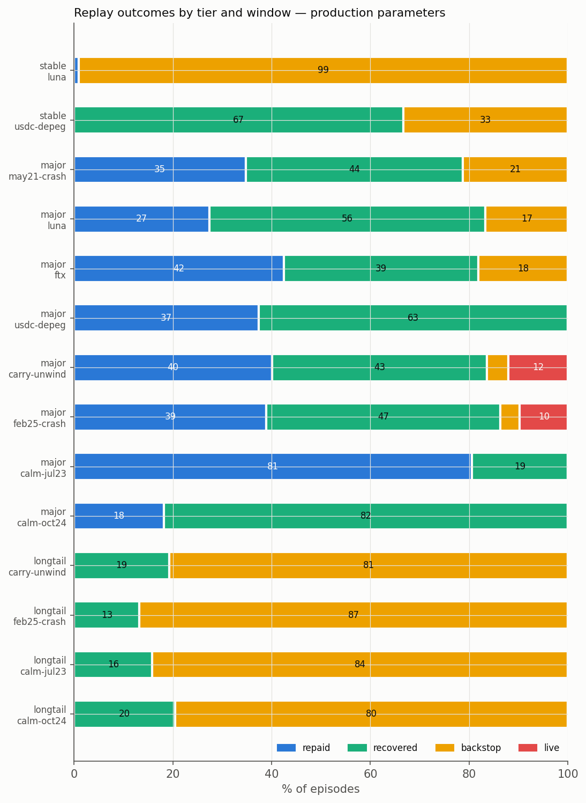
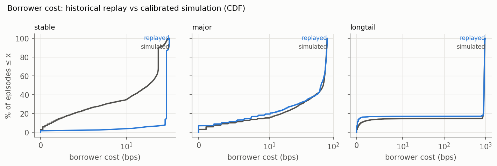
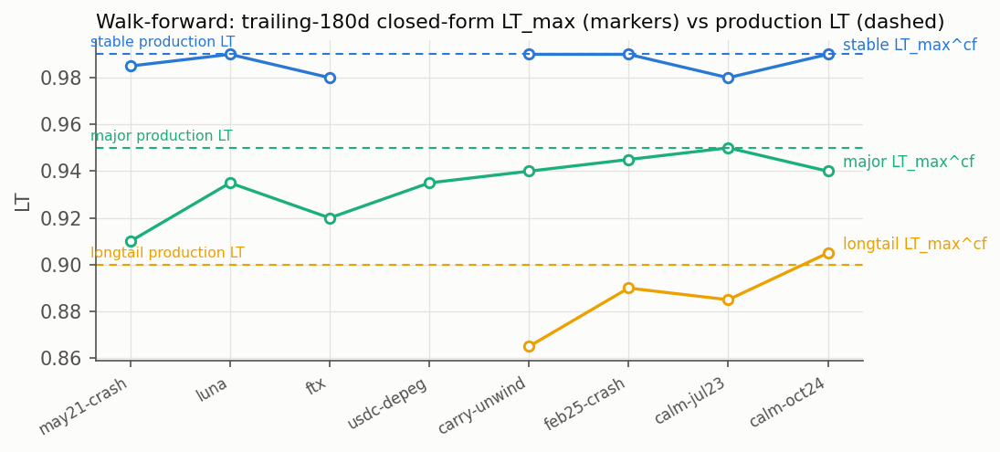
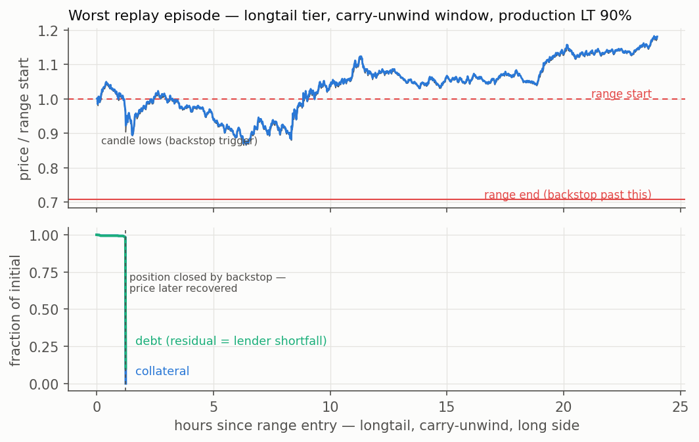

# Historical-replay backtest — results

Produced by [`backtest.py`](backtest.py) (notebook: [`backtest.ipynb`](backtest.ipynb)), driving the same episode engine as the Monte-Carlo sweep ([`engine.py`](engine.py)) with real 1-minute price paths instead of simulated ones. Inputs come from [`calibrate.py`](calibrate.py) (live realized-vol and jump fits, on-chain depth; [`calibration.json`](calibration.json)); price data is cached under [`data/`](data/). Raw metrics: [`backtest_results.json`](backtest_results.json).

**Method.** For each tier, hypothetical positions open every hour of each replay window at the tier's production LT with the contract's 95% opening headroom — in price terms, the liquidation range starts 5% below entry regardless of LT. An episode begins the first minute a candle extreme touches the range start and replays through the engine at the contract's own cadence (dt = 60 s): closes price the chunks, candle lows drive backstop detection (conservative), and both orientations of the pool are tested — a pump liquidates the short-side borrower. Windows: May '21 crash, LUNA, FTX, the USDC depeg, the Aug '24 carry unwind, the Feb '25 crash, and two calm controls.

## Headline

| Tier | Production (LT / N / τ) | Episodes | Shortfall freq | Cond. severity | Exhaustion | Cost med/p95 (bps) |
|---|---|---|---|---|---|---|
| Stable | 99% / 100 / 60 s | 117 | 88.9% | 7.4% | 92.3% | 33 / 36 |
| Major | 95% / 50 / 60 s | 1,190 | 1.34% | 0.75% | 9.8% | 64 / 80 |
| Long-tail | 90% / 100 / 60 s | 770 | 82.9% | 8.5% | 82.9% | 921 / 953 |

Read the verdict column with the conditioning in mind: the ε tolerances of PARAMETERS.md §2 (freq ≤ 1%, severity ≤ 5%, exhaustion ≤ 0.5%) are defined over episodes drawn from the *stress-calibrated model distribution*. Six of the eight replay windows **are** the historic tail — a sample composed of the worst weeks in five years is not the distribution the tolerances quantify over. The per-window decomposition below is where the real information is.

## Finding 1 — the major tier survives its history, ex-ante and ex-post

The walk-forward is the strongest result in this document. For every window, σ and jumps were re-fit on the **trailing 180 days only** — the data a deployer would actually have had — and the full acceptance simulation was re-run at the production parameters. It **accepts LT 95 / N 50 / τ 60 before every window, including May '21** (trailing σ as high as 164%). The parameters were knowable in advance.

Ex-post, the replay across 1,190 episodes:

| Window | Episodes | Shortfall freq | Severity | Cost (med bps) | repaid / recovered / backstop |
|---|---|---|---|---|---|
| may21-crash | 207 | 3.9% | 0.4% | 66 | 35 / 44 / 21 % |
| luna | 168 | 2.4% | 0.2% | 53 | 27 / 56 / 17 % |
| ftx | 160 | 0.6% | 0.4% | 63 | 42 / 39 / 18 % |
| usdc-depeg | 174 | 0.0% | — | 39 | 37 / 63 / 0 % |
| carry-unwind | 207 | 0.5% | 0.5% | 66 | 40 / 43 / 4 % |
| feb25-crash | 154 | 1.3% | 3.4% | 63 | 39 / 47 / 4 % |
| calm-jul23 | 98 | 0.0% | — | 78 | 81 / 19 / 0 % |
| calm-oct24 | 22 | 0.0% | — | 14 | 18 / 82 / 0 % |

Every window outside the two most violent (May '21, LUNA) meets the 1% frequency tolerance outright; conditional severity never exceeds 3.4% and averages 0.75% — a fraction of the 5% tolerance. When lenders did lose, they lost less than one percent of the debt. Median borrower cost (64 bps) lands within a few bps of the calibrated simulation (70 bps): the model is not miscalibrated, which is what the LLAMMA anchor also says (deep episodes cost 73 bps median against the ≈100 bps external anchor).





## Finding 2 — for stables, the only risk is the depeg, and trailing data cannot see it coming

Across five years of replay the stable book produced **zero** episodes outside depeg weeks — USDC/USDT simply never falls 5% otherwise. Inside them, LT 99 fails catastrophically: the May '22 USDT wobble put 105 short-side positions (USDT collateral) into their ranges and backstopped 99% of them, because a multi-percent depeg gaps straight through a 1% LT cushion; no pacing parameter changes that arithmetic. Severity stayed moderate (7.6% of debt — the backstop sells into a nine-billion-dollar book) but frequency is total.

The walk-forward accepts LT 99 before *every* window, including both depeg weeks: **trailing volatility is structurally unable to predict a depeg**, because depegs are regime events that do not precede themselves. This turns the stable-tier choice into an explicit statement rather than a model output:

- **LT 99 is a no-depeg bet.** Correctly priced (episode costs of ~30 bps, near-zero interest), it is the right product for borrowers who accept issuer risk — the user-facing docs should say exactly that.
- **Depeg-aware sizing says LT ≈ 96.5%** (the live-calibrated closed form, whose σ includes the depeg months). A pool owner who wants the tier to survive the next SVB weekend prices it there.

The protocol supports both — `maxLtBps` is per-pool config and the borrower picks their own LT below it; nothing in the mechanism needs to change.

## Finding 3 — long-tail risk is position size against measured depth, not LT

The live PEPE/WETH v3 book measured **$14k one-sided** over a √2 range (long-tail v3 liquidity has largely migrated or died). Against the $100k reference position that is 0.1 depth units: chunks cap at 1% of a book ten times smaller than the position, decay cannot keep up, and 80%+ of episodes backstop **even in calm windows** — PEPE swings past an 8% health line routinely. The same replay at the design depth of 5 units (equivalently, a $2.9k position in today's book, or a $500k book for the reference position) passes the frequency tolerance (1.69%) and fails only conditional severity (6.5% vs 5%) — the same marginal severity failure the Monte-Carlo finds for this tier.

The lever is therefore **sizing, not thresholds**: long-tail listings need `minBorrow` plus a per-position cap proportional to measured in-range depth (the chunk engine already measures it every sale). This is the highest-value roadmap item the backtest surfaces.





## Methodology notes and honest limitations

- **Two-sided episodes**: every window replays both pool orientations (candle lows for the long side, inverted highs for the short side). The LUNA finding above exists *only* because of this — the USDT wobble is invisible to a long-side-only backtest.
- **Truncation**: episodes reaching the end of a window's data deactivate as "live" rather than extrapolating; nothing is decided on data that does not exist.
- **Venue coverage**: Binance delisted USDC/USDT for six months spanning the March 2023 depeg; the depeg window is 63% covered (starting mid-crash at the trough) and the stable FTX window has no usable venue. The fetcher prefers the fullest-coverage venue (Coinbase's USDT/USDC bridges part of the gap). Depeg-week stable results are therefore a *lower bound* on episode count.
- **Correlation**: episodes within one window share the macro event; they are one stress scenario sampled at many entry points, not independent draws — which is why results are reported per window.
- **Engine assumptions carried over**: arbitrage refill κ = 0.9 static; depth from constant active liquidity projected across the range (the contract's own approximation, but an overstatement for peg-concentrated stable books); backstop sales pay a position/depth-scaled impact bounded by the contract's 10% slippage limit.

## Reproduction

```bash
.venv/bin/python notebooks/calibrate.py   # refresh calibration.json (cached data reused)
.venv/bin/python notebooks/backtest.py    # replay + walk-forward + figures + JSON
```

Delete files under `notebooks/data/` to force refetching from exchanges.
