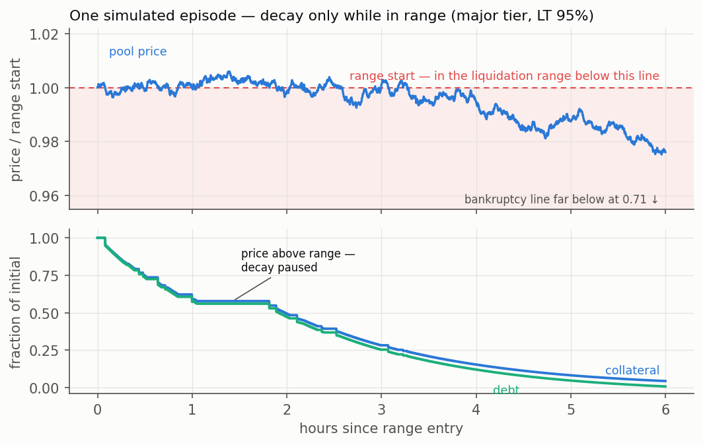
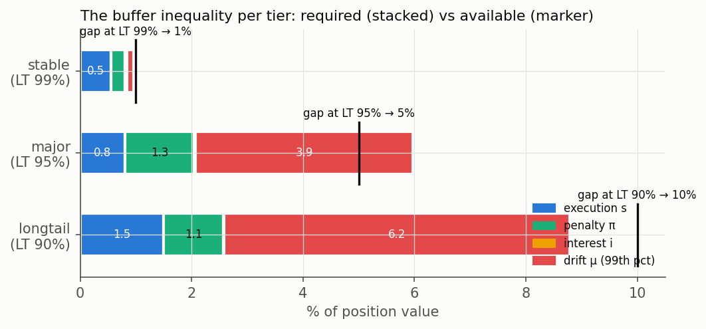
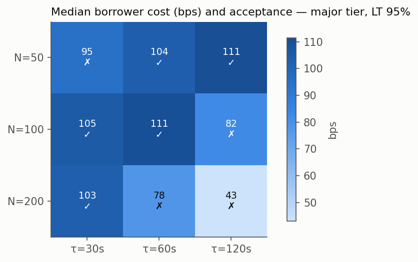
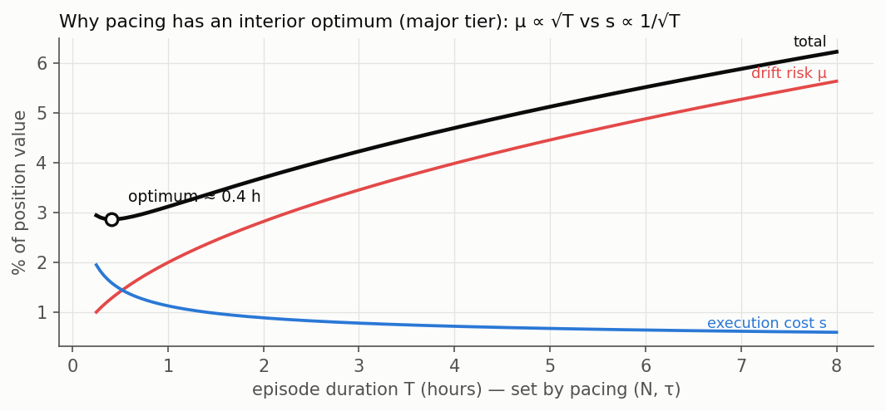
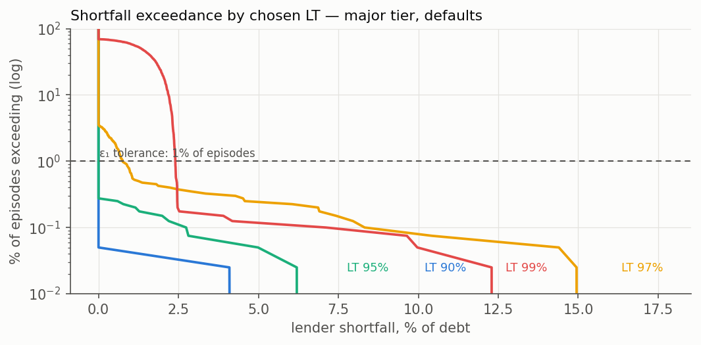

# Parameter model — results

Produced by [`parameters.py`](parameters.py) / [`parameters.ipynb`](parameters.ipynb) implementing the methodology of [PARAMETERS.md](../PARAMETERS.md). 4,000 antithetic jump-diffusion paths per grid point, 12-second steps; the episode engine ([`engine.py`](engine.py)) is a replica of the on-chain chunk engine, asserted against the Solidity unit-test vectors on every import, and is shared verbatim with the historical-replay backtest. Raw metrics: [`results.json`](results.json). Live-calibrated inputs and the replay results live in [`calibration.json`](calibration.json) and [BACKTEST.md](BACKTEST.md).

## Headline: simulated LT_max per tier (static stress calibration)

| Tier | σ (99th-pct ann.) | LT 90% | LT 95% | LT 97% | LT 99% | **LT_max (simulated)** | First cut (closed form) |
|---|---|---|---|---|---|---|---|
| Stable | 2% | ✓ | ✓ | ✓ | ✓ | **99%** | 99% |
| Major | 80% | ✓* | ✓ | ✗ (freq 3.6%) | ✗ | **95%** | 94–95% |
| Long-tail | 150% | ✗ (sev 9.7%) | ✗ | ✗ | ✗ | **≈88–90%†** | 89–90% |

Acceptance = shortfall frequency ≤ 1% of episodes ∧ conditional severity ≤ 5% of debt ∧ exhaustion ≤ 0.5%, at each tier's stress calibration. *Major LT 90 trips the severity tolerance on a 2-of-4,000-path sample (frequency 0.05%) — Monte-Carlo noise at the boundary, not a monotonic effect; LT 95 accepts cleanly. †Long-tail LT 90 passes frequency (0.80%) and fails only conditional severity; it passes at a slightly wider range or LT 88 — and the live-depth replay shows the binding constraint for this tier is position size against measured book depth, not the threshold itself (BACKTEST.md, finding 3).

The closed-form first cuts and the simulation agree — the simulation is the more permissive of the two exactly where it should be (the closed form charges 99th-percentile drift against the *entire* episode; the simulation lets episodes recover), which is the expected direction of the conservatism, not a discrepancy.

## Two contract changes this model forced

The first full sweep produced 100%-instant-backstop rows at high LT — not price risk, but two **fixed parameters silently contradicting borrower-chosen LT**. Both are now fixed in `TrueLendHook` with the same shape of fix (per-position scaling), both regression-tested:

1. **Health buffer vs LT** (`LiqRangeMath.forceCloseReason`): the reason-3 check used the fixed 2% config buffer, but a position *enters its range* at LTV = LT — so any LT > 98% was forceCloseable the moment its gradual liquidation should have started. Fix: `buffer = min(config, (1 − LT)/2)`. Test: `test_forceClose_healthBufferScalesWithLT`.
2. **Penalty vs LT** (`_currentPenaltyBps`): the time-scaled penalty (up to 2.25% of proceeds) exceeded the 1% gap of an LT-99 position, making full repayment through decay arithmetically impossible — positions decayed to dust with residual debt, then booked the residue as shortfall. Fix: effective penalty capped at `(1 − LT)/4`. With it, stable LT-99 episodes repay cleanly (shortfall frequency 0.03%, median borrower cost 30 bps).

The general lesson both instances teach: **every fixed economic parameter must be checked against the smallest LT gap it can meet** — the model's job is to find exactly these interactions before an auditor or an attacker does.

## Live calibration and historical replay

[`calibrate.py`](calibrate.py) replaces the static tier constants with measured inputs: 99th-percentile 30-day realized vol and threshold-detected jumps from hourly exchange history since 2020 (jumps reflected into the adverse direction — a pump is a crash for the short-side borrower), and one-sided in-range depth read live from the deepest Uniswap v3 mainnet pool per tier. Headline calibrated values (2026-07): stable σ 37.8% (depeg months dominate), major σ 182%, long-tail σ 286%; depth $9.2B / $45M / $14k one-sided.

[`backtest.py`](backtest.py) then replays the six historic crash weeks plus calm controls through the same engine at production parameters, both pool orientations, with a trailing-180-day walk-forward. Three findings, in [BACKTEST.md](BACKTEST.md): the major tier's parameters were acceptable ex-ante before every window and lost ≤ 0.75% of debt conditionally ex-post; stable LT 99 is precisely a no-depeg bet (trailing data cannot predict depegs; depeg-aware sizing says ≈ 96.5%); long-tail viability is bounded by position size against measured depth, not by LT.

## Figures

**One episode, end to end** — decay only while the tick is in range; the pause is visible as the plateau; every step down in collateral is a step down in debt:

**The buffer inequality per tier** — required buffer (stacked: execution, penalty, interest, 99th-pct drift) against the available gap (marker). Drift dominates everywhere except stables; interest is invisible at episode timescales — the two structural findings of the closed-form analysis, drawn:

**Pacing grid (major tier, LT 95%)** — median borrower cost with acceptance marks. Slow pacing (bottom-right) is cheap *when it works* and rejected because it doesn't: drift outruns it. The accepted-cheapest cell is N=50, τ=60 s (N=50/τ=30 s fails only a 7-path conditional-severity estimate — within MC noise of the boundary; treat the 30–60 s band as equivalent):

**Why pacing has an interior optimum** — μ grows as √T while s shrinks as ~1/√T; their sum has a minimum, and everything that shortens episodes (deeper pools, faster pacing, active poking) buys LT headroom:

**Shortfall exceedance by LT (major tier)** — the lender's actual tail, against the ε₁ tolerance line:

## Recommended per-tier configs (v1 production values)

| Parameter | Stable | Major | Long-tail |
|---|---|---|---|
| `maxLtBps` | 9900 (no-depeg bet; 9650 depeg-aware) | 9500 | 8800–9000 |
| `targetChunks` / `chunkInterval` | 100 / 60 s | **50 / 60 s** (30–60 s equivalent) | 100 / 60 s |
| `rangeWidth` | 3466 (√2) — 1733 viable | 3466 | ≥ 3466; widen if jump fit demands |
| `basePenaltyBps` | 25–50 | 50 | 75–100 |
| `minBorrow` + position cap | per chain: ~$40-eq (L2) / ~$4k (L1) | same | **cap position ≲ 20% of measured in-range depth** (backtest finding 3) |

## Known model limitations (inputs to the next iteration)

Arbitrage refill fixed at κ = 0.9 rather than fitted (needs trade-level data); depth projected from constant active liquidity across the range — the contract's own approximation, but an overstatement for peg-concentrated stable books; quiet-market execution gaps exercised only through the catch-up multiplier; replay windows are correlated samples of single macro events (reported per window for that reason); stable-tier depeg data is venue-censored (Binance delisting spanned the March 2023 depeg). Resolved since the first iteration: antithetic variates (on), live calibration (calibrate.py), backstop execution now position/depth-scaled within the 10% slippage bound rather than a flat 2%, and real-path validation (backtest.py).
